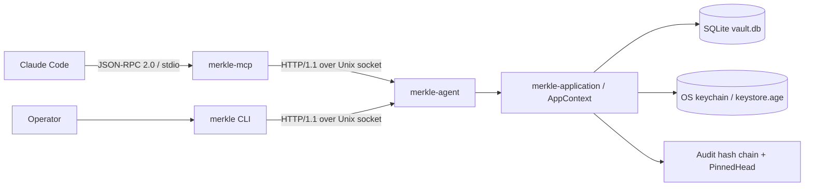

# Merkle — Project Instructions

Local-first MCP secret vault. Rust, edition 2024, hexagonal architecture (DDD + ports/adapters per ADR-0002 / ADR-0024). A long-running **daemon** (`merkle-agent`) owns all key material, SQLite storage, and a tamper-evident audit chain, and exposes a single inbound driving port: the **Companion Socket** (HTTP/1.1 over a Unix domain socket). The **CLI** (`merkle`) and the **MCP server** (`merkle-mcp`) are thin external clients that talk only to that socket — they never touch keys, storage, or domain logic.

## Project

Canonical agent map: **[AGENTS.md](AGENTS.md)**. Architectural contract: `docs/arch/`. Speckit control plane: `doc/arch/` (symlinks into `docs/arch/` for ADRs/schemas/features).

## Spec-first protocol

spec-first: read the corpus before writing code. Drive the control plane with
`~/bin/speckit status`, `~/bin/speckit next`, and `~/bin/speckit validate`
(binary only). Behavioral changes update `docs/arch/` in the same train as code.

## Commands

```bash
~/bin/speckit status
~/bin/speckit next
~/bin/speckit validate
cargo build --workspace
cargo test --workspace --no-fail-fast
cargo clippy --workspace --all-targets -- -D warnings
make doctor
make deploy
```

## First 5 minutes

```bash
cd /Users/farchanjo/dev/mcp-vault

cargo build --workspace                               # debug build (fast)
cargo test --workspace --no-fail-fast                 # full suite (last green run ≈ 753 pass / 0 fail / ~14 ignored)
cargo clippy --workspace --all-targets -- -D warnings
~/bin/spec validate                                   # default (medium) lane — must stay 9/9 green
make doctor                                           # check + clippy + test (one shot; does NOT run spec — use `make doctor-full` to include it)
```

Run the daemon locally for a smoke test:

```bash
cargo run -p merkle-agent          # or `make agent`
cargo run -p merkle-cli -- status  # or `make cli ARGS=status`
```

Read order to onboard: this file → `~/.claude/CLAUDE.md` (global rules) → `docs/arch/adr/` (start ADR-0002, then 0021/0022/0024/0026/0028) → `crates/merkle-application/src/commands/` (use-case entry points) → `docs/arch/integrations/openapi/companion-socket.yaml` (the HTTP contract).

---

## Mental model

- **Hexagonal, strictly layered.** `merkle-types` (value objects) ← 6 domain bounded contexts ← `merkle-ports` (pure traits) ← adapters + `merkle-application` (use cases). The daemon binary is the composition root that wires concrete adapters into `AppContext`.
- **Domain crates depend on nothing but `merkle-types` + std.** No infra leaks inward. `merkle-application` orchestrates the six BCs through port traits and imports **zero** infrastructure.
- **One inbound port.** Everything reaches the daemon through the Companion Socket. The CLI and MCP adapter are clients of `merkle-companion-client`; they never link the domain or storage.
- **Spec is source-of-truth.** `docs/arch/` (CUE, MADR ADRs, Rego, Gherkin, Structurizr, TLA+) gates every PR via `spec validate`. Behavioral changes update the spec artifact **in the same commit** as the code.

---

## Workspace layout

**22 members: 19 library crates + 3 binaries.** Edition 2024, resolver 3, MSRV 1.89 (`rust-toolchain.toml` channel=1.89.0, components rustfmt/clippy/rust-analyzer/rust-src).

### Foundation
| Crate | Role |
|---|---|
| `merkle-types` | Shared value objects: `Handle`, `NamespaceLabel`, `SecretName`, `TagKey`/`TagValue`/`Tag`, `Sensitivity`, `SecurityProfile`, `CompanionDeviceClass`, `OobChannel`, `UuidV7`, `Blake3Hash`, `HmacSignature`, `AuditOp`/`AuditOutcome`, `BoundedContextId`. No infra deps. |

### Domain bounded contexts (depend only on `merkle-types`)
| Crate | Bounded context |
|---|---|
| `merkle-domain-identity` | Identity & Sealing — `VaultIdentity` (AR), `MasterKey`, `VaultRootKey`, `NamespaceDek`, `RecoveryKey`, `SealedState`, `UnsealProtocol`, `UnsealGuard` |
| `merkle-domain-secret-storage` | Secret Storage — `Secret` (AR), `SecretVersion`, `Namespace`, `PrivateBlob`, `PublicMetadata`, `RetentionPolicy`, `SecretVersioning`, categories |
| `merkle-domain-access-mediation` | Access Mediation — `RevealRequest` (AR), `UseToken`, `Tempfile`, `Fifo`, `CompanionDevice`, `OobChallenge`/`OobResolution`, `OperatorConfirmation`, `decision::evaluate` |
| `merkle-domain-audit-compliance` | Audit & Compliance — `AuditEntry` (AR), `AuditLog`, `PinnedHead`, `AuditWriter`, `ChainVerifier`, `AuditQueryModel` |
| `merkle-domain-backup-recovery` | Backup & Recovery — `Backup` (AR), `BackupScheduler`, `RestorePlanner`, `RestorePlan`, `AnacronState` |
| `merkle-domain-policy-permissions` | Policy & Permissions — `NamespacePolicy` (AR), `RevealPolicy`, `RateLimit`, `CrossNamespacePolicy`, `DevicePolicy`, `PolicyEvaluator` |

### Ports
| Crate | Role |
|---|---|
| `merkle-ports` | Pure trait definitions: `StoragePort`, `KeychainPort`, `CryptoPort`, `OobNotifierPort`, `ExternalServicesPort`. Depends on all 6 domain crates + `merkle-types`. |

### Driven adapters (outbound — implement ports)
| Crate | Role |
|---|---|
| `merkle-adapter-sqlite` | sqlx + SQLite (WAL). Per-blob XChaCha20-Poly1305 on `private_blob`, FTS5 over public metadata, append-only audit triggers, `pinned_head` table (migration `004_pinned_head_hmac.sql`) |
| `merkle-adapter-keychain` | Cross-OS keychain via `keyring` (service id `dev.fapp.merkle`). File-backed age keystore fallback + `MockKeychainAdapter` |
| `merkle-adapter-crypto` | `RustCryptoAdapter`: XChaCha20-Poly1305, BLAKE3 (hash + keyed), Argon2id, age, Ed25519, X25519 ECIES. `OsRng` for all nonces/keys |
| `merkle-adapter-oob` | OOB confirmation: desktop notification / TTY prompt / localhost-confirm. Verifies Ed25519 `OobResolution` signatures |
| `merkle-adapter-external-services` | SSH exec (subprocess + tempfile identity), HTTP (reqwest + rustls) with SSRF/DNS-rebind guard. `MockExternalServices` |

### Driving adapters (inbound)
| Crate | Role |
|---|---|
| `merkle-adapter-companion-socket` | axum HTTP/1.1 over Unix socket — the sole inbound port. Peer-cred auth (same-UID only). Its `[lints.rust]` **relaxes `unsafe_code` from `forbid` to `deny`** (for `LOCAL_PEERCRED` on macOS) and sets `missing_docs = "allow"` (transport DTO fields mirror the OpenAPI schema) |
| `merkle-adapter-mcp` | rmcp MCP server: 30 tools + 4 prompts. Translates stdio JSON-RPC → Companion Socket calls. Depends on `merkle-companion-client`, **not** the domain |

### Shared client / application / tests
| Crate | Role |
|---|---|
| `merkle-companion-client` | Reusable HTTP/1.1-over-Unix-socket client (hyper + custom `UnixConnector`). Used by CLI and MCP |
| `merkle-application` | Use-case orchestration: `AppContext`, command handlers (`init_vault`, `unseal_vault`, `seal_vault`, `put_secret`, `bind_namespace`, …) + query handlers. No infra imports |
| `merkle-bdd` | Cucumber-rust acceptance harness (`harness = false`); loads 15 `.feature` files from `docs/arch/specs/features/` |
| `merkle-e2e` | Black-box E2E: spawns `merkle-agent` against a temp DB/socket, drives the CLI, verifies the audit chain. All `#[ignore]` |

### Binaries (`bin/`)
| Binary | Produces | Role |
|---|---|---|
| `bin/merkle-agent` | `merkle-agent` | Daemon / composition root: SQLite, keychain, audit chain, background workers, Companion Socket server, Prometheus endpoint. **Does not serve MCP** (moved out per ADR-0024) |
| `bin/merkle-cli` | `merkle` | Operator CLI (clap). Top-level subcommands: `init`, `unseal`, `seal`, `status`, `bind`, `put`, `list`, `get`, `describe`, `reveal`, `rotate`, `delete`, `search`, `audit`, `backup`, `restore`, `device`, `verify-recovery-key`, `doctor` (`backup`/`restore`/`device` have nested subcommands). Talks only over the socket |
| `bin/merkle-mcp` | `merkle-mcp` | Thin stdio MCP server, one per Claude Code window. Probes daemon health at startup (exit 1 if unreachable), proxies all calls. Never imports application/domain/storage |

---

## Architecture & runtime



### Companion Socket
HTTP/1.1 over a Unix domain socket. **33 paths / 35 HTTP operations** in `docs/arch/integrations/openapi/companion-socket.yaml`; the router registers **35 handler functions** across 33 `.route(` calls (`crates/merkle-adapter-companion-socket/src/router.rs` — its `34 endpoints` doc comment is stale). Groups: agent lifecycle (5: init/status/unseal/seal/doctor), namespaces/secrets (6 incl. versions/rotate/rollback), audit (1), backup (4), reveal (1), sessions (2), use-tokens (4), proxy (11: ssh exec/copy/port-forward/shell, http request/download/upload, spawn, crypto sign/decrypt).

- **Auth** — peer-credential middleware before every handler. macOS: `getsockopt(SOL_LOCAL, LOCAL_PEERCRED)`; Linux: `SO_PEERCRED` + `/proc/<pid>/exe`. Enforces peer UID == agent UID (same-user only). No client header is trusted.
- **Hardening (GAP-007)** — parent dir forced `0700`, umask `0177` during bind, explicit `chmod 0600` on the socket (`bind_hardened`).
- **Per-request timeout 30s; max response body 8 MiB.**
- **Default socket path** — `$XDG_RUNTIME_DIR/merkle/agent.sock` if set; else (macOS) `$TMPDIR/merkle-$USER/merkle/agent.sock`; last resort `/tmp/merkle-merkle/merkle/agent.sock`. Override via `MERKLE_SOCKET` / `--socket` (mcp) / `[companion_socket] path` (agent config). **Note:** the `cli_smoke` test uses a *different* path — `$TMPDIR/merkle/companion.sock` (no `$USER` segment).

### On-disk state (XDG)
| What | Path |
|---|---|
| SQLite DB (everything: namespaces, secrets+versions, audit entries, `pinned_head`, backups, devices, policies) | `~/.local/share/merkle/vault.db` (+ `-wal`, `-shm`) |
| age-encrypted keystore (file backend) | `~/.local/share/merkle/keystore.age` |
| Agent config | `~/.config/merkle/config.toml` |

**Important correction:** audit entries and the pinned head are persisted **in SQLite** (`004_pinned_head_hmac.sql` + `crates/merkle-adapter-sqlite/src/audit.rs`). The config fields `audit_log_path` (`~/.local/state/merkle/audit.jsonl`) and `audit_head_path` (`audit_head.json`) exist and their parent dirs are pre-created at startup, but the live persistence path is the DB — the `AuditWriter` docstrings still telling the caller to flush `PinnedHead` to `audit_head.json` are doc drift from ADR-0009 (Amendment), and `merkle-e2e`'s tamper test reads `audit_head_path` defensively with `.ok()`. `recovery-key.txt` in the data dir is user-saved, not written by any code path.

### Keystore backends
`os` | `file` | `auto` (default). `auto` probes the OS keychain with a **write+verify+delete** round-trip on sentinel `dev.fapp.merkle/__merkle_probe_persist_check` (a read-only probe is insufficient on macOS — unsigned/headless binaries can read but silently fail to store, per ADR-0015 Amend. 4), and falls back to `file` on failure. File backend reads the passphrase from `MERKLE_KEYSTORE_PASSPHRASE` (else TTY via `rpassword`); path overridable via `MERKLE_KEYSTORE_PATH`. `MERKLE_RECOVERY_RECIPIENT` (a real `age1…` recipient) is **required at startup** (GAP-003) — placeholders are rejected.

### Seal / unseal lifecycle
State machine: `Sealed → Unsealing → Unsealed → ShuttingDown → Sealed`; **direct `Sealed→Unsealed` is rejected**; `Unsealing→Sealed` is the rollback edge. Unseal runs in windows (`crates/merkle-application/src/commands/unseal_vault.rs`): begin (write-lock) → keychain read + AEAD-decrypt of the `vrk-master-v1` blob (`nonce[24] || ciphertext`, AAD `b"vault-root-key"`) + derive the audit HMAC key (no-lock; any failure rolls back to `Sealed`, BUG-05) → publish the HMAC key **before** the state flip → append `op=Unseal`. Init ceremony (ADR-0021): generate MasterKey + RecoveryKey + VRK, dual-wrap the VRK (AEAD under MasterKey + ECIES under recovery pubkey), persist both to keychain (`vrk-master-v1`, `vrk-recovery-v1`), return the `age1…` recovery key **once**.

### Audit hash chain
Per entry: `current_hash = BLAKE3(canonical_fields || prev_hash)` (unkeyed); `hmac = BLAKE3_keyed(key, current_hash || id_uuid)`. Genesis: `prev_hash = None`, all-zero `Blake3Hash::GENESIS` sentinel (`blake3:0000…0000`). HMAC key = `BLAKE3_keyed(vrk_bytes, b"merkle vault hmac key v1")` — **the operative domain label lives in `unseal_vault.rs::AUDIT_HMAC_KEY_DOMAIN` (spaces, no colons)**; the crypto-crate doc comment showing `merkle:vault-hmac-key:v1` is wrong. `PinnedHead` (SQLite single-row) binds `head_hash || head_seq || head_id || entry_count` under the same key so the log can't be truncated-then-rewritten without it. `ChainVerifier::verify_full` reject outcomes: `GenesisAnchorMissing`, `BrokenAtEntry`, `HmacMismatch`, `MissingHmac`, `HeadMacMismatch`, `TruncationDetected`, `HeadHashMismatch`, `HmacKeyUnavailable`, `EntrySerializationFailed`. Hash-only `Intact` (no key) is **not** a full tamper-evidence guarantee — check `hmac_checked`.

### Background tasks & MCP flow
Daemon spawns: backup scheduler (anacron, ADR-0010 — real `BackupScheduler::should_trigger` + `TriggerBackupCommand`, dual age recipients), chain verifier, tempfile reaper (registry TTL + orphan sweep of `merkle_*.tmp`/`.fifo`), idle-relock supervisor (`[security] idle_lock_timeout_secs`, default **1800s** when unset — seals via `SealVaultCommand` after idle; companion-socket middleware + unseal call `touch_activity`), Prometheus server, socket server. Shutdown drains with a 30s hard timeout. **MCP:** `Claude Code → rmcp stdio → MerkleMcpServer → CompanionSocketClient → daemon`. The MCP adapter exposes **31 tools** across identity/secrets (incl. `vault_rollback`)/reveal/use_token/proxy/audit/backup/diagnostics, plus 4 prompts (`merkle-doctor`, `merkle-show`, `merkle-reveal`, `merkle-rollback`, ADR-0028). `SessionState` enforces at-most-one bind per session via two-phase `commit_binding()` (ADR-0026).

---

## Domain model & key invariants

`Secret::new` / `Secret::rotate` enforce: (1) `handle.category == category`; (2) `versions` non-empty; (3) `current_version_id` exists; (4) exactly one active version (`deprecated_at == None`); (5) **`Sensitivity::High` requires at least one `env:*` tag** (`HighSensitivityMissingEnvTag`); (6) **`expose` must be false when High** (`ExposeOnHighSensitivity`); (7) no duplicate `key:value` tags; (8) **category is immutable** after creation; (9) nonces unique per encryption; (10) rotation `version_no` strictly increasing (`NonMonotonicVersionNumber`); (11) default retention 3, oldest deprecated pruned on rotate.

`PrivateBlob` AEAD `associated_data` is always the UTF-8 of the exact `Handle` URI — binds ciphertext to identity, blocks cross-secret substitution (and is a second reason category is immutable). `UseToken`: 256-bit, default TTL 60s / max 300s, **single-use** (`consume()` second call → `TokenAlreadyConsumed`), never returned to MCP/LLM. `TagKey` is a **closed** 5-variant enum (`env`/`project`/`role`/`provider`/`team`) — new keys need an ADR. `AuditOp` has **32** closed variants (test `exactly_32_variants` asserts it; `Init` + `Seal` added by amendments). `CrossNamespacePolicy` is default-deny: same-namespace always allowed; cross requires `master_switch = true` **and** target in `allowed_imports`. CWD-bound namespace labels use the regex-validated form `cwd-<16 hex>` (`crates/merkle-types/src/namespace.rs`); `Namespace.cwd_hash` is an `Option<String>` populated by the binding caller.

---

## Crypto & security guarantees

| Primitive | Lib | Use |
|---|---|---|
| XChaCha20-Poly1305 | `chacha20poly1305` | per-blob AEAD (24-byte nonce, 16-byte tag) |
| BLAKE3 hash + keyed | `blake3` | audit hash chain + HMAC substitute / key derivation |
| Argon2id (RFC 9106) | `argon2` | passphrase KDF — floor `m_cost≥65536`, `t_cost≥3`, `p_cost≥1` (`Argon2idBelowFloor`) |
| age (X25519) | `age` 0.11 | two-recipient backup encryption + file keystore |
| Ed25519 | `ed25519-dalek` | OOB resolution / attestation signatures |
| X25519 ECIES | `x25519-dalek` | OOB challenge payload (ADR-0019) |
| OsRng | `rand` 0.10 | all key/nonce generation; entropy gate `assert_entropy_gate()` |

- **Operator confirmation provenance (MERK-001).** `vault_reveal`/`vault_delete` require `dev.fapp.merkle/operator_confirmation == true` in MCP **`_meta`** — attached by the client transport, *not* tool arguments. The LLM controls only `arguments`, so it cannot forge confirmation. Adding `operator_confirmation` as a tool argument does nothing.
- **OOB fixture bypass** (`MERKLE_OOB_FIXTURE_PATH`) is honored **only in debug builds**; release logs an error and ignores it.
- **SSRF / DNS-rebind defense** (`destination_policy.rs` + `dns_guard.rs`). `DestinationPolicy::strict()` (default) rejects non-https, loopback, link-local (incl. 169.254 metadata IP), private, CGNAT, multicast/broadcast/unspecified, IPv6 ULA/link-local, mapped-forbidden — *before* attaching credentials. `ValidatingDnsResolver` re-applies the same `is_forbidden_ip` at connect-time, closing the TOCTOU gap (fails closed).
- **Secrecy/zeroize.** `MasterKey`/`VaultRootKey`/`NamespaceDek`/`PrivateBlob` are zeroed on drop; `Debug` redacts (`[REDACTED]`). `MasterKey::clone()` deliberately does **not** clone key bytes.
- **File keystore mode 0600** (`create_new` + atomic `mode(0o600)`, re-asserted after write). `write_tempfile`/`port_forward` materializations are 0600.
- **Metrics endpoint.** A non-loopback `[metrics] host` requires a non-empty `auth_token` or the daemon refuses to bind.
- **Backup invariant** (ADR-0006): exactly two distinct recipients (MasterPubkey + RecoveryPublicKey), `secret_count > 0`, **encrypt-then-MAC** (BLAKE3 keyed MAC over the age ciphertext). Filename `merkle-bk-<utc-iso8601>.merkle.age`.
- **Security profiles** `[security] security_profile`: `relaxed | balanced (default) | paranoid`. Balanced = OOB for high-sensitivity + 30-min idle; paranoid = OOB for all + 5-min idle + mlock required.
- **Config** uses `#[serde(deny_unknown_fields)]` on every section (GAP-004 — typo'd keys fail loudly). SQLx log directives clamped to `warn` (GAP-005).

---

## Build / test / lint / spec

```bash
cargo fmt --all                                       # make fmt   (fmt-check = --check)
cargo build --workspace [--release]                   # make build / build-release
cargo check --workspace --all-targets                 # make check
cargo test --workspace [--no-fail-fast]               # make test  (test-fast = --lib --bins)
cargo clippy --workspace --all-targets -- -D warnings # make lint
cargo deny check                                      # make deny  (license + bans + advisories)
cargo audit                                           # make audit
cargo llvm-cov --workspace --html                     # make cov
~/bin/spec validate                                   # default (medium) lane; make spec-fast / spec-medium / spec
make doctor                                           # check + clippy + test (NO spec lane); make doctor-full adds it
```

**Lint baseline (LOCKED — never edit `[workspace.lints]`, `clippy.toml`, `rust-toolchain.toml`, or any `forbid/deny`):** `clippy::all = deny (prio -1)`, `clippy::pedantic = deny (prio -1)`, `missing_docs = warn`, `unsafe_code = forbid`, `unused_must_use = deny`. Workspace clippy allows: `module_name_repetitions`, `must_use_candidate`, `missing_errors_doc`, `missing_panics_doc`, `wildcard_imports`, `doc_markdown`. `clippy.toml`: msrv 1.89, cognitive-complexity 25, too-many-args 7, too-many-lines 100, `avoid-breaking-exported-api = false`. Every crate uses `[lints] workspace = true`; the **only** exception is `merkle-adapter-companion-socket`, which overrides `unsafe_code = "deny"` and `missing_docs = "allow"` with documented rationale. Fix code to comply — never alter a rule.

**Release profile** (`opt-level=3`, `lto=true`, `codegen-units=1`, `strip=true`, **`panic = "abort"`**). `panic = "abort"` is a security invariant (no unwind past a poisoned/invariant-violated state) — never change.

### Spec lanes (`docs/arch/.specconfig.yml` → `default_lane: medium`)
| Lane | Command | Validators |
|---|---|---|
| fast (~1.5s) | `~/bin/spec validate --lane fast` (`make spec-fast`) | 4: `lint_cue`, `lint_ddd_role`, `lint_openapi`, `lint_features` |
| **medium (~10s, default)** | `~/bin/spec validate` (`make spec-medium`) | **9** (fast + `lint_structurizr`, `lint_md`, `lint_mermaid`, `lint_madr`, `lint_yaml`) — the everyday local gate, must stay **9/9 green** |
| full (CI gate, ADR-0018) | `~/bin/spec validate --lane full` (`make spec`) | 14 (medium + `lint_conftest`, `lint_vale`, `lint_slo`, `lint_asyncapi`, `run_tlc`) |

The **CI / ADR-0018 contract gate is the full lane (14 validators)**; the default/medium lane (9) is the everyday local must-stay-green check. In the full lane, `lint_vale` (prose style) currently **fails** on newer ADRs — known, tracked, not the contract failure. Spec source-of-truth lives in `docs/arch/` (28 ADRs `0001`–`0028`; `docs/arch/architecture/workspace.dsl`; `schemas/`, `policies/`, `docs/arch/specs/features/` 15 `.feature`, `domain/`, `formal/` TLA+, `threat-model/`, `slo/`). Spec artifacts are **LOCKED** like the lints — fix code or spec to comply, never the validator config.

---

## Test taxonomy

1. **Unit** — `#[cfg(test)]` in src across the crates. `cargo test --workspace --lib`.
2. **Integration** — per-crate `tests/`, real or mock adapters (e.g. `crates/merkle-application/tests/use_cases.rs`, `crates/merkle-domain-audit-compliance/tests/chain_integrity.rs`, proptests in policy/backup). Covered by `cargo test --workspace`.
3. **BDD** — `cargo test -p merkle-bdd`. The cucumber runner prints a `N scenarios (… passed, … failed)` line but **exits 0**; failures shown are pending-step scenarios, not real failures.
4. **E2E** (`merkle-e2e`, all `#[ignore]`) — spawns the agent against a temp dir.
   ```bash
   cargo build --bins && cargo test -p merkle-e2e -- --ignored
   ```
   The harness (`crates/merkle-e2e/tests/harness/agent_handle.rs`) locates the binary via `current_exe()` and sets `MERKLE__STORAGE__DATABASE_URL`, `MERKLE__COMPANION_SOCKET__PATH`, `MERKLE__KEYSTORE__BACKEND=file`, `MERKLE_KEYSTORE_PATH`, `MERKLE_KEYSTORE_PASSPHRASE=e2e-test-passphrase`, `MERKLE_RECOVERY_RECIPIENT=age1ql3z7hjy54pw3hyww5ayyfg7zqgvc7w3j2elw8zmrj2kg5sfn9aqmcac8p`, `MERKLE__METRICS__ENABLED=false` (plus `AUDIT_LOG_PATH`/`AUDIT_HEAD_PATH`, `LOGGING__LEVEL=warn`, `MCP__TRANSPORT=stdio`).
5. **Live smoke** (all `#[ignore]`):
   ```bash
   cargo test -p merkle-agent -- --ignored --nocapture          # lifecycle_smoke (spawns own agent)
   cargo test -p merkle-cli -- --include-ignored                # cli_smoke — needs RUNNING UNSEALED daemon; --include-ignored (NOT --ignored)
   cargo test -p merkle-adapter-keychain --test os_smoke -- --ignored
   cargo test -p merkle-adapter-external-services --test ssh_smoke -- --ignored   # SSH_SMOKE_TARGET, SSH_SMOKE_KEY
   ```
   The repo carries 18 `#[ignore]` tests in total (e2e + the smoke suites above); a default `cargo test --workspace` run reports a smaller ignored count since e2e/live tests are skipped. Treat the build/clippy/`cargo deny`/`spec validate` (medium 9/9) gates as authoritative; re-run the suite for the live pass/fail figures rather than trusting a frozen number.

---

## Deployment & signing (this machine — REAL state)

**Signing identity:** `Apple Development: Fabricio Fonseca (J3LVNXCU3U)` — the **only** codesigning cert present (`security find-identity -v -p codesigning` returns exactly one). There is **no "Developer ID Application"** cert; the old `<CN>` Developer-ID instructions fail here.

**Verification gate = `codesign --verify --deep --strict --verbose=2` (exit 0).** `spctl --assess` prints **rejected (exit 3)** for Apple-Development-signed binaries — **expected and non-blocking** on the dev machine (Gatekeeper only gates downloaded/quarantined files). Do **not** treat `spctl` as the gate.

Always deploy **release** binaries, sign the exact `target/release/` artifact (never a staged copy), install with `install` (never `cp` — drops xattrs, breaks the signature), to `/usr/local/bin`.

**`make deploy`** runs this exact sequence (`build-release` → `sign` → `install` → `kickstart`); `make sign` / `make install` / `make verify-sign` / `make kickstart` run individual stages, and `make redeploy` re-kickstarts an already-installed binary. The manual steps below document what those targets actually run.

```bash
set -euo pipefail
cd /Users/farchanjo/dev/mcp-vault
SIGN_ID="Apple Development: Fabricio Fonseca (J3LVNXCU3U)"

cargo build --workspace --release
for bin in merkle merkle-agent merkle-mcp; do
  codesign --force --options runtime --timestamp --sign "$SIGN_ID" "target/release/$bin"
  codesign --verify --deep --strict --verbose=2 "target/release/$bin"
  sudo install -m 755 -o root -g wheel "target/release/$bin" "/usr/local/bin/$bin"
  # sudo re-sign: errSecInternalComponent warnings are NON-FATAL (login keychain unreachable as root);
  # the target/ signature survives `install` on APFS→APFS, so `|| true` and re-verify.
  sudo codesign --force --options runtime --timestamp --sign "$SIGN_ID" "/usr/local/bin/$bin" || true
  codesign --verify --deep --strict --verbose=2 "/usr/local/bin/$bin"   # authoritative — must be exit 0
done

launchctl kickstart -k gui/$UID/dev.fapp.merkle.agent   # respawn with new binary
sleep 2 && /usr/local/bin/merkle status
```

**Forbidden:** `cp` into `/usr/local/bin`; signing a staged copy; treating `spctl` "rejected" as failure; running steps without `sudo`; running the agent binary directly instead of through the launchd wrapper; putting the passphrase in the plist. Notarization (`xcrun notarytool` + `stapler`) is release-only and requires a Developer ID cert — not part of the dev loop.

---

## LaunchAgent / ops (macOS)

`merkle-agent` runs as a per-user LaunchAgent (`gui/$UID`, not system — keychain + Touch ID are session-bound). Assets in `deploy/launchd/`:

- `dev.fapp.merkle.agent.plist` — Label `dev.fapp.merkle.agent`, `Program = /usr/local/bin/merkle-agent-launchd` (the **wrapper**, never the agent directly), `KeepAlive {SuccessfulExit:false, Crashed:true}`, throttle 10s, logs to `~/Library/Logs/merkle-agent.{out,err}.log`. `REPLACE_WITH_USER` is rendered at install via `sed`.
- `merkle-agent-launchd` — fetches the passphrase from the login keychain (`security find-generic-password -s dev.fapp.merkle.launchd -a passphrase -w`), then `exec merkle-agent`. The plist must **never** carry the passphrase in plaintext.

First-time install (`make install-wrapper` handles the wrapper step, injecting `MERKLE_RECOVERY_RECIPIENT` from the env or from the currently-installed wrapper; `make launchd-install` handles the plist render + bootstrap step):
```bash
sudo install -m 755 -o root -g wheel deploy/launchd/merkle-agent-launchd /usr/local/bin/merkle-agent-launchd
security add-generic-password -s 'dev.fapp.merkle.launchd' -a 'passphrase' -w '<pass>' -U
mkdir -p ~/Library/LaunchAgents ~/Library/Logs
sed "s|REPLACE_WITH_USER|$USER|g" deploy/launchd/dev.fapp.merkle.agent.plist > ~/Library/LaunchAgents/dev.fapp.merkle.agent.plist
launchctl bootstrap gui/$UID ~/Library/LaunchAgents/dev.fapp.merkle.agent.plist
```
Redeploy fast path: `launchctl kickstart -k gui/$UID/dev.fapp.merkle.agent` (`make kickstart` / `make redeploy`). Full cycle: `launchctl bootout … ` (`make launchd-bootout`) → deploy → `launchctl bootstrap …` (`make launchd-install`). Verify: `launchctl print gui/$UID/dev.fapp.merkle.agent | grep -E "pid|state"` (`make launchd-status`) and tail the err log (`make logs`).

---

## Dependency landscape

| Dep | Cargo.toml | Resolved | Note |
|---|---|---|---|
| `age` | 0.11 | 0.11.3 | `["async"]`; scrypt work factor **pinned** (see Gotchas) |
| `rmcp` | 1.7 | **1.8.0** | `["server","macros"]`; many types `#[non_exhaustive]` |
| `sqlx` | 0.8 | — | sqlite + runtime-tokio-rustls + macros + chrono + uuid |
| `axum` | 0.8 | — | socket server (`["macros"]`) |
| `keyring` | 3.6 | — | `["apple-native","windows-native","sync-secret-service"]` — `apple-native`/`windows-native` added per ADR-0015 Amendment 5 / ADR-0029 Amendment 1 (a missing `apple-native` feature previously routed macOS to the crate's in-memory mock store, misdiagnosed as a headless no-op) |
| `prometheus` | 0.14 | 0.14.0 | `default-features=false, features=["process"]` → **protobuf intentionally absent** (drops RUSTSEC-2024-0437) |
| `config` | 0.15 | 0.15.25 | env overlay prefix `MERKLE`, separator `__` |
| `toml` | 1.1 (cli local 0.8) | 1.1.2 | both present in the tree |
| `rand` | 0.10 | 0.10.1 | `rand::fill` free-fn API (transitive 0.8.6/0.9.4 also in lock) |
| `cucumber` | 0.23 | 0.23.0 | BDD |
| `quinn-proto` | transitive | 0.11.15 | bumped for advisory (GAP-008) |
| `time` | transitive | **0.3.45** | lock resolves 0.3.45; `cargo deny` clean |

`cargo deny check` (`deny.toml`): permissive-license allowlist (GPL/AGPL/LGPL/EUPL/SSPL denied), banned crates `openssl`/`openssl-sys`/`git2`, `yanked = deny`. One documented ignore: **RUSTSEC-2023-0071** (`rsa` Marvin attack via the `sqlx-mysql` path — never compiled, only the `sqlite` feature is enabled; the vault signing path is Ed25519/X25519/AEAD only).

---

## Conventions

- **Commits:** Angular `<type>(<scope>): <subject>`. **Never commit all files at once** — split by contextual scope. Examples: `fix(sqlite): forward-migrate the pinned-head MAC`, `chore(deps): migrate rmcp 0.3 → 1.8`.
- **Tests-first** per BUG impl-guard tier: write the reproducing test in the **same edit** as the fix.
- **LOCKED:** Clippy/PMD rulesets, `[workspace.lints]`, `clippy.toml`, `rust-toolchain.toml`, and `docs/arch/` spec artifacts — fix code to comply, never the config.
- **All written artifacts en-US.** Keep `docs/` and the spec in sync with code in the same commit.
- Global `~/.claude/CLAUDE.md` rules apply (rust/ssh/arithma/substrate/merkle skills, spec-mode, model routing, concurrency guard).

---

## GOTCHAS / PITFALLS (hard-won — skipping these wastes hours)

1. **VRK ↔ audit chain must feed identical bytes (BUG-05/BUG-08).** `init_vault` and `unseal_vault` both call the *same* `derive_audit_hmac_key(crypto, &vrk_bytes)` with label `b"merkle vault hmac key v1"`. Never add a second VRK-derivation path — any divergence breaks genesis chain verification. The crypto-crate doc's `merkle:vault-hmac-key:v1` is **wrong**; trust `unseal_vault.rs`.
2. **age 0.11 scrypt work factor must stay pinned** (`crates/merkle-adapter-keychain/src/file.rs`). Encrypt with `set_work_factor(KEYSTORE_SCRYPT_LOG_N=18)`, decrypt with `set_max_work_factor(KEYSTORE_SCRYPT_MAX_LOG_N=22)`. Never revert to `with_user_passphrase` defaults — age rejects decryption when the stored `log_n` exceeds a live-derived ceiling. Changing the constants breaks existing keystores.
3. **rand 0.10 / rmcp 1.8 API shifts.** Use `rand::fill(&mut buf)`; import `RngCore`/`OsRng` from `rand_core`. `Parameters` is at `rmcp::handler::server::wrapper::Parameters`. `ServerInfo`/`Implementation`/`PromptArgument`/`GetPromptResult`/`ListPromptsResult` are `#[non_exhaustive]` — build via constructors (`.with_server_info(...).with_instructions(...)`), never struct literals. `#[tool_router]` no longer triggers `missing_docs` — use `#[allow(missing_docs)]`, not `#[expect(...)]`.
4. **Agent config env vars use `__` (double underscore) as the hierarchy separator**, prefix `MERKLE`: `MERKLE__STORAGE__DATABASE_URL`, `MERKLE__COMPANION_SOCKET__PATH`, `MERKLE__KEYSTORE__BACKEND`. Single underscore does nothing. Config precedence: `--config` > `$MERKLE_CONFIG` > XDG default.
5. **File-backend agent needs three env vars** or it refuses to init: `MERKLE_KEYSTORE_PATH`, `MERKLE_KEYSTORE_PASSPHRASE`, `MERKLE_RECOVERY_RECIPIENT` (a real `age1…`, not a placeholder, GAP-003). Outside a login session (tests/CI), the OS keychain probe fails and `auto` falls back to `file` — so set all three. (Note the bare-secret env vars `MERKLE_KEYSTORE_*` use a **single** underscore — they are not part of the `config` overlay namespace.)
6. **Operator confirmation is MCP `_meta`, not a tool argument.** Do not add `operator_confirmation` to vault tool schemas — the gate reads `_meta`, which only the MCP client writes. The value must be JSON boolean `true` exactly.
7. **UseToken is one-shot.** Resolving a `vault_use` token over the socket consumes it permanently; there's no re-issue without another `vault_use`.
8. **`Sensitivity::High` requires an `env:*` tag** (`secret.rs` + `tags_rules.rs`) — specifically `TagKey::Env`, not any tag — and forbids `expose = true`.
9. **Category is immutable; PrivateBlob AD is the Handle URI.** A "rename" = a new secret; decryption fails if the handle changes.
10. **age recipients are `age1…` (X25519 bech32).** `AGE-SECRET-KEY-1…` is an identity (private key), not a recipient — mixing them is a parse failure.
11. **Audit/pinned-head are SQLite-persisted** — the live store is the DB (`pinned_head` table); the `audit.jsonl` / `audit_head.json` paths in config + `AuditWriter` docstrings are ADR-0009 drift, not the working persistence path.
12. **`spctl --assess` returns "rejected" here and that's fine.** The deploy gate is `codesign --verify --deep --strict --verbose=2` (exit 0). Sign with the Apple Development identity; `sudo codesign`'s `errSecInternalComponent` is a non-fatal warning.
13. **Concurrent materialization tests must use a unique per-test token** (`FixedTokenCrypto::with_token(...)`) — reusing one races on `temp_dir()/merkle_<token>.*`.
14. **`cli_smoke` uses `--include-ignored` (not `--ignored`)** and a daemon already running+unsealed; its socket path is `$TMPDIR/merkle/companion.sock` (no `$USER` segment), unlike the production default `$TMPDIR/merkle-$USER/merkle/agent.sock`.
15. **`make doctor` does NOT run the spec lanes** — it is `cargo check` + `cargo clippy -D warnings` + `cargo test` only (this now matches its documented contract exactly; the old `justfile doctor` recipe silently also ran the full spec lane, which was doc drift — the Makefile fixes it). Run `~/bin/spec validate` (or `make spec` for the full CI lane) separately, or run `make doctor-full` for doctor + spec full in one shot.
