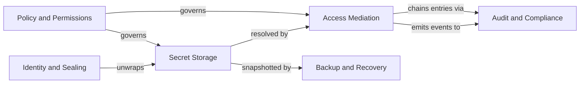
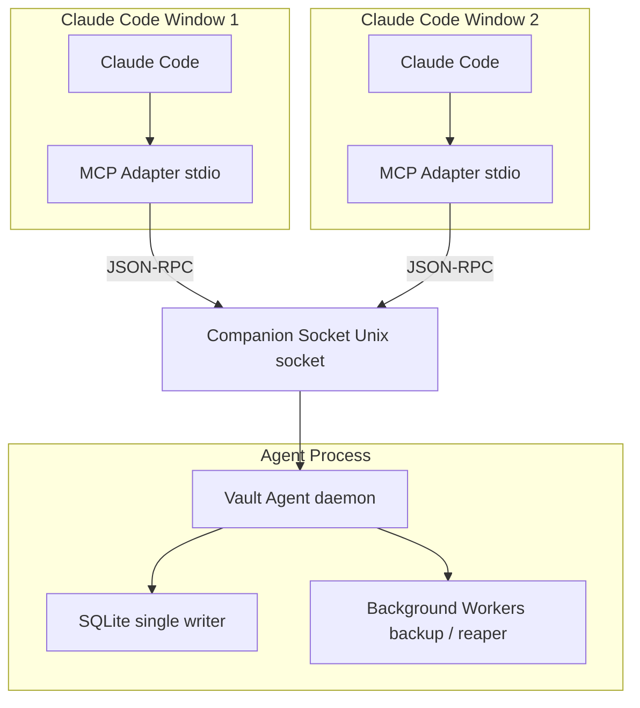

# Merkle

> The gate between context and credential. Every access leaves a hash.

[](#)
[](LICENSE)
[](https://blog.rust-lang.org/2025/02/20/Rust-1.85.0.html)
[](https://modelcontextprotocol.io/specification)

`Merkle` is a local-first MCP vault that mediates between LLM context and secret
storage. It issues opaque handles by default; plaintext only crosses the MCP
transport when the human operator explicitly authorizes a Reveal via slash command
and — for high-sensitivity secrets — Out-of-Band Confirmation.

The project is named after Ralph Merkle (Merkle puzzles 1974, Merkle trees), whose
constructions underpin the audit-chain integrity model.

> [!NOTE]
> **Status: Pre-alpha.** Architecture is fully specified; Rust implementation is in
> progress. See [`docs/arch/`](docs/arch/README.md) for the canonical specification
> (20 ADRs, 48 CUE schemas, 9 Gherkin features, 9 Rego policies, 43 SLO YAML, 2
> TLA+ models).

---

## Why Merkle?

| Property | What it means |
|:---|:---|
| **LLMs hold handles, not secrets** | The MCP transport sees `vault://acme/password/db-admin`, never the plaintext |
| **Operator approval for every Reveal** | No autonomous decryption by the LLM; slash command required |
| **OOB Confirmation for high-sensitivity material** | A separate channel (companion device, desktop notification, terminal prompt) signs every Reveal challenge with Ed25519 |
| **Tamper-evident audit log** | BLAKE3 hash chain with synchronously-pinned head; truncation, removal, and reordering are detectable |
| **Local-first** | No cloud dependency — SQLite + OS keychain + `age` backups |
| **Static binary** | One `cargo build --release`; zero runtime installation |

---

## Architecture at a glance

Six bounded contexts collaborate to keep secrets safe:



**Driving ports:** MCP Adapter (`rmcp` SDK), CLI Adapter (`clap`), Companion Socket
(axum over Unix domain socket).

**Driven ports:** Storage (SQLite WAL), Keychain (cross-OS via `keyring`), Crypto
(XChaCha20-Poly1305 + BLAKE3 + Argon2id + Ed25519 + X25519 + `age`), OOB Notifier.

**Process topology** — Vault Agent daemon + thin MCP Adapter per client window
(same pattern as `ssh-agent` and `gpg-agent`):



See [`docs/arch/README.md`](docs/arch/README.md) for the full architecture model,
bounded-context narratives, and the recommended reading order for newcomers.

---

## Quick start

### Prerequisites

- **Rust 1.85+** — install via [rustup](https://rustup.rs)
- **SQLite 3.35+** — bundled via `rusqlite` (no system install required)
- **OS keychain** — macOS login keychain, Linux Secret Service (GNOME Keyring or
  KWallet), or Windows Credential Manager. Headless/CI uses passphrase fallback.
- **Claude Code** with MCP support enabled

### Build

```sh
git clone https://gitlab.com/farchanjo/mcp-vault.git
cd mcp-vault
cargo build --release
# Binary at target/release/merkle
```

### Initialize the vault

```sh
merkle init
```

The interactive wizard walks through seven steps: database path, config path,
Security Profile (`relaxed` / `balanced` / `paranoid`), Master Key generation,
Recovery Key display and confirmation, and optional service registration.

> [!WARNING]
> The **Recovery Key** is displayed exactly once during `merkle init`. Record it
> offline immediately — printed document, offline password manager, or hardware
> security token. Without it, disaster recovery is impossible if the OS keychain
> is lost.

After init completes, verify the recovery key while the vault is still empty:

```sh
merkle verify-recovery-key
```

### Start the agent

If you chose not to register with the OS service manager during init:

```sh
merkle agent &
```

### Put your first secret

```sh
merkle put \
  --namespace personal \
  --category password \
  --name example \
  --value '{"password":"change-me"}' \
  --sensitivity low
```

### Pair a companion device (optional)

A Companion Device provides a cryptographically bound second factor for
`sensitivity=high` Reveals via Ed25519 signature:

```sh
merkle device pair
# Displays QR code + pairing code for the companion app
merkle device list   # confirm enrollment
```

See [`docs/arch/integrations/onboarding.md`](docs/arch/integrations/onboarding.md)
for the full enrollment ceremony and challenge signing protocol.

### Hook up Claude Code

Add the MCP server entry to `~/.claude.json`:

```json
{
  "mcpServers": {
    "merkle": {
      "command": "/usr/local/bin/merkle",
      "args": ["mcp"],
      "env": {
        "MERKLE_PROFILE": "balanced"
      }
    }
  }
}
```

Restart Claude Code or run `/mcp restart merkle`, then verify:

```
Ask Claude: "Call vault.doctor and show me the full result."
```

Expected: `"sealed": false` when the agent is running and unsealed.

> [!NOTE]
> For full slash command configuration (`/merkle-reveal`, `/merkle-show`,
> `/merkle-rollback`, `/merkle-doctor`) and the Operator Confirmation flow, see
> [`docs/arch/integrations/claude-code-wiring.md`](docs/arch/integrations/claude-code-wiring.md).

---

## Reveal model

Merkle enforces a two-flag authorization model for every `vault.reveal` call:

| Flag | Set by | Channel | Required for |
|:---|:---|:---|:---|
| `slash_command` | Claude Code client | MCP session context | All sensitivities |
| `oob_ack` | OOB Notifier | Distinct OS channel | `sensitivity=high` |

The LLM cannot set either flag through tool call arguments — both are injected by
independent channels outside the model's control. See
[ADR-0011](docs/arch/adr/0011-slash-only-reveal-with-oob-for-high-sensitivity.md)
for the full decision rationale and decision tree.

---

## Documentation

| Area | Location |
|:---|:---|
| Architecture overview | [`docs/arch/README.md`](docs/arch/README.md) |
| Canonical vocabulary | [`docs/arch/glossary.md`](docs/arch/glossary.md) |
| Decisions (20 ADRs) | [`docs/arch/adr/`](docs/arch/adr/) |
| Domain narratives (6 bounded contexts) | [`docs/arch/domain/`](docs/arch/domain/) |
| CUE schemas (48 types) | [`docs/arch/schemas/`](docs/arch/schemas/) |
| API contracts (OpenAPI + AsyncAPI) | [`docs/arch/integrations/`](docs/arch/integrations/) |
| Rego policies (9 files, 123 tests) | [`docs/arch/policies/`](docs/arch/policies/) |
| Acceptance scenarios (9 Gherkin features) | [`docs/arch/specs/features/`](docs/arch/specs/features/) |
| Threat model | [`docs/arch/threat-model/`](docs/arch/threat-model/) |
| SLOs (43 YAML) | [`docs/arch/slo/`](docs/arch/slo/) |
| Formal models (2 TLA+) | [`docs/arch/formal/`](docs/arch/formal/) |
| Operations + runbooks | [`docs/arch/operations/`](docs/arch/operations/) |
| Onboarding walkthrough | [`docs/arch/integrations/onboarding.md`](docs/arch/integrations/onboarding.md) |
| Claude Code wiring | [`docs/arch/integrations/claude-code-wiring.md`](docs/arch/integrations/claude-code-wiring.md) |

**Reading order for newcomers:** glossary → domain narratives → ADRs in numeric order
→ Structurizr workspace → CUE schemas → Rego policies → Gherkin features →
threat model → SLOs + operations.

---

## Development

### Common `just` commands

| Command | Description |
|:---|:---|
| `just build` | Compile all workspace crates in release mode |
| `just test` | Run the full test suite via `cargo nextest` |
| `just spec` | Run the spec validation gate (`spec validate --lane full`) |
| `just doctor` | Run `merkle doctor` against the local dev vault |
| `just lint` | `cargo clippy --all-targets --all-features` |
| `just fmt` | `cargo fmt --all -- --check` |

### Adding a new ADR

1. Copy `docs/arch/adr/0000-template.md` to `docs/arch/adr/NNNN-<slug>.md`.
2. Fill in `status: proposed`, `date`, `deciders`.
3. Complete all sections; link related ADRs in **More Information**.
4. Submit a merge request — the CI spec validation gate will verify the MADR
   structure automatically.

### Spec validation gate

Every code change touching a new behavior must update the corresponding artifact
under `docs/arch/` (CUE schema, Gherkin scenario, OpenAPI/AsyncAPI spec, ADR if
architectural). The `spec validate` gate enforces this in CI:

```sh
spec validate --lane fast    # ~1.5 s — CUE vet, DDD-role header, OpenAPI lint
spec validate                # ~10 s  — fast + Structurizr, markdownlint, format
spec validate --lane full    # CI     — full + Conftest (Rego), Vale, TLC (TLA+)
```

See [ADR-0018](docs/arch/adr/0018-full-coverage-validation-as-architectural-contract.md)
for the full validation contract.

---

## Security

See [SECURITY.md](SECURITY.md) for vulnerability reporting, response SLAs, and
scope.

Cross-reference: [`docs/arch/threat-model/`](docs/arch/threat-model/) for the STRIDE
model and trust boundary analysis.

---

## Contributing

See [CONTRIBUTING.md](CONTRIBUTING.md).

---

## License

Apache-2.0. See [LICENSE](LICENSE).
