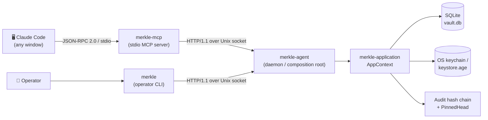
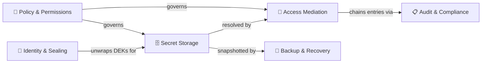
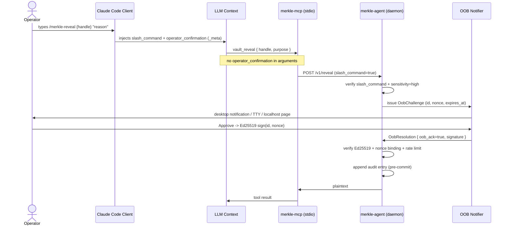
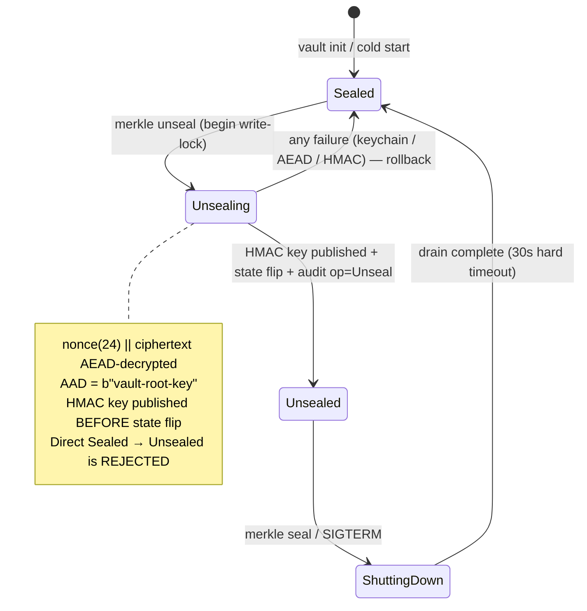
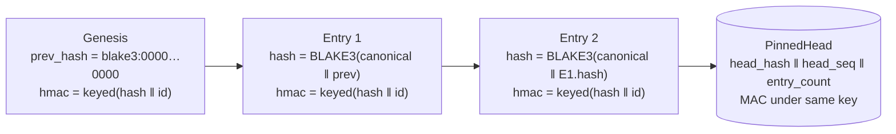

# 🔐 Merkle

> **The gate between context and credential. Every access leaves a hash.**

A **local-first MCP secret vault** that hands your LLM opaque *handles* — never plaintext. A human approves every reveal, and every access is written into a tamper-evident hash chain. 100% on your machine.

[](https://github.com/farchanjo/merkle)
[](LICENSE)
[](rust-toolchain.toml)
[](Cargo.toml)
[](docs/arch/integrations/claude-code-wiring.md)
[](#-development)
[-lightgrey)](#project-status)

---

## What is Merkle?

LLM coding agents are wonderful — until they need a secret. The moment a production password or an SSH key lands in the model's context window, it has been exfiltrated to a provider, cached in a transcript, and quite possibly logged. You can't un-send a secret.

**Merkle changes the contract.** Instead of giving the model a secret, you give it an opaque **handle** like `vault://acme/password/db-prod`. The model can *use* that handle — run an SSH command, make an HTTPS call, materialize a tempfile for a child process — but the plaintext is dereferenced inside a local daemon and **never crosses the MCP transport**. When plaintext genuinely must be revealed, a **human** approves it out-of-band, and the act is recorded forever.

Three guarantees hold it together:

1. 🪪 **The LLM holds handles, not secrets.** Proxy tools operate credentials; only filtered results return.
2. 🙋 **The human approves every reveal.** Authorization arrives over channels the model cannot reach.
3. 🔗 **Everything is audited in a tamper-evident hash chain.** Truncate or rewrite it and verification fails.

And it is **100% local** — a long-running daemon owns your keys, an SQLite database, and the audit chain. Nothing phones home.

> [!NOTE]
> **Why "Merkle"?** Named after **Ralph Merkle** — co-inventor of public-key cryptography (Merkle puzzles, 1974) and the inventor of **Merkle trees**. His hash-chaining idea is exactly what makes Merkle's audit log tamper-evident: each entry is bound to the hash of the one before it, so any edit anywhere shatters every link that follows.

---

## Why Merkle?

| Without a vault | 🔐 With Merkle |
|---|---|
| Secrets pasted into prompts leak to the provider, transcripts, and logs | The LLM only ever sees opaque **handles**; plaintext stays in the local daemon |
| The model can "decide" to read a secret | Every reveal needs an **operator confirmation** the model cannot forge |
| One leaked key = silent compromise | **High-sensitivity** secrets require **out-of-band (OOB)** human acknowledgment |
| No record of who accessed what, when | A **BLAKE3 hash chain** with a pinned head makes tampering detectable |
| Cloud secret managers, network round-trips, egress risk | **Local-first**: SQLite + OS keychain, Unix-socket IPC, no network dependency |
| Heavy runtimes and sidecars | Three small **static Rust binaries** — agent, CLI, MCP server |

---

## How it works

Merkle is built with **hexagonal architecture** (DDD + ports/adapters, per [ADR-0002](docs/arch/adr/0002-adopt-agent-plus-mcp-adapter-topology.md) / [ADR-0024](docs/arch/adr/0024-mcp-adapter-consumes-companion-socket-client.md)). The domain core never imports infrastructure.

The model is the same one you already trust from `ssh-agent` and `gpg-agent`: **a single long-running daemon owns all the dangerous state**, and everything else is a thin client that talks to it over a Unix domain socket.

### Process topology



> [!IMPORTANT]
> `merkle-mcp` and `merkle` **never link** the domain, storage, or keychain crates. They are thin clients of `merkle-companion-client`, which speaks HTTP/1.1 over the Unix socket — the **single inbound port**, called the **Companion Socket**.

### Six bounded contexts



| Bounded context | One-line role |
|---|---|
| **Identity & Sealing** | Owns the key hierarchy (MasterKey → VaultRootKey → NamespaceDEKs) and the sealed/unsealed state machine |
| **Secret Storage** | Models `Secret` aggregates with versioning, categories, sensitivity, and per-blob AEAD encryption |
| **Access Mediation** | Evaluates reveal/proxy requests; issues `UseToken`s; manages OOB confirmation and Companion Devices |
| **Audit & Compliance** | Maintains the tamper-evident BLAKE3 hash chain with an HMAC-keyed `PinnedHead` in SQLite |
| **Backup & Recovery** | Anacron-style scheduler; `age`-encrypted two-recipient exports; disaster-recovery restore plans |
| **Policy & Permissions** | Namespace policies, rate limits, reveal policies, cross-namespace access control, security profiles |

### Ports & adapters at a glance

- **One inbound (driving) port** — the **Companion Socket**: HTTP/1.1 over a Unix domain socket (~33 paths / 35 operations), peer-credential auth (same-UID only), 30 s per-request timeout, 8 MiB max body.
- **Five outbound (driven) ports** — `StoragePort`, `KeychainPort`, `CryptoPort`, `OobNotifierPort`, `ExternalServicesPort`, implemented by the SQLite, keychain, crypto, OOB, and external-services adapters.

See the full crate map in [Workspace layout](#workspace-layout).

---

## The Reveal model

This is the heart of Merkle's security story: **the LLM can never authorize its own reveal.** A reveal is gated by two independent flags — and the model controls neither (per [ADR-0011](docs/arch/adr/0011-slash-only-reveal-with-oob-for-high-sensitivity.md)).

| Flag | Set by | Channel | Required for |
|:---|:---|:---|:---|
| `slash_command` | Claude Code **client** | MCP session context — *not* tool arguments | **All** sensitivities |
| `oob_ack` | **OOB Notifier** | A distinct OS channel (desktop notification / TTY prompt / `localhost` confirm) | `sensitivity=high` (**AND** with `slash_command`) |

On top of those, `vault_reveal` and `vault_delete` consult a third independent signal: **operator confirmation** carried in the MCP `_meta` field under the key `dev.fapp.merkle/operator_confirmation` (MERK-001). The LLM controls only the tool `arguments` object; `_meta` is written by the client transport. `VaultRevealInput` and `VaultDeleteInput` deliberately have **no** `operator_confirmation` field — so a model that tries to set it through arguments achieves nothing.

> [!WARNING]
> Prompt injection cannot forge any of these. `slash_command` comes from the client's turn parser, `oob_ack` requires a *physical action on a separate OS channel*, and `operator_confirmation` must be JSON boolean `true` in `_meta`. A string `"true"` or any other shape evaluates to `false`.

### High-sensitivity reveal, end to end



For low/medium sensitivity the OOB step is skipped; only `slash_command` (and operator confirmation) is needed. If OOB is required but not yet acknowledged, the agent returns `{ "oob_pending": true, "oob_channel": ..., "expires_at": ..., "request_nonce": ... }` and the caller re-issues after acknowledgment.

> [!TIP]
> For proxy operations, prefer **`vault_use`** over `vault_reveal`. It mints a 256-bit, single-use **UseToken** (default TTL 60 s) that a consumer tool (`vault_ssh_exec`, `vault_spawn`, `vault_write_tempfile`, …) dereferences internally. The plaintext never appears in the MCP response at all — the model sees only the token and the command's output.

---

## Seal & unseal lifecycle

On a cold start the vault is **Sealed** — the Vault Root Key (VRK) is not in memory, and every read/write is rejected. Unsealing loads and decrypts the VRK; sealing zeroes it.



**Unseal order of operations:** acquire write-lock → read the `vrk-master-v1` blob from the keychain → AEAD-decrypt it (AAD `b"vault-root-key"`) → derive the audit HMAC key `BLAKE3_keyed(vrk_bytes, b"merkle vault hmac key v1")` → **publish the HMAC key before** flipping state to `Unsealed` → append an `op=Unseal` entry. Any failure between the read and the publish rolls back to `Sealed`.

---

## Audit hash chain

Every operation on a secret is recorded in an append-only, tamper-evident chain — Ralph Merkle's hash chaining, applied to your audit log.



- **Unkeyed hash:** `current_hash = BLAKE3(canonical_fields || prev_hash)` — edit any entry and every later hash diverges.
- **Keyed HMAC:** `hmac = BLAKE3_keyed(hmac_key, current_hash || id_uuid)` — the key is derived from VRK bytes at unseal time and never persisted separately.
- **PinnedHead** (a single SQLite row) binds the chain tip under the same key, defeating *truncate-then-rebuild* attacks.
- `ChainVerifier::verify_full` reports precise rejection outcomes: `GenesisAnchorMissing`, `BrokenAtEntry`, `HmacMismatch`, `MissingHmac`, `HeadMacMismatch`, `TruncationDetected`, `HeadHashMismatch`, and more.

> [!NOTE]
> A hash-only `Intact` result (when no key is available) is **not** full tamper-evidence — `hmac_checked` must be `true` for cryptographic assurance. Audit entries and the pinned head are persisted in **SQLite** (`pinned_head` table); the `audit.jsonl` / `audit_head.json` config paths are [ADR-0009](docs/arch/adr/0009-merkle-style-audit-hash-chain.md) amendment drift, not the live persistence path.

---

## Crypto & security

### Primitives

| Primitive | Crate | Purpose |
|:---|:---|:---|
| XChaCha20-Poly1305 | `chacha20poly1305` | Per-blob AEAD encryption (24-byte nonce, 16-byte tag) |
| BLAKE3 hash + keyed | `blake3` | Audit hash chain integrity, HMAC substitute, KDF (XOF) |
| Argon2id (RFC 9106) | `argon2` | Passphrase KDF — floor `m_cost≥65536`, `t_cost≥3`, `p_cost≥1` |
| age / X25519 | `age` 0.11 | Two-recipient backup encryption + file keystore (scrypt `log_n` pinned at 18) |
| Ed25519 | `ed25519-dalek` | OOB resolution signatures, operator attestation JWTs |
| X25519 ECIES | `x25519-dalek` | OOB challenge payload encryption ([ADR-0019](docs/arch/adr/0019-ecies-encryption-for-oob-challenge-payload.md)) |
| OsRng | `rand` 0.10 | All key/nonce generation — entropy gate `assert_entropy_gate()` |

No OpenSSL. All primitives are pure-Rust (`openssl`/`openssl-sys`/`git2` are banned in `deny.toml`).

### Key guarantees

- **Zeroize:** `MasterKey`, `VaultRootKey`, `NamespaceDek`, and `PrivateBlob` are zeroed on drop; `Debug` redacts to `[REDACTED]`; `MasterKey::clone()` deliberately does **not** copy key bytes.
- **SSRF / DNS-rebind defense:** `DestinationPolicy::strict()` rejects non-HTTPS, loopback, link-local (incl. the `169.254.x.x` cloud-metadata IP), private, CGNAT, multicast, and IPv6 ULA/link-local — *before* attaching credentials. `ValidatingDnsResolver` re-applies the same check at connect-time to close the TOCTOU gap, failing closed.
- **Peer-credential socket auth (GAP-007):** parent dir forced `0700`, umask `0177` during bind, explicit `chmod 0600` on the socket. macOS uses `LOCAL_PEERCRED`, Linux uses `SO_PEERCRED` + `/proc/<pid>/exe`; same-UID only, verified on **every** request.
- **Security profiles** (`[security] security_profile`):

  | Profile | OOB requirement | Idle timeout | mlock |
  |:---|:---|:---|:---|
  | `relaxed` | None | Configurable | Optional |
  | `balanced` *(default)* | `sensitivity=high` | 30 min (1800 s) | Recommended |
  | `paranoid` | All sensitivities | 5 min | Required |

- **Backup invariant ([ADR-0006](docs/arch/adr/0006-age-encryption-for-backups-and-recovery.md)):** exactly two distinct age recipients (MasterPubkey + RecoveryPublicKey), `secret_count > 0`, **encrypt-then-MAC** (BLAKE3 keyed MAC over the age ciphertext). Filename `merkle-bk-<utc-iso8601>.merkle.age`.
- **Release invariant:** `panic = "abort"` — no unwinding past a poisoned/invariant-violated state. Never change it.

Full analysis lives in the [STRIDE threat model](docs/arch/threat-model/stride-analysis.md) and [SECURITY.md](SECURITY.md).

---

## 🚀 Quick start

### Prerequisites

- Rust **1.89**, MSRV **1.89** (pinned via `rust-toolchain.toml`)
- Linux build deps: `libsqlite3-dev pkg-config libdbus-1-dev` (`libdbus-1-dev` is needed by the `keyring` Secret Service backend)
- macOS / Windows: just the Rust toolchain (SQLite is bundled)

### Build

```bash
git clone https://github.com/farchanjo/merkle.git
cd merkle
cargo build --release        # produces target/release/{merkle, merkle-agent, merkle-mcp}
```

### Start the agent

The daemon must be running **before** you initialize — `merkle init` sends the init ceremony over the Companion Socket, so the agent has to be up to receive and execute it.

```bash
cargo run -p merkle-agent    # dev mode (or: make agent)
```

On macOS, you'll normally run the agent as a per-user LaunchAgent — see [LaunchAgent setup](#-development) and the assets in `deploy/launchd/`.

> [!NOTE]
> **Headless / file-backend setup.** When the OS keychain is unavailable (CI, headless Linux, or unsigned dev binaries on macOS), the `auto` keystore probe fails and falls back to the **file** backend, which refuses to start unless these are set first:
> ```bash
> export MERKLE_KEYSTORE_PATH=~/.local/share/merkle/keystore.age
> export MERKLE_KEYSTORE_PASSPHRASE='<a-strong-passphrase>'
> export MERKLE_RECOVERY_RECIPIENT='age1…'   # a REAL recipient, not a placeholder
> ```

### Initialize the vault

```bash
merkle init                  # generates the vault and prints the Recovery Key ONCE
```

> [!WARNING]
> **`merkle init` prints your Recovery Key exactly once.** It is an `age1…` recipient that can decrypt your backups if the keychain is lost. **Write it down and store it offline now** — it is never displayed again, and there is no way to recover it. Verify it later with `merkle verify-recovery-key`.

### Unseal and confirm

```bash
merkle unseal                # load the Vault Root Key into protected memory
merkle status                # confirm sealed=false
```

### Put your first secret

```bash
merkle bind acme             # create + bind the "acme" namespace

# Medium-sensitivity API token
echo -n "ghp_supersecrettoken" | merkle put vault://acme/token/github-pat \
  --sensitivity medium --tag project:my-app --tag role:ci \
  --description "GitHub PAT for CI"

# High-sensitivity password (an env:* tag is REQUIRED, --expose forbidden)
echo -n "hunter2" | merkle put vault://acme/password/db-prod \
  --sensitivity high --tag env:prod --tag role:backend
```

### Wire up Claude Code

Add this to `~/.claude.json`:

```json
{
  "mcpServers": {
    "merkle": {
      "command": "/usr/local/bin/merkle-mcp",
      "args": []
    }
  }
}
```

Then restart Claude Code (or run `/mcp restart merkle`) and verify by asking Claude:

> *"Call `vault_doctor` and show me the full result."*

You should see `"sealed": false`. You're connected.

| Optional env var | Default | Purpose |
|---|---|---|
| `MERKLE_SOCKET` | auto-discovered | Override the Companion Socket path |
| `MERKLE_LOG` | `info` | stderr log level |

---

## 🔧 CLI reference

The `merkle` binary is the operator CLI. It talks only to the running `merkle-agent` over the Companion Socket and never touches keys or storage directly.

**Global flags** (on every subcommand):

| Flag | Env var | Default | Purpose |
|---|---|---|---|
| `--socket <PATH>` | `MERKLE_SOCKET` | platform default | Override the Companion Socket path |
| `--output <FORMAT>` / `-o` | — | `human` | `human`, `json`, or `plain` |

**Lifecycle**

| Command | What it does |
|---|---|
| `merkle init [--non-interactive]` | First-run ceremony — generates the vault, prints the Recovery Key **once**. `--non-interactive` suppresses the TTY prompt (CI). |
| `merkle unseal [--passphrase]` | Load the VRK into memory (Sealed → Unsealed). `--passphrase` reads from TTY instead of the OS keychain. |
| `merkle seal` | Zeroize the VRK (Unsealed → Sealed). |
| `merkle status` | Agent health, seal state, version. |

**Namespaces & secrets**

| Command | What it does |
|---|---|
| `merkle bind <namespace_label>` | Bind a namespace to the session (creates it if absent). Required before `put`/`list`/`get`. |
| `merkle put <handle> [flags]` | Create or overwrite a secret (reads plaintext from stdin). |
| `merkle list [<namespace>] [flags]` | List secrets (`--filter`, `--category`, `--sensitivity`, `--limit`, default 50). |
| `merkle get <handle> [--reason <text>]` | Fetch a single-use access token (no plaintext) for low/medium secrets. |
| `merkle describe <handle>` | Show read-only public metadata (category, sensitivity, tags, versions). |
| `merkle reveal <handle> --reason <text>` | Reveal plaintext. Triggers OOB for `high` secrets; prints a re-run hint if OOB is pending. |
| `merkle rotate <handle> [--purpose <text>] [--base64]` | Rotate the active value (new payload from stdin; version number strictly increases). |
| `merkle delete <handle> --confirm` | Permanently delete a secret and all versions. `--confirm` is required. |
| `merkle search <namespace> <query> [--limit N]` | FTS5 full-text search (default limit 20). |

**`put` flags**

| Flag | Default | Notes |
|---|---|---|
| `--sensitivity <low\|medium\|high>` | `medium` | `high` requires at least one `--tag env:*` and forbids `--expose` |
| `--tag <KEY:VALUE>` | — | Repeatable. Allowed keys: `env`, `project`, `role`, `provider`, `team` |
| `--category <note\|ssh\|password\|token\|...>` | `note` | **Immutable** after creation |
| `--description <text>` | — | Public metadata note |
| `--force` | false | Overwrite an existing secret of the same name |
| `--base64` | false | Treat stdin as Base64 binary (SSH keys, TLS certs, JWK blobs) |

Handle format: `vault://<namespace>/<category>/<name>` or the short form `<namespace>/<cat>/<name>`.

**Audit, backup, restore, devices, diagnostics**

| Command | What it does |
|---|---|
| `merkle audit [--op <type>] [--since <iso8601>] [--limit N]` | Query the append-only audit log (default limit 50). |
| `merkle backup now [--note <text>]` | Trigger an on-demand backup. |
| `merkle backup list [<namespace>] [--limit N]` | List backup snapshots (default limit 20). |
| `merkle restore plan <backup_id> [--mode <newest_wins\|merge>]` | Preview a restore plan (dry run). |
| `merkle restore execute <plan_id>` | Apply a previously created restore plan. |
| `merkle device pair --name <name> --class <hw\|enclave\|software>` | Pair a Companion Device; prints the pairing code. |
| `merkle device list` | List enrolled Companion Devices. |
| `merkle device revoke <device_id>` | Revoke a Companion Device. |
| `merkle verify-recovery-key [--identity-file <PATH>]` | Verify the stored Recovery Key against `recovery_pubkey`. Reads from TTY (echo off) by default. |
| `merkle doctor [--durability] [--chain] [--all]` | Self-diagnostics. `--chain` verifies the audit hash chain; `--all` runs every check. |

> [!TIP]
> Append `-o json` to any command for machine-parseable output suitable for `jq` pipelines.

---

## 🧰 MCP tools & prompts

`merkle-mcp` is a thin stdio MCP server (rmcp 1.8). One process per Claude Code window; it proxies all calls to the daemon and never imports domain or storage code. It exposes **30 tools** and **4 prompts**.

| Group | Tools |
|---|---|
| **Identity** (3) | `vault_unseal` · `vault_seal` · `vault_bind` |
| **Secrets** (8) | `vault_put` · `vault_get` · `vault_list` · `vault_describe` · `vault_rotate` · `vault_delete` · `vault_search` · `vault_history` |
| **Reveal** (1) | `vault_reveal` ⚠️ requires operator confirmation |
| **Use-token** (4) | `vault_use` · `vault_write_tempfile` · `vault_write_fifo` · `vault_revoke_tempfile` |
| **Proxy** (10) | `vault_ssh_exec` · `vault_ssh_copy` · `vault_ssh_port_forward` · `vault_ssh_shell`\* · `vault_http_request` · `vault_http_download` · `vault_http_upload` · `vault_spawn` · `vault_crypto_sign` · `vault_crypto_decrypt` |
| **Audit** (1) | `vault_audit_query` |
| **Backup** (2) | `vault_backup` · `vault_restore` |
| **Diagnostics** (1) | `vault_doctor` |

> \* `vault_ssh_shell` is wired but the daemon returns HTTP 501 (interactive PTY not yet implemented). Use `vault_ssh_exec` for non-interactive commands.

**4 prompts** — surface in Claude Code as `/mcp__merkle__<name>` ([ADR-0028](docs/arch/adr/0028-mcp-prompts-for-slash-commands.md)):

| Prompt | Maps to | Operator confirmation? |
|---|---|---|
| `merkle-doctor` | `vault_doctor` | No |
| `merkle-show` | `vault_describe` | No |
| `merkle-reveal` | `vault_reveal` | **Yes** |
| `merkle-rollback` | `vault_history` + `vault_rotate` | **Yes** |

Every session should start with `vault_bind { label }` (at most once per session, two-phase commit per [ADR-0026](docs/arch/adr/0026-idempotent-bind-and-session-state-atomicity.md)). The `cwd_hash` is derived internally from BLAKE3 of the working directory and never crosses the transport. Full details in the [Claude Code wiring guide](docs/arch/integrations/claude-code-wiring.md).

---

## 📚 Documentation

The spec **is** the source of truth — `docs/arch/` gates every change via `spec validate`.

| Area | Path | Contents |
|---|---|---|
| Architecture overview | [docs/arch/README.md](docs/arch/README.md) | DDD + hexagonal stack, directory layout |
| Glossary | [docs/arch/glossary.md](docs/arch/glossary.md) | Canonical vocabulary by bounded context |
| ADRs (28) | [docs/arch/adr/](docs/arch/adr) | MADR decision records `0001`–`0028`, all accepted |
| Domain narratives | [docs/arch/domain/](docs/arch/domain) | Bounded-context models and invariants |
| CUE schemas (50) | [docs/arch/schemas/](docs/arch/schemas) | Type contracts for DTOs and categories |
| Rego policies (18) | [docs/arch/policies/](docs/arch/policies) | Conftest policy gates |
| Gherkin features (15) | [docs/arch/specs/features/](docs/arch/specs/features) | Acceptance scenarios (Cucumber) |
| Threat model | [docs/arch/threat-model/](docs/arch/threat-model) | STRIDE, trust boundaries, attack surface |
| SLOs (43) | [docs/arch/slo/](docs/arch/slo) | OpenSLO service-level objectives |
| Formal models (2) | [docs/arch/formal/](docs/arch/formal) | TLA+ specs (TLC-checked in the full lane) |
| Integrations | [docs/arch/integrations/](docs/arch/integrations) | Companion Socket OpenAPI, Claude Code wiring, onboarding |
| C4 model | [docs/arch/architecture/workspace.dsl](docs/arch/architecture/workspace.dsl) | Structurizr workspace |

> **Reading order for newcomers:** [docs/arch/README.md](docs/arch/README.md) → [glossary](docs/arch/glossary.md) → [ADR-0002](docs/arch/adr/0002-adopt-agent-plus-mcp-adapter-topology.md) → 0021 / 0024 / 0026 / 0028 → `crates/merkle-application/src/commands/` → the Companion Socket OpenAPI.

---

## 🧪 Development

### First 5 minutes

```bash
cargo build --workspace                               # debug build (fast)
cargo test --workspace --no-fail-fast                 # ~753 pass / 0 fail / ~18 ignored
cargo clippy --workspace --all-targets -- -D warnings # lint (mirrors CI)
~/bin/spec validate                                   # medium lane — must stay 9/9 green
make doctor                                           # check + clippy + test (no spec lane; `make doctor-full` adds it)
```

### `make` targets

Run `make help` for the full self-documented list (build, deploy/codesign, launchd targets included).

| Target | Command(s) | Notes |
|---|---|---|
| `make build` / `make build-release` | `cargo build --workspace [--release]` | Debug / optimized |
| `make check` | `cargo check --workspace --all-targets` | Fast type-check |
| `make test` / `make test-fast` | `cargo test --workspace [--lib --bins]` | Full / skip doc tests |
| `make lint` | `cargo clippy --workspace --all-targets -- -D warnings` | CI gate |
| `make fmt` / `make fmt-check` | `cargo fmt --all [--check]` | Format / dry-run |
| `make deny` / `make audit` | `cargo deny check` / `cargo audit` | License+bans / advisories |
| `make cov` | `cargo llvm-cov --workspace --html` | HTML report |
| `make spec-fast` / `make spec-medium` / `make spec` | `~/bin/spec validate [--lane …]` | 4 / 9 / 14 validators |
| `make doctor` | check + clippy + test | One-shot health gate (no spec lane — run `~/bin/spec validate` separately) |
| `make doctor-full` | doctor + `spec` | doctor plus the full spec lane in one shot |
| `make agent` | `cargo run -p merkle-agent` | Start daemon (dev) |
| `make cli ARGS=…` | `cargo run -p merkle-cli -- <args>` | Run the CLI |
| `make deploy` | build-release → sign → install → kickstart | macOS-only, one-shot release deploy |

### Spec lanes

The spec gate enforces spec-as-source-of-truth per [ADR-0018](docs/arch/adr/0018-full-coverage-validation-as-architectural-contract.md).

| Lane | Command | Time | Validators | Usage |
|---|---|---|---|---|
| **fast** | `make spec-fast` | ~1.5 s | 4: `lint_cue`, `lint_ddd_role`, `lint_openapi`, `lint_features` | Quick sanity during dev |
| **medium** *(default)* | `make spec-medium` | ~10 s | 9: fast + `lint_structurizr`, `lint_md`, `lint_mermaid`, `lint_madr`, `lint_yaml` | **Must stay 9/9 green** |
| **full** | `make spec` | ~60 s | 14: medium + `lint_conftest`, `lint_vale`, `lint_slo`, `lint_asyncapi`, `run_tlc` | **CI merge gate** |

Every behavioral change must update `docs/arch/` in the **same commit** as the code. Spec artifacts are **locked** — fix the code or the spec to comply, never the validator config.

### Test taxonomy

| Tier | How to run | Notes |
|---|---|---|
| **Unit** | `cargo test --workspace --lib` | `#[cfg(test)]` inline |
| **Integration** | `cargo test --workspace` | Per-crate `tests/`, real or mock adapters |
| **BDD** | `cargo test -p merkle-bdd` | Cucumber; exits 0 even on pending scenarios |
| **E2E** | `cargo build --bins && cargo test -p merkle-e2e -- --ignored` | Spawns the agent against a temp dir; all `#[ignore]` |
| **Live smoke** | `cargo test -p merkle-cli -- --include-ignored` (etc.) | All `#[ignore]`; need a running unsealed daemon or env setup |

> [!NOTE]
> `cli_smoke` needs `--include-ignored` (not `--ignored`) **and** a running, unsealed daemon; its socket path is `$TMPDIR/merkle/companion.sock`, different from the production default.

### Workspace layout

**22 members — 19 library crates + 3 binaries.** Edition 2024, resolver 3, MSRV 1.89.

<details>
<summary><strong>Foundation &amp; domain</strong></summary>

| Crate | Role |
|---|---|
| `merkle-types` | Shared value objects (`Handle`, `Sensitivity`, `UuidV7`, `Blake3Hash`, `AuditOp`, …). Zero infra deps. |
| `merkle-domain-identity` | Identity & Sealing — `VaultIdentity`, `MasterKey`, `VaultRootKey`, `SealedState`, `UnsealProtocol` |
| `merkle-domain-secret-storage` | Secret Storage — `Secret`, `SecretVersion`, `Namespace`, `PrivateBlob`, `RetentionPolicy` |
| `merkle-domain-access-mediation` | Access Mediation — `RevealRequest`, `UseToken`, `Tempfile`, `Fifo`, `OobChallenge`, `decision::evaluate` |
| `merkle-domain-audit-compliance` | Audit & Compliance — `AuditEntry`, `AuditLog`, `PinnedHead`, `ChainVerifier` |
| `merkle-domain-backup-recovery` | Backup & Recovery — `Backup`, `BackupScheduler`, `RestorePlanner`, `AnacronState` |
| `merkle-domain-policy-permissions` | Policy & Permissions — `NamespacePolicy`, `RevealPolicy`, `RateLimit`, `PolicyEvaluator` |

</details>

<details>
<summary><strong>Ports, adapters, client, application &amp; binaries</strong></summary>

| Crate | Role |
|---|---|
| `merkle-ports` | Pure trait definitions: `StoragePort`, `KeychainPort`, `CryptoPort`, `OobNotifierPort`, `ExternalServicesPort` |
| `merkle-adapter-sqlite` | sqlx + SQLite WAL; per-blob AEAD, FTS5, append-only audit triggers, `pinned_head` |
| `merkle-adapter-keychain` | Cross-OS keychain (`keyring`, service `dev.fapp.merkle`); file-backed `age` keystore fallback |
| `merkle-adapter-crypto` | `RustCryptoAdapter`: XChaCha20-Poly1305, BLAKE3, Argon2id, age, Ed25519, X25519 ECIES |
| `merkle-adapter-oob` | OOB confirmation (desktop / TTY / localhost); verifies Ed25519 `OobResolution` |
| `merkle-adapter-external-services` | SSH exec + HTTP (reqwest/rustls) with SSRF/DNS-rebind guard |
| `merkle-adapter-companion-socket` | axum HTTP/1.1 over Unix socket — the sole inbound port. ⚠️ Only crate that relaxes `unsafe_code` to `deny` and `missing_docs` to `allow` |
| `merkle-adapter-mcp` | rmcp MCP server: 30 tools + 4 prompts. Depends on `merkle-companion-client`, **not** the domain |
| `merkle-companion-client` | Reusable HTTP/1.1-over-Unix-socket client (hyper + custom `UnixConnector`) |
| `merkle-application` | Use-case orchestration: `AppContext`, command + query handlers. Imports zero infrastructure |
| `merkle-bdd` | Cucumber acceptance harness; loads 15 `.feature` files |
| `merkle-e2e` | Black-box E2E; spawns `merkle-agent`; all `#[ignore]` |
| `bin/merkle-agent` → `merkle-agent` | Daemon / composition root |
| `bin/merkle-cli` → `merkle` | Operator CLI |
| `bin/merkle-mcp` → `merkle-mcp` | Thin stdio MCP server |

</details>

### Lint baseline

The lint config is **locked** — never edit `[workspace.lints]`, `clippy.toml`, or `rust-toolchain.toml`. Fix code to comply.

| Rule | Level | Scope |
|---|---|---|
| `clippy::all` / `clippy::pedantic` | `deny` (prio -1) | workspace |
| `unsafe_code` | `forbid` | workspace (except `merkle-adapter-companion-socket`: `deny`) |
| `missing_docs` | `warn` | workspace (except `merkle-adapter-companion-socket`: `allow`) |
| `unused_must_use` | `deny` | workspace |

Commits follow Angular `<type>(<scope>): <subject>`; never commit all files at once; DCO sign-off required (`git commit -s`).

---

## 🛡️ Security

Found a vulnerability? Please read **[SECURITY.md](SECURITY.md)** for the disclosure process. The full threat analysis (STRIDE, trust boundaries, attack surface) lives in [docs/arch/threat-model/](docs/arch/threat-model).

## 🤝 Contributing

Contributions welcome — see **[CONTRIBUTING.md](CONTRIBUTING.md)** and the **[Code of Conduct](CODE_OF_CONDUCT.md)**. Every behavioral change must update the spec in `docs/arch/` in the same commit, and all local gates (`build`, `clippy -D warnings`, `cargo deny`, `spec validate` medium 9/9) must be green.

## 📄 License

Licensed under the **Apache License 2.0** — see [LICENSE](LICENSE).

---

## Project status

Merkle is **implemented and green**, **pre-1.0**. The full 22-crate workspace is built out; all local gates pass — `cargo build`, `cargo clippy -D warnings`, `cargo deny`, and the medium spec lane (9/9 validators) — with **~753 tests passing / 0 failing** (plus ~18 `#[ignore]` E2E and live-smoke tests). Current version is **0.1.0 (unreleased)**. APIs and the on-disk format may still change before 1.0.
