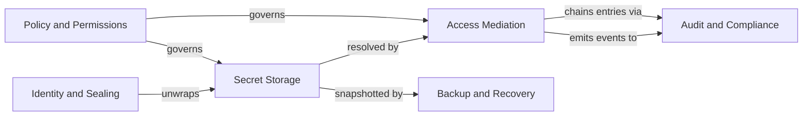

# Merkle Architecture

`Merkle` is a local-first MCP vault that mediates between LLM
context and secret storage. It issues opaque handles by default
and operates secrets through proxy tools so plaintext never crosses
the MCP transport unless the human operator explicitly authorizes
a Reveal.

The project name honors Ralph Merkle, whose Merkle puzzles (1974)
and Merkle trees underpin the audit-chain integrity model used
here.

## Tagline

> The gate between context and credential. Every access leaves a
> hash.

## Architecture stack

- **Strategic DDD** — six bounded contexts (see below) parallel
  across `schemas/`, `policies/`, `specs/features/`, `domain/`.
- **Tactical DDD** — closed roles: `AggregateRoot`, `Entity`,
  `ValueObject`, `DomainService`, `ReadModel`.
- **Hexagonal** — domain core never imports infrastructure.
  Driving port: Companion Socket (the single inbound port hosted
  by the Vault Agent). The MCP Adapter and CLI Adapter are external
  clients that consume the Companion Socket as a driving port; they
  are not ports themselves.
  Driven ports: Storage, Keychain, Crypto, OOB Notifier,
  External Services.
- **GoF** — descriptive naming only; never CI-enforced.

## Bounded contexts



## Directory layout

```text
docs/arch/
├── glossary.md                       canonical vocabulary
├── .specconfig.yml                   per-project overrides
├── README.md                         this file
├── cue.mod/module.cue                CUE module declaration
│
├── architecture/
│   └── workspace.dsl                 Structurizr C4 model
│
├── adr/                              MADR 4.0 decision records
│   └── 0001-..-NNNN-*.md
│
├── schemas/                          CUE domain types
│   ├── identity_and_sealing/
│   ├── secret_storage/
│   │   └── categories/               per-category schemas
│   ├── access_mediation/
│   ├── audit_compliance/
│   ├── backup_recovery/
│   └── policy_permissions/
│
├── policies/                         Conftest + Rego policy gates
│   └── *.rego
│
├── specs/features/                   Gherkin scenarios
│   └── *.feature
│
├── domain/                           narrative MD per context
│   └── *.md
│
├── slo/                              service-level objectives
├── threat-model/                     STRIDE + trust boundaries
├── integrations/                     external interface contracts
├── operations/                       deployment + runbooks
└── formal/                           TLA+ specs (optional)
```

## Validation lanes

- **fast** (`spec validate --lane fast`, ~1.5 s) — CUE vet,
  DDD-role header, OpenAPI lint, Gherkin syntax.
- **medium** (`spec validate`, default, ~10 s) — fast plus
  Structurizr syntax, markdownlint, format check.
- **full** (`spec validate --lane full`, CI lane, minutes) —
  medium plus Conftest (Rego), Vale (prose), TLC (formal).

## Reading order for newcomers

1. `glossary.md` — get the vocabulary right.
2. `domain/*.md` — narrative description of each bounded context.
3. `adr/0001-*.md` onward — read decisions in order; they reveal
   the design rationale.
4. `architecture/workspace.dsl` — render with `spec render` to view
   C4 diagrams.
5. `schemas/**/*.cue` — formal type definitions.
6. `policies/*.rego` — runtime constraints.
7. `specs/features/*.feature` — acceptance scenarios.
8. `threat-model/*.md` — adversary view.
9. `slo/*.md`, `operations/*.md`, `integrations/*.md` — operational
   plane.

## Schema index

See [schemas/README.md](schemas/README.md) for the full CUE catalog.

## Functional overview

See [functional/product-overview.md](functional/product-overview.md).
