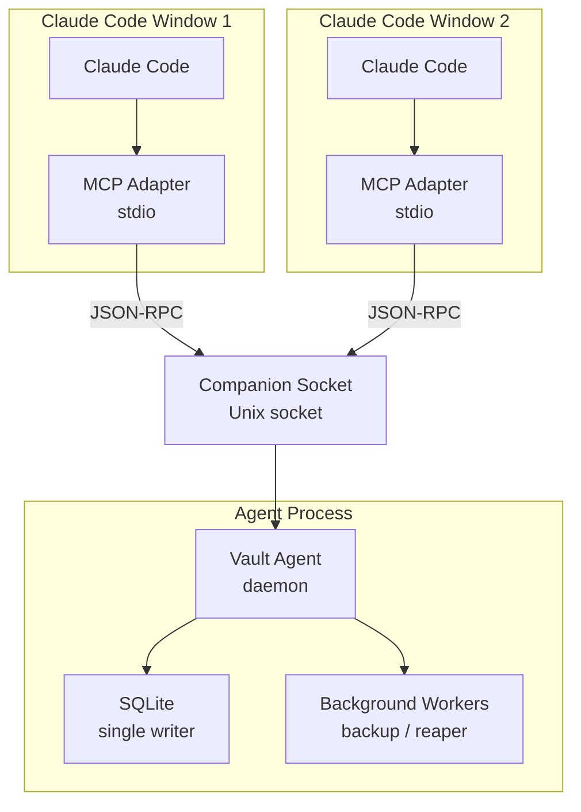

# 0002. Adopt Agent + MCP Adapter Topology

## Context and Problem Statement

Merkle must expose MCP tools to one or more Claude Code windows that
may open and close independently throughout the day, while keeping the
Vault Root Key unsealed in memory across those windows without
requiring the operator to re-enter a passphrase on every new session.
SQLite must be written to by only one process at a time to avoid WAL
corruption. Background workers (backup scheduler, idle-trigger
detector, tempfile reaper) must run continuously regardless of whether
any MCP client is connected.

A naive design where each Claude Code window spawns its own MCP
process that directly reads the SQLite database and manages its own
key material leads to multiple concurrent writers, multiple unseal
prompts, and background workers that terminate when the client window
closes.

## Decision Drivers

* Single unseal prompt per user session, regardless of how many
  Claude Code windows are open.
* Serialized SQLite writes: only one writer at a time to prevent WAL
  corruption without resorting to external locking.
* Background workers (backup scheduler, idle-trigger, tempfile reaper)
  survive client window closures.
* MCP adapter processes are cheap, short-lived, and easy to restart
  without disrupting ongoing operations.
* Companion Socket protocol allows child processes (spawned via
  `vault.spawn`) to resolve Use Tokens without going through the MCP
  transport.
* Well-understood operational model: `ssh-agent`, `gpg-agent`, and
  1Password agent all use the same pattern; operators already know
  how to inspect socket paths and restart daemons.

## Considered Options

* Option A: Vault Agent daemon + thin MCP Adapter process per client
* Option B: Single monolithic MCP server process per client window
* Option C: Single long-lived MCP server shared across all windows

## Decision Outcome

Chosen option: "Option A: Vault Agent daemon + thin MCP Adapter
process per client", because it cleanly separates the lifecycle of
key material (long-lived daemon) from the lifecycle of client
connections (short-lived adapters), enforces serialized writes
through a single writer, and allows background workers to run
continuously.

### Consequences

* Good, because the operator unseals once; all subsequent MCP
  sessions inherit the already-unsealed Vault Root Key from the
  agent.
* Good, because SQLite WAL mode with a single writer eliminates
  concurrent-write corruption entirely.
* Good, because background workers (backup scheduler, idle-trigger,
  tempfile reaper) run independently of any client window lifecycle.
* Good, because the MCP Adapter is a thin translation layer with no
  crypto responsibilities; it can be updated, crashed, or replaced
  without touching the agent.
* Good, because the Companion Socket allows auxiliary consumers
  (spawned subprocesses, shell integrations) to resolve Use Tokens
  without going through the MCP transport.
* Bad, because the agent adds a background process that the operator
  must be aware of (`merkle status`, `merkle stop`).
* Bad, because the Companion Socket introduces a local IPC boundary
  that must be authenticated (PID check, process name allowlist).

## Pros and Cons of the Options

### Option A: Vault Agent daemon + thin MCP Adapter process per client

* Good: single unseal; key material held in exactly one process.
* Good: serialized SQLite writes; no WAL corruption risk.
* Good: background workers survive client closure.
* Good: matches `ssh-agent` / `gpg-agent` / 1Password agent patterns.
* Bad: one extra background process; socket path management required.

### Option B: Single monolithic MCP server process per client window

* Good: simplest process model; no IPC required.
* Bad: each Claude Code window would need a separate unseal; two open
  windows means two independent key-holding processes.
* Bad: no mechanism for serialized writes without external locking.
* Bad: background workers terminate when the window closes; backup
  scheduler is unreliable.
* Bad: Companion Socket feature would require a second long-lived
  process anyway, recreating the agent topology.

### Option C: Single long-lived MCP server shared across all windows

* Good: single process, single writer.
* Bad: Claude Code expects to spawn MCP servers via stdio on demand;
  a shared persistent MCP server violates the stdio lifecycle
  contract of the MCP specification.
* Bad: no standard mechanism for multiple Claude Code windows to
  multiplex onto a single stdio server.

## Validation

* Integration test: two MCP adapter processes connect simultaneously;
  confirm that the second detects the running agent (via socket
  presence) rather than attempting its own unseal.
* Load test: 100 concurrent tool calls across two adapters; confirm
  no SQLite `SQLITE_BUSY` errors.
* Survival test: kill MCP Adapter 1; verify Adapter 2 continues to
  serve requests and that the backup scheduler has not stopped.

## More Information

* `ssh-agent` (OpenSSH): single-daemon, per-user socket model.
* `gpg-agent` (GnuPG): same topology; survives terminal closures.
* 1Password desktop agent: same topology for browser and CLI clients.
* MCP specification (2025-11-25), Section 2.1: stdio transport
  lifecycle.
* Related: [0001-use-rust-as-implementation-language.md](0001-use-rust-as-implementation-language.md)
* Related: [0015-rust-keyring-crate-for-multi-os-keychain.md](0015-rust-keyring-crate-for-multi-os-keychain.md)
* Related: [0016-rmcp-official-rust-sdk-for-mcp.md](0016-rmcp-official-rust-sdk-for-mcp.md)

## Status Update — 2026-05-24

The topology described in this ADR was not fully implemented as specified.
Two violations were introduced during Phase 5:

1. `crates/merkle-adapter-mcp` imports `merkle_application::commands::*` and
   holds a direct `Arc<AppContext>`, bypassing the Companion Socket entirely.
   The MCP Adapter is not an external client of the driving port as prescribed
   here; it is wired in-process to the domain layer.

2. `bin/merkle-agent/src/run.rs::mcp_task` runs the rmcp stdio server inside
   the agent daemon itself, consuming the daemon's own stdin and stdout. This
   makes multi-window MCP impossible and contradicts the thin-adapter model
   illustrated in the diagram above.

The original decision (Option A) remains correct and is still accepted. The
violations are implementation drift, not a change of intent.

ADR-0024 documents the corrective migration plan: extracting a
`CompanionSocketClient` crate, refactoring the MCP adapter to use it, and
introducing a new thin `bin/merkle-mcp` binary that satisfies the external-
client relationship prescribed by this ADR.
