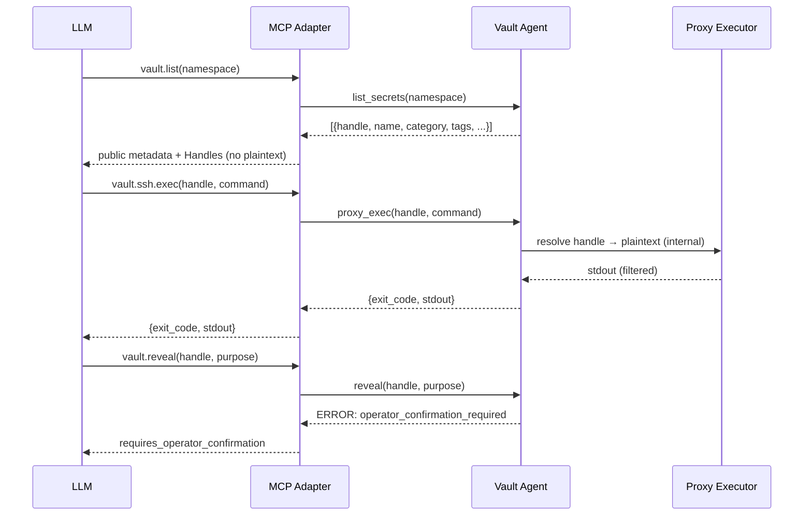

# 0007. Handle Default Exposure Model

## Context and Problem Statement

When an LLM interacts with a secret vault over MCP, two classes of
data must be carefully separated: public metadata (name, category,
tags, description) that the LLM needs to reason about secrets, and
private material (passwords, tokens, keys, certificates) that must
never appear in the conversation transcript unless the human operator
explicitly authorizes a Reveal.

The threat is dual: (1) accidental exposure — the LLM includes a
secret in a response or in a tool argument that ends up in the
transcript, and (2) prompt injection — a malicious input tricks the
LLM into issuing `vault.reveal` or into passing secret material to
an untrusted tool.

The exposure model must define what the LLM sees by default, what it
must do to operate a secret without seeing its plaintext, and what
happens when a Reveal is genuinely required.

## Decision Drivers

* Plaintext must never appear in the MCP transport by default; the
  LLM must be able to operate secrets through Proxy Tools without
  the plaintext crossing the transport.
* Opaque Handles (`vault://<namespace>/<category>/<name>`) must be
  sufficient to invoke any Proxy Tool.
* A Reveal requires explicit Operator Confirmation and is subject to
  rate limiting; it is the exception, not the default.
* Use Tokens (TTL 60 seconds) scope access to a single consumer
  process and expire automatically, preventing long-lived token leaks.
* The model must be compatible with sensitivity levels: `low`,
  `medium`, `high`. The `high` level adds OOB Confirmation on top of
  Operator Confirmation (see
  [0011-slash-only-reveal-with-oob-for-high-sensitivity.md](0011-slash-only-reveal-with-oob-for-high-sensitivity.md)).
* Handles must be stable across rotations so that the LLM can refer
  to the same logical secret over multiple sessions.

## Considered Options

* Option A: Opaque Handle default with Reveal opt-in
* Option B: Plaintext-by-default with rate limiting
* Option C: Encrypted-by-default with LLM decryption keys

## Decision Outcome

Chosen option: "Option A: Opaque Handle default with Reveal opt-in",
because it minimizes the attack surface for both accidental exposure
and prompt injection. The LLM never holds plaintext; it holds only
Handles, which are URIs with no credential value.

The flow is:

Use Tokens are issued by `vault.use(handle, purpose)` when the LLM
needs to pass credential access to a subprocess. The token is
short-lived (60 seconds), single-consumer, and resolved only through
the Companion Socket by authenticated processes. The LLM sees the
token string (opaque) but never the plaintext it represents.

### Consequences

* Good, because the transcript of any LLM session contains only
  Handles, public metadata, and filtered output — no plaintext
  credentials.
* Good, because prompt injection attacks cannot cause unauthorized
  Reveals without Operator Confirmation.
* Good, because Use Tokens auto-expire; a leaked token is useless
  after 60 seconds.
* Good, because Handles are stable and content-addressable by name,
  category, and namespace; the LLM can reason about "the production
  SSH key" without knowing its value.
* Bad, because the LLM cannot self-serve in scenarios where the
  plaintext is genuinely needed (e.g., generating a config file with
  a credential inline); those scenarios require explicit Reveal with
  Operator Confirmation.
* Bad, because the operator must understand the distinction between
  `vault.use` (subprocess access) and `vault.reveal` (LLM transcript
  access) to avoid unnecessarily authorizing Reveals.

## Pros and Cons of the Options

### Option A: Opaque Handle default with Reveal opt-in

* Good: zero plaintext in transcript by default.
* Good: prompt injection cannot force a Reveal.
* Good: Use Tokens expire automatically; no long-lived leaks.
* Bad: requires operator to authorize Reveals explicitly.

### Option B: Plaintext-by-default with rate limiting

* Good: simplest LLM integration; no Handle concept needed.
* Bad: every LLM response that mentions a secret exposes plaintext
  in the conversation history.
* Bad: rate limiting alone does not prevent prompt injection;
  a single unguarded Reveal is still a full credential leak.
* Bad: conversation history in Claude.ai / persistent memory
  features would store plaintext credentials.

### Option C: Encrypted-by-default with LLM decryption keys

* Good: ciphertext in transcript is safe to store.
* Bad: giving the LLM a decryption key means the LLM can reveal
  any secret; the protection is illusory.
* Bad: no standard mechanism for an LLM to hold and use decryption
  keys securely in 2025.

## Validation

* Transcript audit: run 50 simulated MCP tool call sequences; assert
  that `private_blob` content does not appear in any tool result.
* Token expiry test: issue a Use Token; wait 61 seconds; attempt
  resolution via Companion Socket; assert rejection.
* Prompt injection test: craft a system prompt that instructs the
  agent to reveal all secrets; assert that the MCP Adapter returns
  `operator_confirmation_required` for every `vault.reveal` call.

## More Information

* MCP specification (2025-11-25): tool result transport rules.
* Related: [0008-cwd-bound-namespace-with-overrides.md](0008-cwd-bound-namespace-with-overrides.md)
* Related: [0011-slash-only-reveal-with-oob-for-high-sensitivity.md](0011-slash-only-reveal-with-oob-for-high-sensitivity.md)
* Related: [0017-llm-as-composer-no-foreign-keys-between-secrets.md](0017-llm-as-composer-no-foreign-keys-between-secrets.md)
