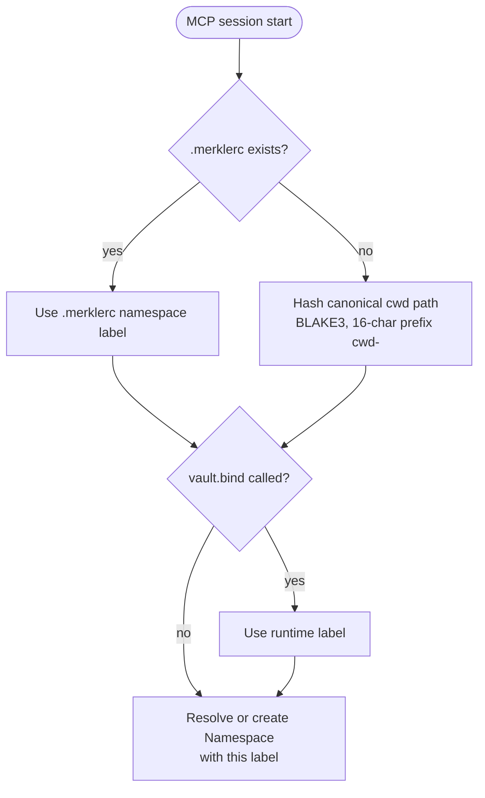

# 0008. cwd-Bound Namespace with Overrides

## Context and Problem Statement

A Namespace is the top-level container that groups related Secrets.
When the operator opens a Claude Code window in a project directory,
Merkle must automatically associate that session with the correct
Namespace without requiring manual selection. The binding must be
deterministic and reproducible: reopening the same project directory
must always resolve to the same Namespace.

At the same time, there are legitimate use cases for overriding the
default binding: monorepo workspaces where multiple services share
a Namespace, shared team vaults bound to a logical label rather than
a filesystem path, and CI environments where the cwd is ephemeral.

## Decision Drivers

* Zero-configuration experience: opening a project in Claude Code
  should automatically scope secret operations to that project's
  Namespace without any manual `vault.bind` call.
* Deterministic: the same cwd must always map to the same Namespace
  label; the binding must survive directory moves only if `.merklerc`
  is used.
* Overridable: `.merklerc` in the project root can declare a
  `namespace` label that overrides the cwd hash; `vault.bind(label)`
  in the MCP session can further override at runtime.
* Stable across cwd path changes: if the operator moves the project
  directory, the `.merklerc`-bound Namespace remains intact; the
  cwd-hash-bound Namespace would diverge (acceptable; the operator
  should use `.merklerc` for stable binding).
* Cross-namespace access is forbidden by default; an explicit import
  allowlist in the Namespace Policy is required.

## Considered Options

* Option A: cwd hash as default Namespace binding; overridable via
  `.merklerc` or `vault.bind(label)`
* Option B: Global single Namespace for all projects
* Option C: Manual namespace selection required on every session

## Decision Outcome

Chosen option: "Option A: cwd hash as default Namespace binding",
because it provides zero-configuration isolation between projects
(the most common use case) while remaining fully overridable for
monorepos, teams, and CI environments.

The binding algorithm:

1. On MCP session start, the MCP Adapter reads the `cwd` from the
   MCP session context (provided by Claude Code as part of the MCP
   handshake).
2. If a `.merklerc` file exists in the `cwd` (or in any parent
   directory up to the user home), its `namespace` field is used as
   the binding label.
3. Otherwise, the binding label is the hex-encoded BLAKE3 hash of
   the canonical `cwd` path, truncated to 16 characters, prefixed
   with `cwd-`.
4. `vault.bind(label)` in the MCP session replaces the label for the
   duration of that session.

### Consequences

* Good, because the operator never needs to name or select a
  Namespace when working on a single-project directory; isolation is
  automatic.
* Good, because `.merklerc` provides a stable, VCS-tracked override
  that survives directory moves and team sharing.
* Good, because `vault.bind` in the session allows runtime override
  without touching the filesystem; useful for scripts and CI.
* Bad, because moving a project directory without a `.merklerc` will
  produce a new cwd-hash binding; the operator must re-bind manually
  or add a `.merklerc`. This is documented in the operator guide.
* Bad, because the hash-based label is not human-readable; `merkle
  status` must show the resolved human label alongside the hash to
  aid diagnostics.

## Pros and Cons of the Options

### Option A: cwd hash as default; overridable

* Good: zero configuration for the common case.
* Good: deterministic; reproducible across sessions.
* Good: override mechanisms cover all edge cases.
* Bad: directory moves break cwd-hash binding without `.merklerc`.

### Option B: Global single Namespace

* Good: simplest possible model.
* Bad: all secrets from all projects are visible to every Claude Code
  window, regardless of project; no isolation.
* Bad: prompt injection in project A could probe secrets from
  project B.

### Option C: Manual namespace selection required on every session

* Good: explicit; no ambiguity.
* Bad: high friction; the operator must name the Namespace on every
  new Claude Code window, which breaks the zero-configuration goal.
* Bad: forgotten selections silently use the wrong namespace.

## Validation

* Isolation test: two MCP sessions open in different project
  directories; assert that `vault.list` in session A does not
  return secrets from session B's Namespace.
* `.merklerc` override test: add `namespace = "acme-prod"` to
  `.merklerc`; open a session; assert resolved label is `acme-prod`.
* `vault.bind` override test: call `vault.bind("team-shared")` in
  a session; assert subsequent `vault.list` targets `team-shared`.
* Directory move test: move a project directory; open a new session;
  assert the cwd-hash label has changed; previous secrets are
  accessible via the old label directly.

## More Information

* `.merklerc` format specification: `docs/arch/schemas/policy_permissions/`.
* Related: [0002-adopt-agent-plus-mcp-adapter-topology.md](0002-adopt-agent-plus-mcp-adapter-topology.md)
* Related: [0007-handle-default-exposure-model.md](0007-handle-default-exposure-model.md)
* Related: [0012-eleven-built-in-categories-plus-cue-schema-for-custom.md](0012-eleven-built-in-categories-plus-cue-schema-for-custom.md)
