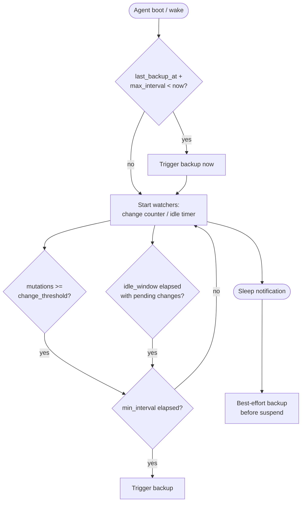

# 0010. Anacron-Style Backup Triggers

## Context and Problem Statement

Merkle runs on developer laptops that are frequently closed, suspended,
or powered off for hours or days at a time. A cron-style fixed-interval
backup scheduler would miss its window entirely whenever the machine is
asleep, potentially leaving the vault without a recent backup for days.

The backup strategy must handle four scenarios without operator
involvement: (1) the machine comes online after a long sleep with
pending changes and an overdue backup interval, (2) the user has made
many changes and a backup is due by change count, (3) the user has
been idle for a while with unsaved changes, and (4) the machine is
about to sleep and there are pending changes.

## Decision Drivers

* Laptop-friendly: the scheduler must detect missed intervals at
  boot/wake time and trigger a backup immediately if overdue, rather
  than waiting for the next cron window.
* Crash-resilient: the last-successful-backup timestamp must be
  persisted durably so that a crash during backup does not falsely
  mark a backup as complete.
* Change-triggered: accumulating more than a configurable number of
  mutations since the last backup should trigger an immediate backup
  regardless of time elapsed.
* Idle-triggered: a configurable idle period with pending changes
  should trigger a backup opportunistically.
* Sleep-triggered: best-effort backup before system sleep; not
  guaranteed but significantly reduces data loss window on suspend.
* Configurable intervals: `min_interval` prevents excessive backup
  frequency; `max_interval` guarantees a backup within a bounded
  time window.

## Considered Options

* Option A: Anacron-style triggers (min_interval, max_interval,
  change-trigger, idle-trigger, sleep-hook)
* Option B: Fixed cron-style schedule (e.g., every 6 hours)
* Option C: Manual backup only (operator-initiated)
* Option D: Continuous incremental sync to a remote store

## Decision Outcome

Chosen option: "Option A: Anacron-style triggers", because it
reliably handles the laptop suspend/resume lifecycle without
requiring the operator to manually trigger backups, and the multi-
signal design (time, change count, idle, sleep) maximizes backup
freshness across all operating patterns.

Default configuration:

| Parameter | Default | Description |
|---|---|---|
| `min_interval` | 1 hour | Minimum time between backups |
| `max_interval` | 24 hours | Force backup if exceeded |
| `change_threshold` | 50 mutations | Trigger on change count |
| `idle_window` | 15 minutes | Trigger after idle with changes |

At Vault Agent boot, the scheduler compares the current time against
the persisted `last_backup_at` timestamp. If the difference exceeds
`max_interval`, a backup is initiated immediately (after unseal
completes).

### Consequences

* Good, because the anacron check-on-boot pattern ensures that a
  vault not backed up for more than `max_interval` will receive a
  backup at the next agent start, regardless of how long the
  machine was suspended.
* Good, because the change threshold prevents excessive backup
  frequency during intensive vault operations.
* Good, because the idle trigger opportunistically backs up during
  natural pauses in work without interrupting the operator.
* Good, because the sleep hook provides best-effort protection
  against data loss on suspend; it is not guaranteed (the OS may not
  deliver the signal in time) but significantly reduces the risk.
* Bad, because the sleep hook is platform-specific (macOS IOKit,
  Linux logind/systemd inhibitor, Windows PowerBroadcast); each
  platform requires a separate implementation path.
* Bad, because a backup initiated during a slow network operation
  (if the backup destination is remote) may not complete before
  suspend; the agent must track partial backups and clean them up
  on next boot.

## Pros and Cons of the Options

### Option A: Anacron-style triggers

* Good: handles all laptop lifecycle scenarios.
* Good: configurable; adapts to different usage patterns.
* Good: multiple independent signals provide redundant coverage.
* Bad: platform-specific sleep hook implementations.

### Option B: Fixed cron-style schedule

* Good: simple to implement.
* Bad: misses all windows when the machine is asleep; a laptop
  suspended at the cron window time will not back up until the
  next scheduled time, which may be hours later.
* Bad: no change-triggered or idle-triggered backups.

### Option C: Manual backup only

* Good: zero complexity; complete operator control.
* Bad: requires discipline the operator may not consistently apply.
* Bad: data loss window is unbounded; a hardware failure with no
  recent manual backup loses all changes.

### Option D: Continuous incremental sync

* Good: minimal data loss window.
* Bad: requires a remote store to be available continuously;
  violates the local-first design.
* Bad: significant implementation complexity (conflict resolution,
  partial sync recovery, network error handling).
* Bad: network-dependent; offline laptops cannot sync.

## Validation

* Boot-trigger test: set `last_backup_at` to 25 hours ago; start
  agent; assert backup is triggered within 30 seconds of unseal.
* Change-trigger test: perform 51 mutations; assert backup triggered
  before the next scheduled time.
* Idle-trigger test: perform 10 mutations; wait `idle_window + 30s`;
  assert backup triggered.
* Min-interval guard test: trigger two mutations 5 minutes apart;
  assert second backup is not triggered until `min_interval` has
  elapsed.
* Crash-resilience test: kill agent mid-backup; restart; assert the
  incomplete backup is not marked as `last_backup_at`; assert a new
  backup is triggered.

## More Information

* `anacron` manpage: `man anacron` (Linux).
* macOS IOKit power notifications:
  `https://developer.apple.com/library/archive/qa/qa1340/_index.html`.
* Linux systemd inhibitor locks:
  `https://systemd.io/INHIBITOR_LOCKS/`.
* Related: [0006-age-encryption-for-backups-and-recovery.md](0006-age-encryption-for-backups-and-recovery.md)
* Related: [0009-merkle-style-audit-hash-chain.md](0009-merkle-style-audit-hash-chain.md)
