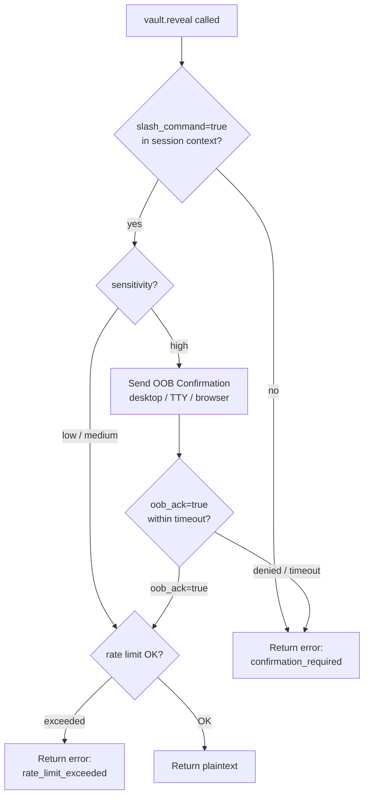

# 0011. Slash-Only Reveal with OOB Confirmation for High-Sensitivity Secrets

## Context and Problem Statement

The Handle default exposure model (see
[0007-handle-default-exposure-model.md](0007-handle-default-exposure-model.md))
establishes that Reveals are always opt-in. However, the mechanism
by which an LLM signals authorization must itself be tamper-resistant
to prompt injection. If the LLM can issue `vault.reveal` with an
`operator_confirmed=true` flag by including that flag in a tool call
generated from adversarial input, the protection is bypassed.

For `sensitivity=high` secrets (private keys, root credentials,
production database passwords), a second, out-of-band confirmation
channel is required that cannot be satisfied by crafting a tool call
argument. The operator must take a separate physical action on a
channel that is not the MCP transport.

## Decision Drivers

* Prompt injection resistance: the confirmation signal must be
  unforgeeable by a crafted system prompt or injected user content.
* Slash commands carry a verifiable flag: Claude Code's slash command
  mechanism (`/merkle-reveal`, `/merkle-show`) sets a
  `slash_command=true` bit in the MCP session context that is set
  by the client, not generated by the LLM. This is the
  operator-controlled confirmation channel for the default Reveal
  path.
* OOB Confirmation for high-sensitivity: secrets with
  `sensitivity=high` require an additional out-of-band signal
  (desktop notification with Approve/Deny button, agent TTY prompt,
  or localhost browser confirmation) that requires physical action
  by the operator, distinct from the LLM conversation.
* Rate limiting: reveals are always rate-limited (`reveals` class);
  OOB Confirmation does not bypass rate limits.
* The OOB channel must not involve the MCP transport or the LLM
  conversation; it must use a distinct OS channel.

## Considered Options

* Option A: Slash command for all Reveals; OOB Confirmation
  additionally required for `sensitivity=high`
* Option B: Any `operator_confirmed=true` flag accepted from the
  LLM tool call arguments
* Option C: Passphrase re-entry for every Reveal
* Option D: Timed automatic Reveal with rate limiting only

## Decision Outcome

Chosen option: "Option A: Slash command AND OOB Confirmation for high
sensitivity", because it creates two independent and mandatory confirmation
layers for the most sensitive secrets: (1) a slash command that can only
be issued by the human operator typing in the Claude Code interface, and
(2) an OOB Confirmation that requires a physical action outside the
conversation entirely. Both are required simultaneously for
`sensitivity=high`; neither satisfies the other.

### Operator Confirmation Two-Flag Model

Operator Confirmation is represented by two independent boolean flags:

| Flag | Set by | Channel | Required for |
|---|---|---|---|
| `slash_command: bool` | Claude Code client | MCP session context | All sensitivities |
| `oob_ack: bool` | OOB Notifier | Distinct OS channel | sensitivity=high (or policy threshold) |

Authorization rules:
- All sensitivities: `slash_command == true` is required. The LLM cannot
  set this flag through tool call arguments; it is injected by the client.
- `sensitivity=high`: **both** `slash_command=true` **AND** `oob_ack=true`
  are required. This is an AND condition, not OR.
- `sensitivity < high` (below policy threshold): `slash_command=true` alone
  is sufficient; `oob_ack` is not required.

OOB channel options (when `oob_ack=true`, exactly one must be recorded in
`oob_channel`): `"desktop-notif"` | `"terminal-prompt"` | `"localhost-confirm"`.

The reveal decision tree:



The `slash_command=true` flag is set by the Claude Code client when
the user issues a recognized slash command. The LLM cannot set this
flag by crafting a tool call; it is injected into the session context
by the client process. The `oob_ack=true` flag is set by the OOB
Notifier after the operator physically acknowledges a confirmation
request on a channel entirely outside the MCP transport.

### Consequences

* Good, because prompt injection cannot trigger a Reveal for any
  sensitivity level; the slash command requires the human to type
  `/merkle-reveal` explicitly.
* Good, because `sensitivity=high` requires a physical action
  (clicking Approve on a desktop notification or pressing Enter in
  the agent TTY) that is completely separate from the LLM
  conversation.
* Good, because the OOB Confirmation timeout (default 60 seconds)
  prevents a hanging Reveal from blocking the agent indefinitely.
* Good, because the rate limit applies after OOB Confirmation,
  preventing repeated OOB approvals from being abused for bulk
  extraction.
* Bad, because the OOB Confirmation UX is disruptive for batch
  operations that legitimately need to reveal multiple
  `sensitivity=high` secrets; operators who need this must use the
  `paranoid` Security Profile with explicit bulk-reveal policy.
* Bad, because the slash command mechanism is specific to Claude
  Code; other MCP clients that do not support slash commands must
  supply an alternative confirmation signal (signed config flag for
  automation, or TTY passthrough).

## Pros and Cons of the Options

### Option A: Slash command + OOB for high sensitivity

* Good: two independent confirmation layers for high sensitivity.
* Good: slash command is unforgeable by LLM tool call arguments.
* Good: OOB Confirmation provides physical-layer separation.
* Bad: disruptive for legitimate batch Reveal workflows.

### Option B: Any operator_confirmed=true flag from LLM

* Good: simplest implementation.
* Bad: prompt injection can set `operator_confirmed=true` in the
  tool arguments; no real protection.
* Bad: the LLM-generated argument and the operator's intent are
  indistinguishable at the transport level.

### Option C: Passphrase re-entry for every Reveal

* Good: cryptographically strong; requires knowledge the LLM lacks.
* Bad: extremely disruptive UX; re-entering a passphrase for every
  Reveal destroys usability.
* Bad: the agent is already unsealed; re-entering the passphrase does
  not add meaningful security beyond what the unseal already provides.

### Option D: Timed automatic Reveal with rate limiting

* Good: zero friction for the operator.
* Bad: rate limiting alone does not prevent a single malicious
  Reveal; it only limits frequency.
* Bad: an attacker who can inject one prompt can issue one Reveal
  before the rate limit kicks in; for `sensitivity=high` secrets,
  one Reveal is a full compromise.

## Validation

* Injection test: craft a system prompt containing
  `operator_confirmed=true` as a tool call argument; assert that the
  MCP Adapter rejects the Reveal with `slash_command_required`.
* Slash command flow test: issue `/merkle-reveal` in Claude Code for
  a `sensitivity=medium` secret; assert plaintext is returned.
* OOB flow test: issue `/merkle-reveal` for a `sensitivity=high`
  secret; assert OOB notification fires; simulate approval; assert
  plaintext is returned.
* OOB timeout test: issue `/merkle-reveal` for `sensitivity=high`;
  do not respond to OOB notification within 60 seconds; assert Deny.
* Rate limit test: issue 5 successful Reveals within 60 seconds;
  assert the 6th is rejected with `rate_limit_exceeded`.

## More Information

* Claude Code slash command specification (internal).
* Related: [0007-handle-default-exposure-model.md](0007-handle-default-exposure-model.md)
* Related: [0012-eleven-built-in-categories-plus-cue-schema-for-custom.md](0012-eleven-built-in-categories-plus-cue-schema-for-custom.md)

## Amendment — 2026-05-22

### OOB Companion Device Enrollment Ceremony

The OOB Confirmation path is extended to support a cryptographically bound
companion device. The enrollment ceremony is initiated by the operator running
`merkle device pair`.

**Key generation:**

1. `merkle device pair` generates an Ed25519 keypair using `OsRng`.
2. The private key is stored in the OS keychain under service identifier
   `merkle-companion-<device-id>`, where `device-id` is a randomly generated
   URL-safe base64 identifier (16 bytes → 22 characters).
3. The corresponding Ed25519 public key is stored in the vault's sealed state
   record alongside the `device-id`. Multiple enrolled devices are supported; each
   has an independent entry.

**Device listing and revocation:**

- `merkle device list` enumerates enrolled devices (device-id and enrollment
  timestamp only; public keys are not printed by default).
- `merkle device revoke <device-id>` removes the public key from the sealed state
  and deletes the keychain entry on the local machine.

### OOB Challenge Cryptographic Binding (mandatory)

Every `OobChallenge` event MUST include a `nonce` field: 32 bytes of random data
generated by `OsRng` at challenge creation time, encoded as URL-safe base64 (43
characters). The nonce is request-scoped and MUST NOT be reused across challenges.

The companion device MUST produce a signature over the concatenation:

```
device_signature = Ed25519Sign(
  private_key = enrolled_device_private_key,
  message = canonical_challenge_bytes
)
```

where `canonical_challenge_bytes` is the BLAKE3 hash of the concatenation:

```
challenge_id (UTF-8) || 0x00
|| secret_handle (UTF-8) || 0x00
|| outcome (UTF-8: "approved" | "denied") || 0x00
|| authorized_at (RFC 3339 UTC, UTF-8) || 0x00
|| nonce (43 UTF-8 base64 characters) || 0x00
```

The Vault Agent verifies the `device_signature` against the enrolled Ed25519 public
key for the `device-id` identified in the `OobChallenge` response. The agent MUST
reject any challenge response where:

- `outcome = "approved"` and the `device_signature` is null, zero-valued, or fails
  Ed25519 verification.
- `outcome = "approved"` and the `authorized_at` timestamp is more than 5 minutes
  before the agent's current wall clock (replay window).
- The `nonce` in the signed message does not match the nonce issued with the
  original `OobChallenge`.

A rejection MUST emit an `oob_signature_invalid` audit entry and return
`confirmation_required` to the caller. There is no fallback to unsigned OOB
approval.

### Non-Claude Client Signed Config Flag

MCP clients that are not Claude Code (and therefore cannot issue slash commands)
MAY authenticate reveals via a `signed_config_flag`: an Ed25519-signed JWT attesting
that the client's operator trusts its turn-boundary enforcement.

**JWT structure:**

```json
{
  "iss": "merkle-operator-attestation",
  "sub": "<client-id>",
  "iat": <unix timestamp>,
  "exp": <unix timestamp, max iat+3600>,
  "vault_id": "<vault identity UUID>",
  "slash_command_equivalent": true
}
```

The JWT is signed with an Ed25519 private key stored in the OS keychain at service
identifier `merkle-operator-attestation`. The corresponding public key is stored in
the vault's sealed state at init time. The public key can be rotated via
`merkle operator-key rotate`.

The Vault Agent verifies the JWT signature, `exp`, and `vault_id` before treating
the flag as equivalent to `slash_command=true`. A valid `signed_config_flag` does
not satisfy the OOB requirement for `sensitivity=high`; OOB remains mandatory.

**Reject conditions:** the agent MUST reject a reveal request with
`confirmation_required` if:

- `slash_command=false` (the client is not Claude Code), AND
- No valid `signed_config_flag` is present (missing, expired, invalid signature, or
  wrong `vault_id`).

### OobChallenge Payload: Remove `approval_url`

The `approval_url` field is removed from the `OobChallenge` event payload that
crosses the MCP transport. The URL for the localhost browser confirmation channel is
sensitive: exposing it in the tool call result makes it visible to the LLM context,
from which a prompt injection could attempt to influence the operator's browser.

The confirmation URL is delivered exclusively through the OOB channel itself:

- Desktop notification: the URL appears in the notification body, not in the MCP
  tool result.
- Terminal prompt: the URL is printed to the agent's TTY (the process's controlling
  terminal), not to stdout.
- Localhost browser: the URL is opened directly by the OOB notifier process, not
  returned to the MCP transport.

The `OobChallenge` struct returned to the MCP adapter SHALL contain only:
`challenge_id`, `secret_handle` (opaque URI), `expires_at`, `oob_channel`, and
`nonce`. All URL and redirect fields are removed.

Cross-reference:
[0007-handle-default-exposure-model.md](0007-handle-default-exposure-model.md),
[0015-rust-keyring-crate-for-multi-os-keychain.md](0015-rust-keyring-crate-for-multi-os-keychain.md),
[0018-full-coverage-validation-as-architectural-contract.md](0018-full-coverage-validation-as-architectural-contract.md) — the AsyncAPI
OOB event-stream spec and the Rego companion tests machine-verify the
confirmation-gate invariants established in this ADR.

## Amendment 5 — 2026-05-23 — Real OOB Channel Implementations

### Channel Feature Gates

Real OOB channel delivery is opt-in via Cargo feature flags in
`merkle-adapter-oob`.  This design minimises the binary attack surface and
allows unit tests to run without real platform dependencies:

| Feature | Enables |
|---|---|
| `desktop-notif-real` | `notify-rust` OS notification delivery |
| `localhost-confirm-real` | `axum` HTTP confirmation server + `open` browser-open |
| `all-channels` | Alias enabling both of the above |

Without a feature flag, each channel's `dispatch` is a logged stub and
`available()` returns `false`, so the adapter dispatcher falls through to the
next available channel.

### MERKLE_OOB_AUTO_DENY=1 Environment Variable

Setting `MERKLE_OOB_AUTO_DENY=1` causes `TerminalPromptChannel::dispatch` to
immediately record a `Denied` resolution without reading from `/dev/tty`.
Intended use: automated CI pipelines and integration test harnesses that run
without a controlling terminal.

**Production deployments MUST NOT set this variable.**  The variable is
honoured only by the terminal-prompt channel; it has no effect on
`DesktopNotifChannel` or `LocalhostConfirmChannel`.

### Localhost Confirmation Port

`LocalhostConfirmChannel` binds an axum sub-router on `127.0.0.1:39842` by
default.  The port is configurable via `LocalhostConfirmChannel::with_port(n)`.

| Endpoint | Method | Purpose |
|---|---|---|
| `/oob/{challenge_id}` | GET | Renders approve / deny HTML page |
| `/oob/{challenge_id}/approve` | POST | Records Approved resolution |
| `/oob/{challenge_id}/deny` | POST | Records Denied resolution |

The confirmation URL is delivered only through the OOB channel (notification
body, TTY stderr, or browser-open) and never returned to the MCP transport per
the existing Amendment.

### DesktopNotifChannel UX Flow

Because desktop notification action callbacks cannot directly produce a signed
`OobResolution`, the notification body embeds the localhost confirmation URL.
The operator clicks **Approve** to open the page (Linux: action button via
dunst/mako; macOS/Windows: body text or automatic browser-open).  The
`LocalhostConfirmChannel` HTTP server then receives the POST and resolves the
`PendingChallengeRegistry` entry.

This means `DesktopNotifChannel` and `LocalhostConfirmChannel` operate as
**complementary layers** for the highest-UX path:

```
OS Notification (desktop-notif-real)
  └─ embeds URL → operator clicks
       └─ browser opens localhost confirm page (localhost-confirm-real)
            └─ POST /approve → PendingChallengeRegistry.resolve()
                 └─ await_resolution() unblocks → Approved
```

For `desktop-notif-real` alone (without `localhost-confirm-real`), the
operator must manually navigate to the URL printed in the notification body.

### Companion Device App — Phase 8+

Full hardware-class Companion Device integration (Phase 8+, ADR-0020) remains
deferred.  The channels implemented in this amendment are the "low-friction"
alternatives for `sensitivity ≤ medium` workflows and developer environments.
For `sensitivity = high` in production, the Companion Device Ed25519 signature
requirement (Amendment 1 of this ADR) continues to apply regardless of which
OOB delivery channel is used.

### Test Coverage

- Mock-only unit tests for all three channels (no real notification daemons).
- Feature-gated smoke tests under `#[cfg(feature = "localhost-confirm-real")]`:
  axum server GET page, POST approve, POST deny.
- Auto-deny path tested via `TerminalPromptChannel::new_auto_deny_for_test()`
  (no `unsafe` env-var mutation required).
- All existing BDD scenarios in `reveal_with_oob.feature` remain passing.

## Amendment 6 — 2026-05-23 — MCP JWT Attestation Wire Format

### Concrete JWT Shape

Non-Claude MCP clients that cannot issue slash commands authenticate reveals via a
`signed_config_flag`: an Ed25519-signed JWT whose wire format is fully specified here.

**Header:**
```json
{"alg":"EdDSA","typ":"JWT","kid":"merkle-operator-attestation"}
```

**Payload:**
```json
{
  "sub": "non-claude-mcp-client",
  "iss": "<operator-id>",
  "aud": "merkle-vault",
  "iat": <unix-seconds>,
  "exp": <iat+300>,
  "challenge_id": "<UuidV7>",
  "session_id": "<UuidV7>"
}
```

Maximum token lifetime is 300 seconds (`exp ≤ iat + 300`).

**Signature:** Ed25519 over `base64url(header).base64url(payload)` (RFC 7515 compact serialisation,
no padding).

### Verification Path

1. The agent retrieves the operator's Ed25519 public key from the OS keychain entry
   `service = "dev.fapp.merkle"`, `account = "merkle-operator-attestation"`.
2. The agent verifies the Ed25519 signature over the compact serialisation.
3. The agent validates:
   - `aud == "merkle-vault"`
   - `exp` has not elapsed (agent wall clock)
   - `challenge_id` matches the `RevealRequest`'s challenge identifier
4. On success, the flag is treated as equivalent to `slash_command=true` for the policy
   decision. It does NOT satisfy the OOB requirement for `sensitivity=high`.

### Replay Protection

The agent tracks consumed JWT `jti` values (if present) in an in-memory set for 5 minutes.
Re-use of the same `jti` within the replay window is rejected with `challenge_mismatch`.
Tokens without a `jti` are not tracked but ARE subject to the `exp` staleness check.

### Failure Modes

`Err(AppError::PolicyDenied("invalid_signed_config_flag"))` with canonical sub-reason:

| Sub-reason | Trigger |
|---|---|
| `expired` | `exp` timestamp is in the past |
| `wrong_audience` | `aud` field is not `"merkle-vault"` |
| `signature_invalid` | Ed25519 verify fails |
| `key_not_enrolled` | Keychain entry `merkle-operator-attestation` not found |
| `challenge_mismatch` | `challenge_id` does not match the RevealRequest or `jti` replayed |

### Keychain Constant

`merkle-domain-identity` exports `KEYCHAIN_ACCOUNT_OPERATOR_ATTESTATION = "merkle-operator-attestation"`
alongside the existing `KEYCHAIN_ACCOUNT_MASTER_KEY` constant, ensuring all callers share the
same canonical account name.

### Test Coverage

- Unit tests in `merkle-application/src/jwt_verifier.rs`: valid path, wrong key, expired exp,
  wrong audience, challenge mismatch.
- Integration test in `merkle-application/tests/use_cases.rs`: full reveal via JWT instead of
  slash command.
- Three new BDD scenarios in `reveal_with_oob.feature`: success, signature failure, exp past.
