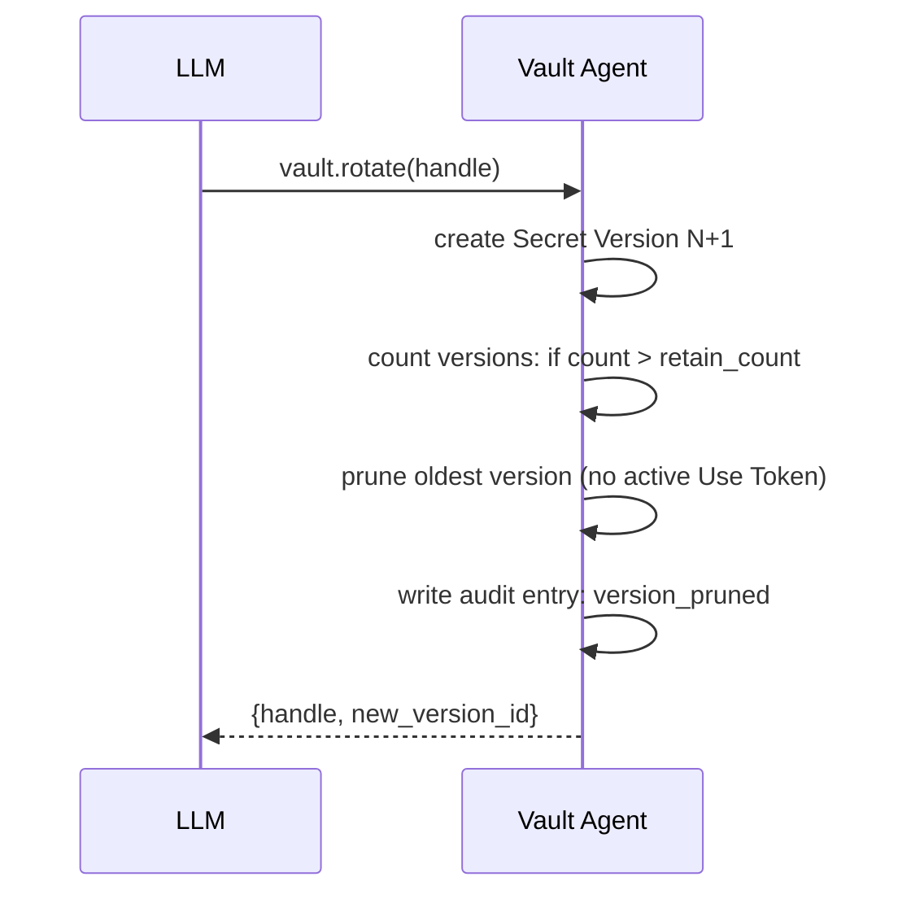

# 0014. Retention Policy Default retain_count=3

## Context and Problem Statement

Every `vault.rotate` call on a Secret creates a new Secret Version
and preserves the previous version for potential rollback. Without a
bounded retention policy, the version history grows indefinitely,
consuming disk space and complicating restore operations.

The retention policy must balance two goals: enough historical
versions to enable rollback after an accidental rotation (the most
common recovery scenario), and a bounded storage cost per secret that
scales predictably as the vault grows.

The policy must be configurable at the Namespace level and optionally
overridden per-secret, with the default being safe for the majority
of use cases.

## Decision Drivers

* Bounded storage: the total number of Secret Versions per secret
  must have a defined upper bound to prevent unbounded growth.
* Rollback window: at least the previous two versions (plus the
  current) must be retained so that a double-rotation accident can
  be undone.
* Per-namespace configurability: teams with different compliance
  requirements (some require 7 versions; some require 1) must be
  able to configure the retention policy without changing the vault
  binary.
* Audit log integrity: deleting a Secret Version must produce an
  Audit Entry; the version deletion is not silent.
* Version deletion must be explicit: the vault must not silently
  discard a version that is younger than any active Use Token
  referencing it.

## Considered Options

* Option A: `retain_count = 3` (current + 2 previous) as default;
  configurable per namespace or per secret
* Option B: `retain_count = 1` (current only; no version history)
* Option C: Unlimited retention (no pruning)
* Option D: Time-based retention (e.g., retain versions for 30 days)

## Decision Outcome

Chosen option: "Option A: retain_count = 3", because it provides a
meaningful rollback window (two prior versions) while keeping storage
predictable. The value 3 is the minimum that allows recovery from a
double-rotation mistake.

When a rotation creates a new version that would exceed
`retain_count`, the vault asynchronously prunes the oldest version
after confirming no active Use Token references it. The pruning
produces an Audit Entry of type `version_pruned`.



The default configuration in `config.toml`:

```toml
[policy.defaults]
retain_count = 3
```

Per-namespace override in `.merklerc`:

```toml
[policy]
retain_count = 7
```

### Consequences

* Good, because `retain_count = 3` covers the most common
  recovery scenario (one accidental rotation) with a spare, while
  keeping storage predictable.
* Good, because the per-namespace override allows compliance teams
  to increase retention without modifying the vault binary.
* Good, because the Audit Entry for `version_pruned` preserves a
  record that a version existed, even after it is deleted.
* Good, because pruning is blocked on active Use Token references,
  preventing a race condition where a subprocess is using version N
  while it is being pruned.
* Bad, because `retain_count = 3` may be too low for teams that
  rotate frequently and need a longer audit trail of actual secret
  values. These teams should increase the count and accept the
  storage cost.
* Bad, because the asynchronous pruning model means the database
  temporarily holds more than `retain_count` versions between
  rotation and prune completion; this window is bounded to the
  pruning background task interval (default 5 seconds).

## Pros and Cons of the Options

### Option A: retain_count = 3 (default)

* Good: bounded storage; two-version rollback window.
* Good: configurable; Audit Entry on prune.
* Bad: may be too low for high-frequency rotation teams.

### Option B: retain_count = 1 (current only)

* Good: minimal storage; simplest model.
* Bad: no rollback window; a single accidental rotation permanently
  destroys the previous value.
* Bad: a double rotation (value updated twice in quick succession)
  is completely unrecoverable.

### Option C: Unlimited retention

* Good: complete history; maximum rollback depth.
* Bad: unbounded storage growth; vaults used for years with frequent
  rotations could hold thousands of versions per secret.
* Bad: `vault.history` becomes unwieldy; the LLM context window
  fills with version metadata.

### Option D: Time-based retention (30 days)

* Good: predictable window in calendar terms.
* Bad: inconsistent with heavily rotated secrets (a secret rotated
  100 times in 30 days retains 100 versions) and lightly rotated
  secrets (a secret not rotated in 31 days loses its entire history
  at once).
* Bad: time-based pruning requires clock accuracy; laptop clock
  skew or timezone changes can cause unexpected behavior.

## Validation

* Prune trigger test: rotate a secret 4 times; assert that the
  oldest version is pruned and only 3 versions remain.
* Rollback test: rotate a secret twice; roll back to version N-1;
  assert the secret value matches version N-1; assert Audit Entry
  shows rollback.
* Use Token guard test: issue a Use Token for version N; rotate to
  N+1; assert version N is not pruned until the Use Token expires.
* Audit test: after pruning, query the audit log for
  `version_pruned` entries; assert one entry per pruned version
  with correct metadata.

## More Information

* Namespace Policy CUE schema:
  `docs/arch/schemas/policy_permissions/`.
* Related: [0003-sqlite-with-per-blob-encryption.md](0003-sqlite-with-per-blob-encryption.md)
* Related: [0009-merkle-style-audit-hash-chain.md](0009-merkle-style-audit-hash-chain.md)


## Amendment — 2026-07-10 — Immutable-history secret rollback (append-copy)

### Context

Retention (`retain_count = 3`) assumes a rollback window, but the original ADR
does not specify the **mechanics** of restoring a historical value. Live code
implements `Secret::rollback_to` as an **append-copy**, not an in-place
reactivation of an old `version_no`. Feature and OpenAPI prose that said
"set active version to N" / audit `op: rollback` drifted from the domain
invariant already stated in `docs/arch/domain/secret-storage.md`.

### Decision

1. **Append-copy semantics.** `Secret::rollback_to(target_version_no, policy)`:
   - Requires the target historical version to exist.
   - Allocates a **new** `SecretVersion` with `version_no = max(existing) + 1`.
   - Copies the target's private blob / DEK material into that new version
     (immutable history — historical rows stay unchanged).
   - Deprecates the previous active version through the same rotation path
     used by `Secret::rotate`, including `retain_count` pruning of the oldest
     deprecated versions when the chain would exceed the policy.
2. **Surfaces.**
   - Socket: `POST /v1/namespaces/{namespace_id}/secrets/{handle}/rollback`
     with `target_version` + `OperatorConfirmation` (`slash_command` required).
   - MCP: `vault_rollback` gated by MERK-001 `_meta` operator confirmation
     (ADR-0011 amendment) and slash prompt `/merkle-rollback` (ADR-0028).
   - Requires Unsealed vault.
3. **Audit op.** Rollback does **not** introduce `AuditOp::Rollback`. Success
   and denial both record **`AuditOp::Rotate`** (deny carries
   `denial_reason` describing missing operator confirmation). Rationale: the
   domain effect is a new monotonic version with copied material — the same
   chain shape as rotate — and the closed `AuditOp` enum stays smaller. Clients
   that need to distinguish rollbacks must use purpose/handle context or
   command traces, not a separate op variant, until a future ADR adds one.
4. **Client contract.** Response `active_version` is the **new** monotonic
   version number, **not** equal to `target_version`. Clients must not assume
   the historical `version_no` becomes current.

### Consequences

* Good, because version numbers stay strictly monotonic and historical rows
  remain tamper-evident and decryptable.
* Good, because rollback reuses retention pruning (cannot grow unbounded).
* Bad, because operators watching only for audit `op=rollback` never see an
  event (use `rotate` plus command context).
* Bad, because a rollback counts against `retain_count` and may prune older
  history the operator still wanted.

### Cross-references

* `crates/merkle-domain-secret-storage/src/secret.rs` — `rollback_to`
* `crates/merkle-application/src/commands/rollback_secret.rs`
* ADR-0011 (operator confirmation), ADR-0028 (slash prompt)
* OpenAPI rollback path; Gherkin `rotate_secret.feature` rollback scenario
* Domain: `docs/arch/domain/secret-storage.md` invariant 3
