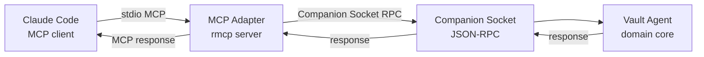

# 0016. rmcp — Official Rust SDK for MCP

## Context and Problem Statement

The MCP Adapter must implement the Model Context Protocol (MCP)
specification (2025-11-25), including: stdio transport, tool
registration, tool call dispatch, session lifecycle, and error
handling. Implementing the MCP wire protocol from scratch would
require parsing JSON-RPC 2.0, implementing the MCP handshake, and
keeping up with specification changes — all with no upstream support.

The MCP specification authors maintain official SDKs in multiple
languages. The Rust SDK (`rmcp`) is one of these official
implementations. Using the official SDK aligns Merkle's adapter with
the canonical interpretation of the specification and reduces the
risk of subtle protocol deviations.

## Decision Drivers

* Protocol compliance: the official SDK is maintained by the same
  team that maintains the MCP specification; deviation risk is
  minimal compared to a community or hand-rolled implementation.
* Stable `async fn` in traits: `rmcp` uses Rust's `async fn` in
  traits (stable since Rust 1.75 for object-safe traits, fully
  ergonomic in the 2024 edition) for tool handler registration;
  this requires the Rust 2024 edition selected in
  [0001-use-rust-as-implementation-language.md](0001-use-rust-as-implementation-language.md).
* Stdio transport: the SDK handles stdio framing (newline-delimited
  JSON-RPC), content-length headers if required, and graceful
  shutdown; no need to implement these in the adapter.
* Tool schema generation: the SDK provides derive macros for
  generating JSON Schema from Rust structs, reducing the manual
  tool definition maintenance burden.
* Active maintenance: the `rmcp` crate receives updates when the
  MCP specification is revised; tracking a minor version is the
  upgrade path.

## Considered Options

* Option A: `rmcp` — official Rust MCP SDK
* Option B: Hand-rolled JSON-RPC 2.0 implementation with custom MCP
  message types
* Option C: Community `mcp-rs` or similar unofficial crate
* Option D: Bridge via the TypeScript MCP SDK with a Rust FFI layer

## Decision Outcome

Chosen option: "Option A: rmcp", because it is the official Rust SDK
for MCP, maintained by the specification authors, and directly
handles the stdio transport and tool registration surface that the
MCP Adapter needs. The derive macro approach for tool schema
generation reduces maintenance burden substantially.

The MCP Adapter in the hexagonal architecture is the sole consumer
of `rmcp`. All domain logic lives in the agent; the adapter layer is
a thin translation between `rmcp` tool calls and Companion Socket
JSON-RPC messages:

Tool definitions are implemented as structs deriving `rmcp::Tool`,
with `#[tool(description = "...")]` attributes. The SDK generates
the JSON Schema for the tool parameters automatically from the Rust
type definitions.

### Consequences

* Good, because the MCP Adapter tracks the specification via a
  crate version bump, not a manual protocol implementation update.
* Good, because the derive macros keep tool parameter schemas in
  sync with the Rust types; schema drift is caught at compile time.
* Good, because the stdio transport, session lifecycle, and
  JSON-RPC framing are handled by the SDK; the adapter focuses only
  on tool business logic.
* Good, because `rmcp` is tested against the same protocol
  conformance suite used by the TypeScript and Python official SDKs.
* Bad, because `rmcp` is a relatively new crate; its API may evolve
  with breaking changes as the MCP specification matures. Merkle
  pins the minor version and reviews release notes on each upgrade.
* Bad, because the derive macro approach requires the tool
  parameter structs to be `serde`-serializable; any complex Rust
  type that is not `serde`-compatible requires a wrapper type.

## Pros and Cons of the Options

### Option A: rmcp (official Rust SDK)

* Good: official; specification-compliant; maintained by spec authors.
* Good: stdio transport and session lifecycle handled.
* Good: derive macros for tool schema generation.
* Bad: newer crate; API may evolve with breaking changes.

### Option B: Hand-rolled JSON-RPC + MCP

* Good: full control; no external dependency.
* Bad: high implementation cost; protocol deviation risk.
* Bad: every MCP specification update requires manual diff and
  implementation changes.
* Bad: no conformance test suite for a hand-rolled implementation.

### Option C: Community crate (mcp-rs, etc.)

* Good: potentially simpler API for specific use cases.
* Bad: not maintained by the specification authors; protocol
  interpretation may diverge.
* Bad: smaller review surface; security issues may go unpatched
  longer.

### Option D: TypeScript SDK via FFI

* Good: TypeScript SDK is more mature and widely tested.
* Bad: FFI between Rust and JavaScript (Node.js via napi-rs or
  similar) adds significant complexity, binary size, and Node.js
  runtime dependency — directly contradicting the static binary
  goal from
  [0001-use-rust-as-implementation-language.md](0001-use-rust-as-implementation-language.md).

## Validation

* Conformance test: run the MCP protocol conformance test suite
  against the Merkle MCP Adapter; assert all mandatory test cases
  pass.
* Tool discovery test: connect a bare MCP client; call
  `tools/list`; assert all declared tools appear with correct JSON
  Schema.
* Stdio framing test: send a malformed JSON-RPC request; assert
  the adapter returns a proper JSON-RPC error response and does not
  crash.
* Session lifecycle test: connect, perform 10 tool calls, disconnect,
  reconnect; assert the second session is correctly initialized and
  orphan tempfiles from the first session are reaped.

## More Information

* `rmcp` crate: `https://crates.io/crates/rmcp`.
* MCP specification (2025-11-25): `https://spec.modelcontextprotocol.io/`.
* Related: [0001-use-rust-as-implementation-language.md](0001-use-rust-as-implementation-language.md)
* Related: [0002-adopt-agent-plus-mcp-adapter-topology.md](0002-adopt-agent-plus-mcp-adapter-topology.md)
