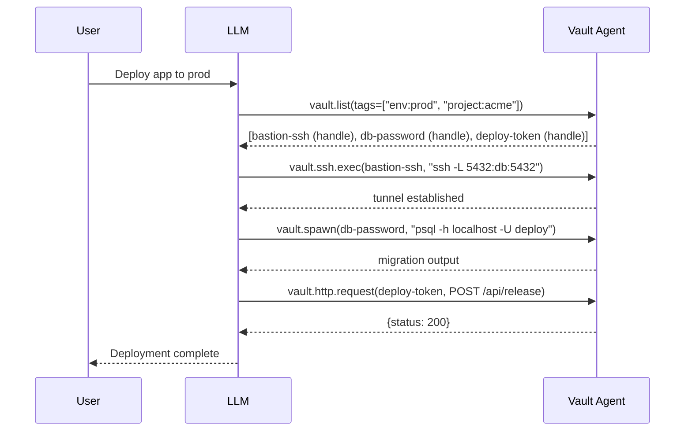

# 0017. LLM-as-Composer — No Foreign Keys Between Secrets

## Context and Problem Statement

Real-world operations frequently require coordinating multiple
credentials: SSH to a bastion host using one key, then connect to a
database using a database password, then fetch an API token for a
third-party service. A traditional vault might model this as a
"workflow" or "credential group" with explicit foreign-key references
between secrets (e.g., `database_password.references = ssh_key.id`).

Storing foreign-key relationships between secrets in the vault
schema introduces several problems: the relationships must be kept
in sync as secrets are created, deleted, or renamed; the vault must
expose a graph traversal API; and the LLM loses the flexibility to
compose different combinations of secrets for different tasks.

Merkle's design treats the LLM itself as the composer. The vault
provides discovery (FTS5 search, `vault.list`, `vault.describe`) and
operation primitives (Proxy Tools). The LLM is responsible for
discovering relevant secrets, deciding which to use together, and
sequencing the Proxy Tool calls. Informal cohesion between secrets
is expressed through Tags rather than stored foreign keys.

## Decision Drivers

* Simplicity: the vault schema has no relationship tables; each
  Secret is a standalone aggregate root with no outbound references.
* Flexibility: the LLM can compose any set of secrets for any task
  without being constrained by pre-defined relationships stored in
  the vault.
* Tag-Based Cohesion: secrets that belong together share Tags
  (`env:prod`, `project:acme`, `role:bastion`); the LLM uses tags
  as hints during discovery.
* Cross-Env Warning: when secrets with different `env:*` tags are
  accessed in the same session, the audit log emits a Cross-Env
  Warning as a forensic marker; this is not a block.
* No Composition is stored: the sequence of Proxy Tool calls that
  accomplishes a task is not persisted in the vault; the LLM
  reconstructs it from context on every session.
* Domain simplicity: the Secret Storage bounded context has a single
  aggregate root (`Secret`) with no outbound foreign keys.

## Considered Options

* Option A: LLM-as-composer with Tag-Based Cohesion; no foreign keys
* Option B: Stored workflow graph with explicit foreign-key
  relationships between secrets
* Option C: Named credential groups (collections of secrets with a
  shared label, no ordering)

## Decision Outcome

Chosen option: "Option A: LLM-as-composer with Tag-Based Cohesion",
because it eliminates an entire relationship management layer from
the vault's domain model, makes the vault's schema simpler and more
robust, and delegates composition to the entity (the LLM) that
already has the contextual intelligence to make composition decisions.

The composition pattern:

No relationship between `bastion-ssh`, `db-password`, and
`deploy-token` is stored in the vault. The LLM discovered all three
via the shared tags `env:prod` and `project:acme` and sequenced the
operations itself.

### Consequences

* Good, because the `secrets` table has no foreign-key columns;
  the schema is simpler, migrations are easier, and there is no
  referential integrity maintenance burden.
* Good, because deleting or renaming a secret never causes cascading
  foreign-key violations; each secret is independently lifecycle-
  managed.
* Good, because the LLM's contextual intelligence is more flexible
  than any pre-defined workflow graph; the LLM can compose secrets
  in ways the vault author did not anticipate.
* Good, because Tag-Based Cohesion scales naturally: adding a tag to
  a secret immediately makes it discoverable in LLM queries for that
  tag without any schema change.
* Bad, because the LLM must re-discover and re-reason the
  composition on every session; there is no "run the prod deployment
  workflow" shortcut stored in the vault. This is mitigated by the
  LLM's context memory within a session.
* Bad, because Cross-Env Warnings are advisory, not blocking; if the
  operator genuinely needs to use a prod secret and a dev secret
  together (e.g., copying data from dev to prod), the warning is
  noise. Per-namespace policy can suppress the warning for known
  cross-env access patterns.

## Pros and Cons of the Options

### Option A: LLM-as-composer + Tag-Based Cohesion

* Good: simplest domain model; no relationship tables.
* Good: maximum flexibility; LLM adapts to novel task combinations.
* Good: Tag-Based Cohesion scales without schema changes.
* Bad: no stored composition shortcuts; LLM re-reasons on each session.

### Option B: Stored workflow graph

* Good: repeatable; "run workflow X" is a single command.
* Bad: the vault must maintain graph consistency across secret
  renames, deletes, and namespace moves.
* Bad: pre-defined graphs cannot adapt to novel task combinations
  without being updated manually.
* Bad: significant schema and API complexity (graph traversal,
  cycle detection, topological sort for ordered workflows).

### Option C: Named credential groups

* Good: simpler than a full graph; no ordering semantics.
* Bad: groups still require maintenance when members are renamed or
  deleted.
* Bad: groups provide discovery grouping but not composition
  sequencing; the LLM still needs context to know how to use the
  group, making the group redundant with tags.
* Bad: groups as a concept overlap with namespaces (which already
  group secrets by project/environment); two grouping mechanisms
  with unclear precedence creates confusion.

## Validation

* Schema test: assert that the `secrets` table schema contains no
  foreign-key columns referencing other rows in `secrets`.
* Tag discovery test: create three secrets with `env:prod` tag;
  call `vault.list(tags=["env:prod"])`; assert all three are
  returned and no other secrets appear.
* Cross-Env Warning test: access a `env:prod` secret and a
  `env:dev` secret in the same session; assert an audit entry of
  type `cross_env_warning` is written.
* Composition end-to-end test: simulate a three-tool Proxy Tool
  sequence using handles from the same tag group; assert all three
  operations complete without any stored relationship in the
  database.

## More Information

* Eric Evans — Domain-Driven Design (2003), Aggregate Root pattern.
* Related: [0007-handle-default-exposure-model.md](0007-handle-default-exposure-model.md)
* Related: [0012-eleven-built-in-categories-plus-cue-schema-for-custom.md](0012-eleven-built-in-categories-plus-cue-schema-for-custom.md)
* Related: [0013-fts5-on-public-metadata-fields-only.md](0013-fts5-on-public-metadata-fields-only.md)
* See also: [0018-full-coverage-validation-as-architectural-contract.md](0018-full-coverage-validation-as-architectural-contract.md) — the
  full-coverage validation lane keeps the no-foreign-keys CUE schema
  constraint recorded here continuously machine-verified.
