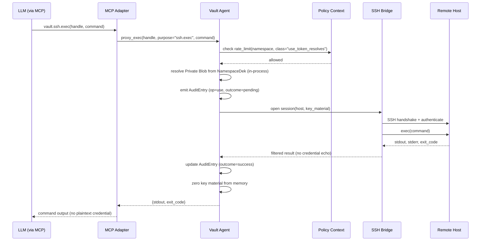
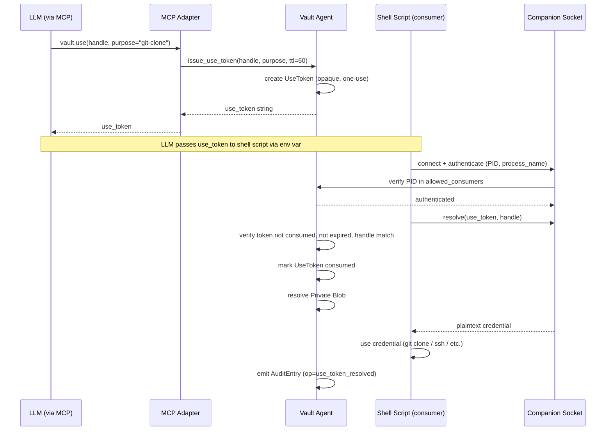

# Access Mediation

## Purpose

The Access Mediation bounded context is the enforcement layer between the LLM
transcript and secret material. Its central responsibility is to ensure that
credential plaintext is consumed by the intended operation — an SSH session,
an HTTP request, a child process, or a tempfile — without ever being returned
to the MCP transport where it would become part of the conversation context
or a log entry. This context owns the short-lived tokens, the ephemeral
filesystem artifacts, and the Companion Socket that mediates between the
Vault Agent and external processes.

This context does not store Secrets, manage encryption keys, or set policy.
It is a pure consumer of resolved credentials: it receives plaintext from the
Secret Storage context (inside the agent process boundary), immediately
commits it to the intended operation, and discards it. The boundary between
what the LLM can see and what it cannot is entirely maintained here.

## Ubiquitous Language

| Term | Definition | Notes |
|---|---|---|
| Proxy Tool | MCP tool that operates a Secret without exposing plaintext. | Examples: `vault.ssh.exec`, `vault.http.request`, `vault.spawn`, `vault.write_tempfile`. |
| Use Token | Short-lived opaque token (default TTL 60 seconds) issued by `vault.use(handle, purpose)`. | Permits a single consumer process to dereference the Secret via the Companion Socket. |
| Proxy Executor | Domain service resolving a Handle to private material inside the agent and invoking the appropriate external operation. | SSH session, HTTP request, process spawn, or tempfile write. |
| Tempfile | Filesystem path materializing a Secret on disk with mode `0600`. | Cleaned up on session close, idle timeout, or explicit revoke. |
| FIFO | Named pipe variant of Tempfile; delivers Secret exactly once on first read, then is removed. | Suitable for tools that consume credentials by path but never re-read. |
| Companion Socket | Unix domain socket (or Windows named pipe) exposed by the agent to local processes. | Resolves Use Tokens to plaintext; authenticates callers by PID and process name. |
| Allowed Consumers | Glob list of process names authorized to dereference Use Tokens for a Namespace. | Checked against peer PID on the Companion Socket. |
| Reveal | Explicit return of a Secret's plaintext to the MCP transport. | Always requires Operator Confirmation. |
| OOB Confirmation | Out-of-band acknowledgment delivered through a channel distinct from the MCP transport. | Desktop notification, terminal prompt, or localhost browser page. |
| Operator Confirmation | Verifiable signal that the human operator authorized a sensitive action. | Sources: slash command, OOB Confirmation, signed config flag. |
| Slash Command | Client-side trigger carrying a verifiable Operator Confirmation flag. | `/merkle-reveal`, `/merkle-rollback`, `/merkle-show`. |
| MCP Session | Connection between a client window and the MCP server process; identified by `session_id`. | Used for orphan tempfile reaping and idle backup triggers. |
| Handle | Opaque URI identifying a Secret without exposing its material. | Sufficient to invoke any Proxy Tool. |
| Sensitivity | Closed enum: `low`, `medium`, `high`. | Determines OOB Confirmation requirement for Reveal. |
| Namespace Policy | Rules applied to all Secrets in a Namespace including allowed consumers and reveal policy. | Consulted by Proxy Executor on every operation. |
| Vault Agent | Long-running background daemon; owns key lifecycle and Companion Socket. | |
| MCP Server | Short-lived process per client window; translates MCP tool calls to Vault Agent RPC. | |
| SSH Bridge | Component performing SSH connections inside the agent, injecting key material without exposing it. | Backed by `russh` or an isolated ssh-mcp subprocess. |
| HTTP Bridge | Component performing HTTP requests inside the agent, injecting auth headers without exposing them. | |
| Process Spawn | Operation starting a child process with selected environment variables drawn from a Secret. | Captures filtered stdout and stderr. |

## Aggregates and Roles

### UseToken

Role: AggregateRoot.

Responsibility: Represents the authorization for a single external process to
dereference one Secret once through the Companion Socket. Created by
`vault.use(handle, purpose)`, carried by the caller process to the Companion
Socket, and destroyed on first successful resolution or on TTL expiry.
Encapsulates the Handle it authorizes, the declared purpose, the issuing
session identifier, the issue timestamp, and the TTL.

Invariants:

1. A UseToken is consumed exactly once; a second resolution attempt with the
   same token returns an error even if the token has not yet expired.
2. Default TTL is 60 seconds from issue time; expired tokens are rejected
   before resolution is attempted.
3. The Handle encoded in the UseToken must match the Handle presented at the
   Companion Socket on resolution; substitution attacks are rejected.
4. A UseToken is never transmitted to the LLM transport; it is issued only
   as a return value to the caller process (e.g., a shell wrapper script).

### RevealRequest

Role: AggregateRoot.

Responsibility: Represents the authorized decision to return a Secret's
plaintext to the MCP transport. Created only when all of the following are
satisfied: the Reveal Policy for the Namespace permits it, the Sensitivity
threshold is met, and the required Operator Confirmation flags are present.
Carries the Handle, the authorizing confirmation flags, a reference to the
Audit Entry that will record the event, and the plaintext payload (held in
memory only for the duration of the response serialization).

Operator Confirmation uses a two-flag model:
- `slash_command: bool` — true when the client verified a `/merkle-reveal`
  slash command was issued by the human operator. This flag cannot be set
  by the LLM through tool call arguments.
- `oob_ack: bool` — true when an OOB Confirmation was received through a
  channel distinct from the MCP transport (desktop notification, terminal
  prompt, or localhost browser page).

Invariants:

1. A RevealRequest cannot be created without `slash_command=true`; all
   reveals — regardless of sensitivity — require a verified slash command.
   Reveals where `slash_command=false` are rejected before plaintext is
   ever loaded.
2. For `sensitivity = high` Secrets, both `slash_command=true` AND
   `oob_ack=true` are required. The slash command provides Operator
   Confirmation via the client channel; the OOB Confirmation provides
   physical-presence confirmation via a distinct OS channel. Neither flag
   alone is sufficient for high-sensitivity material.
3. The plaintext is held in the RevealRequest object only for the minimum
   time necessary to serialize the MCP response; it is zeroed immediately
   after serialization.

### Tempfile

Role: Entity.

Responsibility: Tracks a Secret materialized as a filesystem path accessible
to an external process. Created by `vault.write_tempfile(handle)`, assigned a
random name under a vault-managed temporary directory, written with mode
`0600`, and registered against the issuing `session_id`. Tracks its creation
time and an optional explicit expiration for idle-timeout enforcement.

Invariants:

1. Mode `0600` is enforced atomically at creation; the file must not be
   readable by any UID other than the agent's effective UID before the
   calling process can access it.
2. A Tempfile is removed on MCP Session close, on idle timeout, on explicit
   `vault.revoke_tempfile`, or by the orphan reaper at agent boot.
3. A Tempfile reference (path) may be returned to the LLM transcript; the
   file content must never appear in the transcript.

### Fifo

Role: Entity.

Responsibility: Named pipe variant of Tempfile that delivers Secret content
exactly once to the first reader, then removes itself. Created by
`vault.write_fifo(handle)`. Suitable for programs that open a credential path
exactly once (e.g., SSH identity file via `ssh -i`). The Vault Agent writes
the plaintext into the pipe in a separate goroutine/task after the reader
opens it.

Invariants:

1. The FIFO is removed after the first successful read; subsequent opens
   return an error.
2. If no process reads the FIFO within the session TTL, the FIFO is cleaned
   up by the same reaper path that handles Tempfiles.
3. The agent write side blocks until a reader opens; a timeout prevents
   indefinite blocking.

### CompanionSocketSession

Role: Entity.

Responsibility: Represents the state of a single external process connection
to the Companion Socket. Authenticates the connecting process by reading its
PID from the socket ancillary data and resolving the process name from
`/proc/<pid>/comm` (Linux) or `sysctl kern.proc.pid` (macOS), then matching
against the Allowed Consumers list from the Namespace Policy. Holds the
authenticated PID, process name, and the Namespace context for the duration
of the connection.

Invariants:

1. A CompanionSocketSession is established only after successful PID
   authentication and Allowed Consumers list match; unauthenticated
   connections are closed immediately.
2. Each CompanionSocketSession is bound to exactly one Namespace context;
   cross-Namespace token resolution through a single session is not
   permitted.
3. The plaintext returned over the Companion Socket connection is never
   logged; only the Handle and outcome are recorded in the Audit Entry.

### ProxyExecutor

Role: DomainService.

Responsibility: The central orchestrator of mediated Secret operations.
Receives a Handle and a purpose from the Proxy Tool layer, resolves the
Private Blob through the Secret Storage context (within the agent process),
selects the appropriate bridge (SSH Bridge, HTTP Bridge, Process Spawn, or
filesystem materialization), invokes the operation, captures the filtered
result, and discards the plaintext. Consults the Policy and Permissions
context before every operation to verify rate limits and allowed-consumer
constraints.

Invariants:

1. The ProxyExecutor never returns the resolved plaintext to the MCP
   transport; only the operation result (filtered stdout, response body,
   exit code, or filesystem path) crosses the MCP boundary.
2. All bridge invocations are timed out; a hanging SSH session or HTTP
   request does not block the agent indefinitely.
3. Every execution is recorded as an Audit Entry before the operation begins
   (with outcome `pending`) and updated to `success` or `failure` on
   completion.

## Key Invariants

1. A UseToken is consumed exactly once and expires after a default TTL of 60
   seconds from issue time.
2. Tempfiles are cleaned up on MCP Session close, idle timeout, or orphan
   reaper sweep at boot; no Secret material persists beyond the session
   lifecycle without explicit operator action.
3. FIFOs deliver Secret content to exactly one reader and are then removed;
   they cannot be read a second time.
4. The Companion Socket authenticates callers by PID and process name against
   the Allowed Consumers list; anonymous connections are rejected.
5. A RevealRequest requires `slash_command=true` before plaintext is loaded;
   for `sensitivity = high`, both `slash_command=true` AND `oob_ack=true`
   are required. The slash command and OOB Confirmation are independent
   confirmation layers — neither satisfies the other for high sensitivity.
6. The ProxyExecutor never exposes resolved plaintext on the MCP transport;
   only operation results (filtered stdout, status codes, file paths) are
   returned.
7. Every mediated operation emits an Audit Entry; there are no silent
   accesses.

## Primary Flows

### Proxy Tool Execution (vault.ssh.exec)



### Reveal Flow (Slash Command AND OOB Confirmation for high sensitivity)

The reveal flow uses a two-flag Operator Confirmation model.
`slash_command=true` is required for all sensitivity levels.
`oob_ack=true` is additionally required when `sensitivity=high` (or when the
namespace policy threshold is met). Both flags must be present simultaneously
for high-sensitivity reveals; neither satisfies the other.

```mermaid
sequenceDiagram
    actor Operator
    participant Client as Claude Code Client
    participant MCP as MCP Adapter
    participant Agent as Vault Agent
    participant OOB as OOB Notifier
    participant Policy as Policy Context

    Operator->>Client: /merkle-reveal vault://ns/ssh/bastion
    Client->>MCP: vault.reveal(handle, slash_command=true, oob_ack=false)
    Note over Client,MCP: slash_command flag set by client; LLM cannot forge it
    MCP->>Agent: reveal_request(handle, {slash_command=true, oob_ack=false})
    Agent->>Policy: check reveal_policy(namespace, sensitivity=high)
    Policy-->>Agent: slash_command=true verified; sensitivity=high requires oob_ack=true
    Agent->>OOB: send OOB prompt (desktop notification / TTY / localhost)
    OOB->>Operator: "Authorize reveal of vault://ns/ssh/bastion? [Y/n]"
    Operator-->>OOB: Y
    OOB-->>Agent: oob_ack=true, oob_channel=desktop-notif
    Note over Agent: both slash_command=true AND oob_ack=true now satisfied
    Agent->>Agent: create RevealRequest (plaintext loaded into memory)
    Agent->>Agent: emit AuditEntry (op=reveal, outcome=pending)
    Agent-->>MCP: plaintext payload
    Agent->>Agent: zero plaintext from RevealRequest
    Agent->>Agent: update AuditEntry (outcome=success, note=oob_confirmed)
    MCP-->>Client: plaintext
    Client-->>Operator: credential displayed
```

### UseToken Flow (Companion Socket)



## Edge Cases and Trade-offs

**UseToken replay prevention.** The one-use semantic is enforced in memory by
the Vault Agent. If the agent crashes and restarts between token issue and
consumption, the token is lost (not persisted). The caller must request a new
token. The 60-second TTL further limits the exposure window for any undelivered
token.

**Tempfile orphan reaping.** If the MCP Server process exits without a clean
shutdown (crash, kill), Tempfiles registered to that `session_id` become
orphaned. The Vault Agent reaps orphaned Tempfiles on every boot by scanning
the database for entries whose `session_id` is no longer associated with a
live MCP connection. This provides a safety net but is not a guarantee of
instantaneous cleanup on crash.

**FIFO blocking semantics.** The agent write side blocks waiting for a reader.
If the consumer process never opens the FIFO (e.g., a misconfigured tool path),
the agent worker is blocked until the session timeout fires. The implementation
must run the write in an isolated task with a timeout rather than the main
request handler.

**OOB Confirmation channel selection.** The choice of OOB channel (desktop
notification, TTY prompt, localhost browser page) depends on the runtime
environment. In a headless CI context, all OOB channels may be unavailable,
making interactive reveals impossible. The Namespace Policy's `require_oob`
flag should be set to `false` for automation namespaces; the trade-off is
weaker confirmation guarantees.

**Allowed Consumers and process name spoofing.** On Linux, `/proc/<pid>/comm`
can be written by the process itself under some configurations, making process
name authentication weak. The Companion Socket authentication is a defense-in-
depth measure against accidental misuse, not a cryptographic guarantee against
a malicious process with appropriate privileges.

## Integration Points

**Driving (inbound):**
- Companion Socket Port (Hexagonal driving port) — receives Proxy Tool calls
  (`vault.ssh.exec`, `vault.http.request`, `vault.spawn`,
  `vault.write_tempfile`, `vault.use`), Use Token issuance requests, and
  Reveal requests from MCP Adapter or CLI Adapter. The Companion Socket Port is
  the single inbound driving port for this context.

**Driven (outbound):**
- External Service driven port → `ExternalServiceAdapter` for SSH Bridge
  (russh), HTTP Bridge (reqwest), Process Spawn, and Cloud Provider API calls.
- OOB Notifier driven port → `OobNotifierAdapter` for delivering OOB
  Confirmation requests (desktop notification, terminal prompt, localhost
  browser page) via a channel distinct from the MCP transport (per ADR-0011).

**Cross-context inbound dependencies:**
- SecretStorage (C/S upstream) — provides resolved Private Blob by Handle;
  SecretStorage owns the Handle and Blob contract.
- PolicyPermissions (C/S upstream) — governs Proxy Tool execution and Reveal
  decisions; rate limits and Reveal Policy are enforced per operation.

**Cross-context outbound relationships:**
- Emits Audit Entry on every operation to AuditCompliance (C/S — AuditCompliance
  is upstream and owns the AuditEntry schema; this context conforms).

**Context relationships (see [context-map.md](context-map.md)):**
- Downstream of SecretStorage (C/S) — consumes Private Blob records by Handle.
- Downstream of PolicyPermissions (C/S) — governed by RateLimit and RevealPolicy.
- Upstream of AuditCompliance (C/S + CF) — primary emitter of Audit Entries.
- AuditCompliance validates all entries emitted by this context during chain
  verification (read-only, no runtime call from AuditCompliance into this context).

## Cross-Context Contracts

**Receives (inbound commands/queries):**

- `ProxyExecCommand` from `SecretStorage` — shape: `#UseToken`, `#Handle`
  (see `schemas/access_mediation/use_token.cue`, `schemas/secret_storage/handle.cue`) —
  SecretStorage provides the resolved Private Blob referenced by Handle; AccessMediation
  calls in-process to obtain plaintext before bridge invocation.
- `RevealRequest` from `Operator` (via MCP Adapter or CLI Adapter through the
  Companion Socket Port) — shape: `#RevealRequest`
  (see `schemas/access_mediation/reveal_request.cue`) — carries `slash_command: bool`,
  `oob_ack: bool`, and the Handle to be revealed.
- `PolicyDecision` from `PolicyPermissions` — shape: `#RevealPolicy`, `#RateLimit`
  (see `schemas/policy_permissions/reveal_policy.cue`, `schemas/policy_permissions/rate_limit.cue`) —
  governs every Proxy Tool execution and Reveal authorization before plaintext is loaded.

**Emits (outbound events):**

- `AuditEntry` to `AuditCompliance` — shape: `#AuditEntry`
  (see `schemas/audit_compliance/audit_entry.cue`) — one entry per mediated operation
  (`op=use`, `op=reveal`, `op=use_token_resolved`); emitted before the operation begins
  with `outcome=pending` and finalized on completion.
- `OobResolution` from `Companion Device` (via OOB Notifier Adapter) — shape: `#OobResolution`
  (see `schemas/access_mediation/oob_resolution.cue`) — carries `outcome`, optional
  `device_signature` (Ed25519 over canonical challenge bytes per ADR-0011 Amendment),
  and `challenge_id`.

## References

- [ADR-0007: Handle default exposure model](../adr/0007-handle-default-exposure-model.md)
- [ADR-0011: Slash only reveal with oob for high sensitivity](../adr/0011-slash-only-reveal-with-oob-for-high-sensitivity.md)
- Policy: [sensitivity_oob.rego](../policies/sensitivity_oob.rego)
- Policy: [unseal_required.rego](../policies/unseal_required.rego)

## Schema contracts

See also the [schema index](../schemas/README.md).

- [`schemas/access_mediation/companion_socket_session.cue`](../schemas/access_mediation/companion_socket_session.cue)
- [`schemas/access_mediation/use_token.cue`](../schemas/access_mediation/use_token.cue)
- [`schemas/access_mediation/reveal_request.cue`](../schemas/access_mediation/reveal_request.cue)
- [`schemas/access_mediation/operator_confirmation.cue`](../schemas/access_mediation/operator_confirmation.cue)
