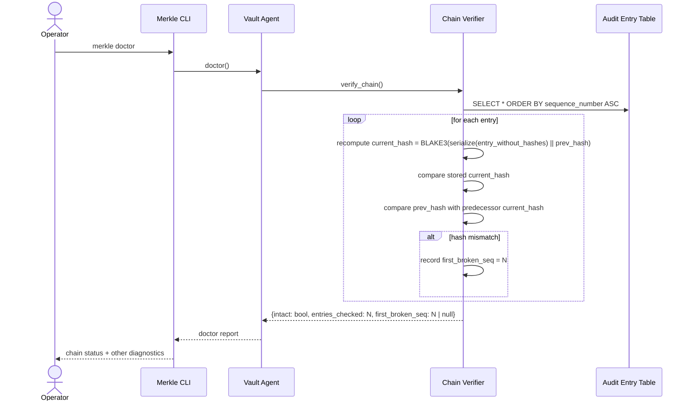
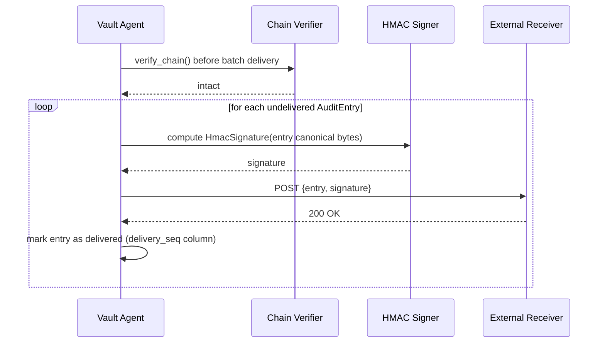

# Audit and Compliance

## Purpose

The Audit and Compliance bounded context maintains the tamper-evident record
of every operation performed against the vault. It is responsible for appending
Audit Entries, maintaining the Hash Chain that links them end-to-end, signing
entries for remote delivery, and exposing a read-only query surface for
forensic review. The context takes its name from Ralph Merkle: each entry
commits to the hash of the previous one, making retrospective tampering
detectable at any point in the chain.

This context produces records but does not enforce authorization rules, manage
keys, or gate operations. It is a passive receiver of events from the Identity
and Sealing, Secret Storage, and Access Mediation contexts, and a data source
for the Doctor command and external compliance receivers. The append-only
discipline is the single non-negotiable invariant: no operation within or
outside this context may modify or remove an entry once written.

## Ubiquitous Language

| Term | Definition | Notes |
|---|---|---|
| Audit Entry | Append-only record of every Secret operation: unseal, put, get, use, use_token_resolved, reveal, rotate, delete, restore. | Includes timestamp, session id, namespace id, op, handle, purpose, outcome, caller pid, and chain fields `current_hash` + `prev_hash`. |
| Hash Chain | Sequence of Audit Entries linked by two fields: `current_hash` = BLAKE3(serialize(entry_without_hashes) \|\| prev_hash) and `prev_hash` = current_hash of predecessor. | Two fields replace the older 3-field design; tamper detection is equivalent. Tampering with any entry invalidates all following entries. |
| Chain Verifier | Domain service validating the Hash Chain end-to-end; detects entry mutation, reordering, or removal. | |
| HMAC Signature | Detached integrity tag computed over the Audit Entry payload using a per-vault HMAC key. | Used by the remote sync worker to authenticate events to an external receiver. |
| Append-Only | Storage discipline: entries can only be added; updates and deletes are forbidden at the data layer. | Enforced by SQLite triggers and write-only file handles. |
| BLAKE3 | Cryptographic hash function used to compute per-entry content hashes and the Hash Chain links. | Fast, parallel, wide output. |
| Doctor | Diagnostic command reporting audit chain integrity along with agent status and key availability. | |
| Cross-Env Warning | Audit-level signal emitted when Secrets tagged with different `env:*` values are accessed in the same session. | Not a block; a forensic marker for later review. |
| MCP Session | Connection between a client window and the MCP server process; identified by `session_id`. | Carried on every Audit Entry for session-level correlation. |
| Vault Agent | Long-running background daemon that writes all Audit Entries; owns the HMAC key. | |
| Handle | Opaque URI identifying a Secret. | Recorded verbatim in Audit Entries; never replaced with plaintext. |
| SQLite | Embedded relational database used as persistence backend; WAL mode. | |
| Sensitivity | Closed enum affecting Audit Entry verbosity: high-sensitivity events carry extended context fields. | |
| Tag | Structured `key:value` discriminator; `env:*` tags are extracted for Cross-Env Warning analysis. | |
| Namespace | Top-level Secret container; recorded as `namespace_id` on every Audit Entry. | |

## Aggregates and Roles

### AuditEntry

Role: AggregateRoot.

Responsibility: Represents one immutable event record. Created by the Vault
Agent immediately before an operation begins (with `outcome = pending`) and
finalized at completion (with `outcome = success` or `outcome = failure`). The
entry carries all fields necessary for forensic reconstruction: the wall-clock
timestamp with microsecond precision, the monotonic sequence number, the
session identifier, the namespace identifier, the operation type, the Handle
(or the absence thereof for namespace-level ops), the stated purpose, the
outcome, the caller PID, and two chain fields: `current_hash` (BLAKE3 of the
entry's canonical content combined with `prev_hash`, i.e.
`BLAKE3(serialize(entry_without_hashes) || prev_hash)`, which ties content and
chain linkage together in a single field and is simpler yet equivalent to a
3-field design for tamper detection), and `prev_hash` (the `current_hash` of
the immediately preceding entry, or the genesis zero value).

Invariants:

1. Sequence numbers are monotonically increasing and assigned within a
   write-serialized critical section; no two entries share a sequence number.
2. Timestamps are monotonically non-decreasing; a new entry must carry a
   timestamp greater than or equal to the previous entry's timestamp.
3. `prev_hash` for the first entry in the chain is the zero hash (32 zero
   bytes); for every subsequent entry it equals the `current_hash` of the
   immediately preceding entry.
4. Once written, an AuditEntry is never updated or deleted; the SQLite
   trigger that enforces this must be present and cannot be disabled from
   within the application.
5. The `outcome` field transitions from `pending` to `success` or `failure`
   exactly once; a second update is a programming error and must panic in
   debug builds.

### ChainVerifier

Role: DomainService.

Responsibility: Walks the sequence of AuditEntries in ascending sequence-number
order and recomputes each entry's `current_hash` as
`BLAKE3(serialize(entry_without_hashes) || prev_hash)`, then verifies that the
stored `current_hash` matches and that each entry's `prev_hash` equals the
`current_hash` of the predecessor. Reports the first sequence number at which a
discrepancy is found, the total number of entries examined, and whether the
chain is intact. Invoked by the Doctor command and by the remote sync worker
before delivering a batch.

Invariants:

1. ChainVerifier never writes to the AuditEntry table; it is a pure read-only
   traversal.
2. A verification pass that encounters a missing sequence number (gap in the
   sequence) reports the gap as a chain break, not as a skipped entry.
3. The canonical serialization used to compute `current_hash` (i.e.
   `serialize(entry_without_hashes) || prev_hash`) must be deterministic
   across platform restarts; field ordering and encoding are fixed by the
   schema.

### AuditQuery

Role: ReadModel.

Responsibility: Provides a structured query surface over the Audit Entry table
for the Doctor command, the CLI `merkle audit log` subcommand, and any
external compliance exporter. Supports filtering by session identifier,
namespace identifier, operation type, time range, and outcome. Returns entries
in ascending sequence-number order. Never exposes Private Blob content or any
decrypted field; only the data already stored in the Audit Entry row is
returned.

Invariants:

1. AuditQuery results are read-only projections; the query surface has no
   mutation path.
2. All query parameters are validated before execution; injection via
   filter values is prevented by parameterized SQL.
3. Pagination is enforced; unbounded queries that would return more than a
   configured maximum number of rows are rejected with an error indicating
   the required `after_seq` cursor.

### HmacSignature

Role: ValueObject.

Responsibility: A detached integrity tag computed over the canonical
serialization of an AuditEntry payload using HMAC-BLAKE3 with a per-vault
HMAC key stored in the Vault Agent's secure memory (never in the database or
on disk in plaintext). Produced by the remote sync worker for each entry
before delivery. Allows the external receiver to verify that the event
originated from a genuine Merkle vault without having access to the
encryption key hierarchy.

Invariants:

1. The HMAC key is distinct from the Master Key, Vault Root Key, and Namespace
   DEKs; it is generated independently at vault initialization.
2. The HMAC key is loaded into the agent's protected memory during Unseal and
   held for the duration of the Unsealed State.
3. A HmacSignature is computed fresh for each delivery attempt; it is not
   stored in the database.

## Key Invariants

1. The Audit Entry table is append-only; the SQLite trigger enforcing this
   must not be disabled or bypassed by any code path.
2. Timestamps within the chain are monotonically non-decreasing.
3. The BLAKE3 Hash Chain is intact end-to-end; any single-entry mutation,
   reordering, or removal is detectable by the Chain Verifier.
4. HMAC-signed entries delivered to external receivers allow the receiver to
   verify authenticity without possessing the vault's encryption key
   hierarchy.
5. Chain breakage is reported at the granularity of the first broken entry's
   sequence number, providing precise forensic pinpointing.
6. Every operation in the Secret Storage and Access Mediation contexts emits
   exactly one Audit Entry; there are no silent accesses. Use Token resolution
   by a consumer process emits a `use_token_resolved` entry (distinct from the
   `use` entry that issued the token).
7. A Cross-Env Warning is emitted as an Audit Entry of type `cross_env_warning`
   whenever Secrets with differing `env:*` tags are accessed within the same
   MCP Session.

## Primary Flows

### Operation Audit (every Secret operation)

```mermaid
sequenceDiagram
    participant Op as Calling Context
    participant Agent as Vault Agent
    participant AuditLog as Audit Entry Table (SQLite)

    Op->>Agent: begin operation (put / use / reveal / rotate / delete)
    Agent->>Agent: serialize pending AuditEntry (outcome=pending)
    Agent->>Agent: compute current_hash = BLAKE3(serialize(entry_without_hashes) || prev_hash)
    Agent->>Agent: set prev_hash = current_hash of previous entry
    Agent->>AuditLog: INSERT AuditEntry (write serialized, trigger enforces append-only)
    AuditLog-->>Agent: row written (sequence_number assigned)
    Agent->>Op: proceed with operation
    Op-->>Agent: outcome (success / failure + detail)
    Agent->>AuditLog: UPDATE outcome field (exactly once; trigger enforces)
    AuditLog-->>Agent: committed
```

### Chain Verification (Doctor command)



### Remote Sync Delivery



## Edge Cases and Trade-offs

**Pending outcome and agent crash.** If the Vault Agent crashes between
writing the `pending` AuditEntry and updating it to `success` or `failure`,
the entry remains with `outcome = pending` forever. The Chain Verifier treats
a `pending` entry as a valid (if unfinalized) entry; it does not break the
chain. The Doctor command surfaces all `pending` entries older than a
configurable staleness threshold as a warning.

**Monotonic timestamp enforcement.** Wall-clock time on the host may go
backward (NTP adjustment, VM migration). The Vault Agent maintains a
last-seen timestamp in memory and ensures that each new entry's timestamp is
at least equal to the previous one. If the system clock reports an earlier
time, the agent uses the last-seen timestamp plus one microsecond. This
preserves the monotonicity invariant at the cost of slight timestamp
inaccuracy during clock adjustments.

**Remote sync delivery failures.** If the external receiver is unavailable,
the sync worker retries with exponential back-off and records the delivery
attempt in a separate table. Undelivered entries accumulate locally without
limit; the operator must provision sufficient storage or reduce the remote
sync target's downtime window. The local audit log remains intact regardless
of delivery status.

**Audit log growth.** An append-only log grows indefinitely. The current
design provides no log rotation or compaction for the audit table; this is a
deliberate trade-off to preserve the full forensic record. Operators who need
bounded storage should configure the vault's backup path to capture and
archive the SQLite file periodically and declare an explicit `max_entries`
policy (future work flagged in the threat model).

**Cross-Env Warning at scale.** In sessions that access many Secrets across
environments, the number of Cross-Env Warning entries in the audit log can
become large. The warning is forensic-only; no operational gating occurs.
Downstream compliance tooling should aggregate by session to avoid alert
fatigue.

## Integration Points

**Driving (inbound):**
- No external driving port. This context is a passive receiver: it does not
  expose an inbound service surface of its own. Audit Entries arrive via
  in-process Rust trait calls from the Vault Agent — specifically from
  AccessMediation (the primary emitter) and from IdentityAndSealing and
  SecretStorage for lifecycle events. The Doctor command reads from this
  context via an in-process read path; there is no separate inbound port.

**Driven (outbound):**
- Storage driven port → `StorageAdapter` for mirroring Audit Entries to the
  SQLite audit table (append-only, enforced by SQLite trigger).
- Crypto driven port → `CryptoAdapter` for BLAKE3 Hash Chain hash computation
  and HMAC-BLAKE3 signature generation (per ADR-0009).
- Audit Log File port → append-only JSONL write to `audit.jsonl` and
  synchronous write to `audit_head.json` (per ADR-0009 Amendment).
- Remote Audit Webhook port → optional HTTPS delivery of HMAC-signed Audit
  Entries to `RemoteAuditWebhook` (opt-in, push on delivery batch).

**Cross-context inbound dependencies:**
- AccessMediation (C/S — this context is upstream and owns AuditEntry schema)
  — primary emitter of Audit Entries via in-process trait call.
- IdentityAndSealing and SecretStorage also emit lifecycle Audit Entries
  (unseal, put, rotate, delete, restore) via the same in-process path.

**Shared Kernel:**
- `HmacSignature` is a Shared Kernel artifact co-owned with BackupRecovery
  (see [context-map.md](context-map.md)); changes to the HMAC signature shape
  require joint agreement between both contexts.

**Context relationships (see [context-map.md](context-map.md)):**
- Downstream of AccessMediation (C/S + CF) — conforms to AccessMediation's
  event stream as the primary consumer.
- Shares `HmacSignature` (SK) with BackupRecovery.
- No runtime dependency on PolicyPermissions or IdentityAndSealing beyond
  receiving their lifecycle events.

## Cross-Context Contracts

**Receives (inbound commands/queries):**

- `AuditEntry` from `AccessMediation` — shape: `#AuditEntry`
  (see `schemas/audit_compliance/audit_entry.cue`) — primary event stream; carries
  `op`, `handle`, `purpose`, `outcome`, `caller_pid`, `session_id`, `namespace_id`,
  `current_hash`, and `prev_hash`. AccessMediation conforms to this schema (CF).
- `AuditEntry` from `IdentityAndSealing` — shape: `#AuditEntry`
  (see `schemas/audit_compliance/audit_entry.cue`) — lifecycle events: `op=unseal`,
  `op=seal`, `op=disaster_recovery`.
- `AuditEntry` from `SecretStorage` — shape: `#AuditEntry`
  (see `schemas/audit_compliance/audit_entry.cue`) — lifecycle events: `op=put`,
  `op=rotate`, `op=delete`, `op=restore`, `op=namespace_create`.
- `AuditQuery` from `Operator` (via CLI Doctor command or audit log subcommand) —
  shape: `#AuditQuery` (see `schemas/audit_compliance/audit_query.cue`) — carries
  filter parameters: `session_id`, `namespace_id`, `op`, `time_range`, `outcome`.

**Emits (outbound events):**

- `HmacSignature` to `RemoteAuditWebhook` — shape: `#HmacSignature`
  (see `schemas/audit_compliance/hmac_signature.cue`) — Shared Kernel artifact
  co-owned with BackupRecovery; HMAC-BLAKE3 tag authenticating each delivered
  Audit Entry payload to the external receiver.
- `VerifyResult` to `Doctor` (via ChainVerifier) — shape: `#VerifyResult`
  (see `schemas/audit_compliance/chain_verifier.cue`) — carries `intact: bool`,
  `entries_checked`, and `first_broken_seq`.

## References

- [ADR-0009: Merkle style audit hash chain](../adr/0009-merkle-style-audit-hash-chain.md)
- Schema: [audit_entry.cue](../schemas/audit_compliance/audit_entry.cue)

## Schema contracts

See also the [schema index](../schemas/README.md).

- [`schemas/audit_compliance/audit_entry.cue`](../schemas/audit_compliance/audit_entry.cue)
- [`schemas/audit_compliance/audit_value_objects.cue`](../schemas/audit_compliance/audit_value_objects.cue)
