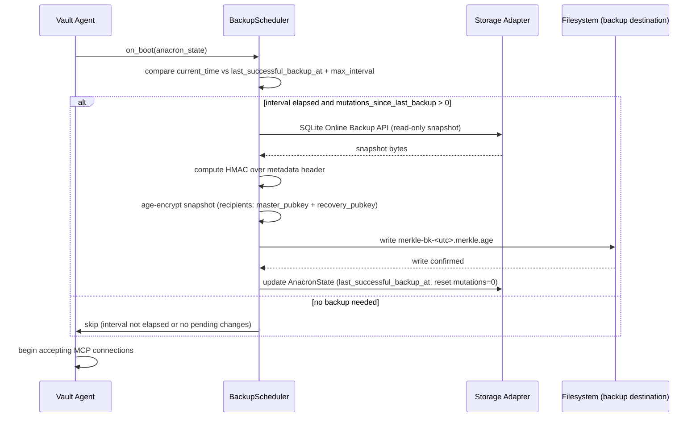
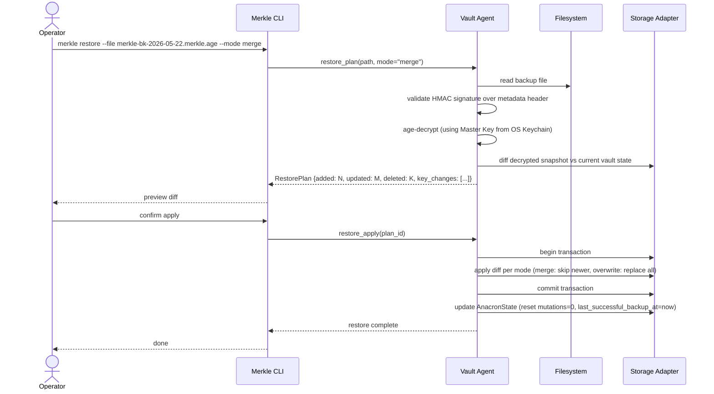

# Backup and Recovery

## Purpose

The Backup and Recovery bounded context protects the vault against permanent
data loss by maintaining a schedule of encrypted full-state exports and by
providing a safe, previewed restore procedure. It is responsible for deciding
when a Backup is due, producing the encrypted artifact, validating its
integrity, and orchestrating restore — including Disaster Recovery when the
Master Key is unavailable.

This context does not own encryption keys; it receives the necessary key
material from the Identity and Sealing context at backup time and supplies the
Recovery Key (held by the operator) at restore time. It does not make
operational decisions about individual Secrets; it treats the vault database
as an opaque blob. Policy decisions about whether a Backup is required before
certain operations (such as delete-all or namespace drop) are enforced by the
Policy and Permissions context, which may block such operations until a fresh
Backup is confirmed.

## Ubiquitous Language

| Term | Definition | Notes |
|---|---|---|
| Backup | Encrypted single-file export of the entire vault state. | Format: `age`-encrypted with two recipients (Master public key + Recovery Public Key). Filename: `merkle-bk-<utc-iso8601>.merkle.age`. |
| Restore | Procedure that reads a Backup, validates integrity, previews changes, and applies them. | Modes: `overwrite`, `merge`, `newest-wins`. |
| Disaster Recovery | Restore path when the Master Key is unavailable; operator supplies the Recovery Key. | Agent re-wraps Vault Root Key with a freshly generated Master Key after recovery. |
| Anacron Trigger | Boot-time check comparing current time against last successful Backup timestamp and configured `max_interval`. | Triggers a Backup if the interval has elapsed and pending changes exist. |
| Change-Triggered Backup | Backup initiated when a configurable count of mutations has accumulated since the last successful Backup. | |
| Idle-Triggered Backup | Backup initiated after a configurable idle period with pending changes. | |
| Sleep Hook | Platform-specific notification of imminent system sleep; best-effort Backup trigger. | macOS IOKit, Linux logind, Windows PowerBroadcast. |
| Recovery Public Key | `age` recipient corresponding to the Recovery Key; stored in `config.toml`. | Second recipient on every Backup. |
| Recovery Key | `age` identity (X25519 secret key) held only by the operator. | Used to decrypt Backup during Disaster Recovery. |
| Master Key | 32-byte symmetric key; its public form is used as the first `age` recipient on every Backup. | |
| age | File-encryption format used for Backup encryption. | filippo.io/age. Two recipients per Backup. |
| HMAC Signature | Detached integrity tag used to validate Backup authenticity on restore. | |
| Vault Agent | Long-running background daemon owning the backup scheduler and restore orchestration. | |
| Operator Confirmation | Verifiable signal that the human operator authorized a sensitive action. | Required for restore apply after preview. |
| Doctor | Diagnostic command reporting Backup freshness as part of agent health. | |
| SQLite | Embedded relational database; snapshotted as part of Backup. | WAL mode; backup uses SQLite Online Backup API. |
| MCP Session | Connection between a client window and the MCP server process. | Session close triggers idle-backup check. |

## Aggregates and Roles

### Backup

Role: AggregateRoot.

Responsibility: Represents one completed, encrypted export of the vault state.
Contains the `age`-encrypted archive, a metadata header (vault UUID, creation
timestamp, software version, chain tip sequence number), and a detached HMAC
Signature over the unencrypted metadata header. The Backup is the unit of
atomic export: it is either fully produced and written to the destination path
or it is absent; partial writes are discarded on failure.

Invariants:

1. Every Backup must be encrypted with exactly two `age` recipients: the
   Master public key and the Recovery Public Key. A Backup with only one
   recipient is rejected at write time.
2. The HMAC Signature over the metadata header is computed before encryption
   and stored as a detached file alongside the `.merkle.age` archive (or
   embedded in the archive header, depending on the chosen format). Restore
   validates the HMAC before decryption begins.
3. A Backup file is immutable once written; the filename encodes the creation
   timestamp and is not reused.
4. The Backup records the `chain_tip_seq` — the sequence number of the last
   Audit Entry at the time of snapshot — to allow post-restore chain
   continuity validation.

### RestorePlan

Role: Entity.

Responsibility: The structured preview of what a restore operation will
change before the operator confirms the apply step. Generated by reading the
Backup, decrypting it (with either the Master Key or the Recovery Key),
and computing a diff against the current vault state. Captures the list of
Secrets to be added, updated, and deleted; the key material changes; and
the Audit Entry count difference. Presented to the operator for review; only
an explicit confirmation triggers the apply.

Invariants:

1. A RestorePlan is generated and presented before any mutation is applied to
   the live vault; no side effects occur during plan generation.
2. The RestorePlan expires after a configurable timeout (default 10 minutes);
   a stale plan cannot be applied.
3. The mode (`overwrite`, `merge`, `newest-wins`) is validated against the
   current Namespace Policy before the plan is generated; unsupported modes
   for a Namespace are surfaced in the preview.

### BackupScheduler

Role: DomainService.

Responsibility: Decides when a Backup should run and initiates the Backup
aggregate creation. Implements three trigger mechanisms — Anacron Trigger on
boot, Change-Triggered Backup on accumulated mutations, and Idle-Triggered
Backup on session close with pending changes — and responds to Sleep Hook
signals for best-effort pre-sleep backups. Records the timestamp and result of
each Backup attempt in a scheduler state table. Reads the `max_interval`,
`change_threshold`, and `idle_timeout` from the Namespace Policy (falling
back to vault-level defaults).

Invariants:

1. The BackupScheduler runs at most one Backup at a time; concurrent
   initiation attempts are serialized.
2. A Backup initiated by the BackupScheduler is considered successful only
   if the destination file is fully written, the HMAC is computed, and the
   scheduler state table is updated atomically.
3. On boot, the Anacron Trigger fires before the Vault Agent begins accepting
   MCP connections, ensuring that a potentially stale vault is backed up
   before new writes accumulate.
4. Best-effort Sleep Hook backups do not block the sleep transition; if the
   Backup does not complete within a 10-second window, it is abandoned and
   the Sleep Hook returns.

### AnacronState

Role: ValueObject.

Responsibility: The persisted scheduler state that drives the Anacron Trigger.
Records the timestamp of the last successful Backup, the timestamp of the last
attempted Backup (whether successful or not), the count of mutations since the
last successful Backup, and the next scheduled check timestamp. Immutable once
written; a new AnacronState is created on every scheduler state update.

Invariants:

1. The `last_successful_backup_at` field is updated only when the Backup
   aggregate reports a successful write; a failed attempt increments
   `attempt_count` but does not update `last_successful_backup_at`.
2. `mutations_since_last_backup` is incremented atomically within the same
   transaction as every Secret write; it is reset to zero on successful
   Backup.

## Key Invariants

1. Every Backup is encrypted with exactly two `age` recipients: the Master
   public key and the Recovery Public Key.
2. The HMAC Signature over the Backup metadata header is validated before
   decryption is attempted on restore; a signature mismatch aborts restore.
3. Restore preview (RestorePlan) is always presented to the operator before
   any mutation is applied to the live vault.
4. The Anacron Trigger fires on boot when the elapsed time since the last
   successful Backup exceeds `max_interval` and there are pending changes.
5. On-shutdown (Sleep Hook) backup is best-effort; it does not block the
   system sleep transition beyond a 10-second window.
6. A RestorePlan expires after a configurable timeout (default 10 minutes);
   stale plans cannot be applied.
7. Disaster Recovery re-wraps the Vault Root Key under a freshly generated
   Master Key stored in the OS Keychain; the old (unavailable) Master Key is
   not referenced afterward.

## Primary Flows

### Boot Anacron Check and Backup



### Restore with Preview



### Disaster Recovery (Recovery Key path)

```mermaid
sequenceDiagram
    actor Operator
    participant CLI as Merkle CLI
    participant Agent as Vault Agent
    participant FS as Filesystem
    participant Keychain as OS Keychain
    participant DB as Storage Adapter

    Operator->>CLI: merkle recover --file merkle-bk-2026-05-22.merkle.age --recovery-key id.age
    CLI->>Agent: disaster_restore(path, recovery_key_path)
    Agent->>FS: read backup file
    Agent->>Agent: validate HMAC signature over metadata header
    Agent->>Agent: age-decrypt (using operator Recovery Key from id.age)
    Agent->>DB: diff decrypted snapshot vs current (possibly empty) vault state
    Agent-->>CLI: RestorePlan preview
    Operator->>CLI: confirm apply
    CLI->>Agent: disaster_restore_apply(plan_id)
    Agent->>DB: apply snapshot (overwrite mode)
    Agent->>Agent: generate new Master Key (generation n+1)
    Agent->>Keychain: store new Master Key (account=master-vN+1)
    Agent->>Agent: re-wrap VaultRootKey under new Master Key
    Agent->>Agent: re-wrap VaultRootKey under Recovery Public Key (unchanged)
    Agent->>DB: atomic replace both wrapped VaultRootKey copies
    Agent->>Agent: enter Unsealed State
    Agent-->>CLI: disaster recovery complete
    CLI-->>Operator: vault restored and unsealed; new master key enrolled
```

## Edge Cases and Trade-offs

**Two-recipient age encryption and recipient rotation.** If the operator
generates a new Recovery Key, all historical Backups remain decryptable with
the old Recovery Key (which is still in the operator's possession), but new
Backups will use the new Recovery Public Key. The operator must not discard
the old Recovery Key until all historical Backups encrypted with it have been
superseded by newer ones or explicitly re-encrypted.

**SQLite Online Backup API and WAL mode.** The backup uses SQLite's Online
Backup API, which reads a consistent snapshot of the database without blocking
writers. In WAL mode, this means a read transaction is opened and held for
the duration of the snapshot copy, which may be tens of seconds for a large
vault. The scheduler initiates backup during idle periods where possible.

**HMAC key availability during Sealed State.** The BackupScheduler uses the
HMAC key (loaded during Unseal) to sign the metadata header. If the vault is
in Sealed State at boot and the Anacron Trigger fires, the scheduler must
wait until Unseal completes before producing the Backup. The boot sequence
enforces this ordering: Unseal before Anacron check.

**Restore and the Audit Entry chain.** Restoring a Backup replaces the live
database, which may truncate the Audit Entry sequence or introduce a gap
relative to the current chain tip. Post-restore, the audit log records a
`restore` event as the new chain tip. The Chain Verifier will detect the
discontinuity if run across the restore boundary; the Doctor command surfaces
this as an expected break with an associated restore event.

**Change-Triggered Backup and high-frequency writes.** In environments with
continuous writes (e.g., a CI system rotating tokens frequently), the
Change-Triggered Backup may fire very often. The `change_threshold` should be
tuned to the expected write rate; excessively low thresholds cause backup
storms. The BackupScheduler enforces a minimum inter-backup interval as a
guard.

## Integration Points

**Driving (inbound):**
- BackupScheduler DomainService (internal) — receives trigger signals from the
  anacron scheduler loop, change counter, idle timer, Sleep Hook listener, and
  on-shutdown trigger. There is no external driving port; all backup initiations
  originate inside the Vault Agent process.
- CLI Adapter — receives explicit `merkle backup`, `merkle restore`, and
  `merkle recover` commands via the Companion Socket Port.

**Driven (outbound):**
- Crypto driven port → `CryptoAdapter` for `age` encryption of Backup archives
  with two recipients (Master public key + Recovery Public Key) (per ADR-0006).
- Storage driven port → `StorageAdapter` for reading vault state via SQLite
  Online Backup API and for writing `AnacronState` updates.
- Backup Store port → filesystem write of `merkle-bk-<utc>.merkle.age` files
  to the configured backup destination.
- Drive Sync Target port (optional) → mirroring encrypted Backup files to cloud
  or local sync destination.

**Cross-context inbound dependencies:**
- SecretStorage (C/S upstream) — provides vault state snapshot for Backup
  export; BackupRecovery is a Conformist consumer of the export contract.
- PolicyPermissions (C/S upstream) — `BackupScheduler` reads `max_interval`,
  `change_threshold`, and `idle_timeout` fields from NamespacePolicy to
  determine backup cadence.
- IdentityAndSealing (C/S upstream) — provides the HMAC key (loaded during
  Unseal) for signing the Backup metadata header; backup creation requires
  Unsealed State.

**Shared Kernel:**
- `HmacSignature` is a Shared Kernel artifact co-owned with AuditCompliance
  (see [context-map.md](context-map.md)); BackupRecovery imports the type via
  `import "fapp.dev/merkle/schemas/audit_compliance"` in `backup.cue`.

**Context relationships (see [context-map.md](context-map.md)):**
- Downstream of SecretStorage (C/S + CF) — consumes vault state as Conformist.
- Downstream of PolicyPermissions (C/S) — reads scheduling parameters from
  NamespacePolicy.
- Downstream of IdentityAndSealing (C/S) — depends on Unsealed State for
  HMAC key availability.
- Shares `HmacSignature` (SK) with AuditCompliance.

## Cross-Context Contracts

**Receives (inbound commands/queries):**

- `VaultStateSnapshot` from `SecretStorage` — shape: SQLite Online Backup API
  stream; contract owned by `SecretStorage` (C/S upstream). BackupRecovery is a
  Conformist consumer: it treats the snapshot as an opaque byte stream and does
  not interpret individual Secret records.
- `NamespacePolicy` fields from `PolicyPermissions` — shape: `#BackupScheduler`
  fields `max_interval`, `change_threshold`, `idle_timeout`
  (see `schemas/backup_recovery/backup_scheduler.cue`) — consulted by
  BackupScheduler on every scheduling decision.
- `UnsealState` from `IdentityAndSealing` — implicit contract: backup creation
  requires Unsealed State so that the HMAC key (loaded during Unseal) is
  available for signing the Backup metadata header.

**Emits (outbound events):**

- `Backup` to `BackupStore` (filesystem) — shape: `#Backup`
  (see `schemas/backup_recovery/backup.cue`) — age-encrypted archive with two
  recipients (Master public key + Recovery Public Key), detached HMAC Signature
  over metadata header, and embedded `chain_tip_seq`.
- `AnacronState` update to `StorageAdapter` — shape: `#AnacronState`
  (see `schemas/backup_recovery/anacron_state.cue`) — written atomically after
  each successful backup: `last_successful_backup_at`, `mutations_since_last_backup`.
- `RestorePlan` to `Operator` (via CLI Adapter) — shape: `#RestorePlan`
  (see `schemas/backup_recovery/restore_plan.cue`) — preview diff before apply;
  carries added/updated/deleted counts and key-material changes.

## References

- [ADR-0006: Age encryption for backups and recovery](../adr/0006-age-encryption-for-backups-and-recovery.md)
- [ADR-0010: Anacron style backup triggers](../adr/0010-anacron-style-backup-triggers.md)

## Schema contracts

See also the [schema index](../schemas/README.md).

- [`schemas/backup_recovery/backup.cue`](../schemas/backup_recovery/backup.cue)
- [`schemas/backup_recovery/restore_plan.cue`](../schemas/backup_recovery/restore_plan.cue)
