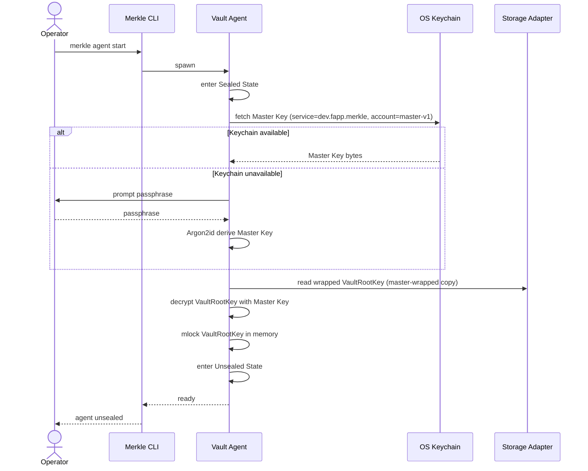

# Identity and Sealing

## Purpose

The Identity and Sealing bounded context owns the entire key hierarchy of
Merkle: generation, wrapping, persistence strategy, and the sealed/unsealed
lifecycle of the Vault Agent. It is solely responsible for making cryptographic
material available to other contexts at runtime while ensuring that no
plaintext key ever reaches disk, the MCP transport, or the audit log.

This context intentionally excludes knowledge of individual Secrets, their
categories, or any application-level business logic. It does not enforce
access policy or emit Audit Entries for Secret-level operations; it emits
only lifecycle events (sealed, unsealed, key rotated, recovery key enrolled).
Neighboring contexts consume the Unsealed State through the Storage Adapter
and Keychain Adapter ports rather than through direct dependency on this
context's domain objects.

## Ubiquitous Language

| Term | Definition | Notes |
|---|---|---|
| Master Key | 32-byte symmetric key at the top of the key hierarchy; generated once at `merkle init`. | Never persisted in plaintext. |
| Recovery Key | `age` identity (X25519 secret key) shown once at init and never stored by the system. | Used to unwrap Vault Root Key when Master Key is unavailable. |
| Recovery Public Key | `age` recipient corresponding to the Recovery Key; stored in plaintext in `config.toml`. | Used to dual-wrap Vault Root Key and encrypt Backups. |
| Vault Root Key | 32-byte symmetric key protecting all Namespace DEKs; stored wrapped in the database. | Wrapped twice: once by Master Key, once by Recovery Public Key. |
| Namespace DEK | Per-Namespace 32-byte Data Encryption Key; wrapped by Vault Root Key. | Allows Namespace-granularity revocation. |
| Sealed State | Agent state in which Vault Root Key is absent from memory; all operations rejected. | Default on agent boot. |
| Unsealed State | Agent state in which Vault Root Key is loaded in mlocked memory. | Read and write operations permitted. |
| Unseal Protocol | Procedure transitioning agent from Sealed to Unsealed. | Fetches Master Key from OS Keychain or derives from passphrase. |
| OS Keychain | Operating-system-managed credential store abstracted by the `keyring` crate. | Backends: macOS Security framework, Linux Secret Service, Windows Credential Manager. |
| Service Identifier | Logical key name in the OS Keychain: `dev.fapp.merkle` with account `master-v1`, `master-v2`, etc. | Versioned to support key rotation. |
| XChaCha20-Poly1305 | AEAD cipher used for per-blob encryption; 24-byte nonces. | RFC 8439 extended-nonce variant. |
| Argon2id | Password hashing function used to derive Master Key from passphrase in keychain-absent fallback. | RFC 9106. |
| age | File-encryption format used for Backups and Recovery Key wrapping. | filippo.io/age. |
| Nonce | Per-blob random 24-byte value prefixed to ciphertext. | Number used once. |
| Doctor | Diagnostic command reporting agent status including key availability and audit chain integrity. | |
| Vault Agent | Long-running background daemon that owns the key lifecycle. | One per user. |

## Aggregates and Roles

### VaultIdentity

Role: AggregateRoot.

Responsibility: Represents a single Merkle installation. Holds the
VaultRootKey (in memory when unsealed, absent when sealed), references the
Recovery Public Key, tracks the current Master Key generation counter, and
coordinates the Unseal Protocol. It is the only entity authorized to grant
other contexts access to Namespace DEKs.

Invariants:

1. VaultRootKey is either fully loaded (Unsealed State) or fully absent
   (Sealed State); there is no partially loaded intermediate.
2. The Recovery Public Key stored in `config.toml` must always match the
   private Recovery Key held only by the operator.
3. Master Key generation counter increments on every rotation; stale
   generation entries may coexist in the OS Keychain but are never used
   for new operations.

### MasterKey

Role: Entity.

Responsibility: Wraps the VaultRootKey for the primary unlock path. Stored
in the OS Keychain under the Service Identifier. When the OS Keychain is
unavailable, a surrogate is derived via Argon2id from the operator passphrase
and used identically. The MasterKey entity tracks its generation number to
allow rotation without losing the ability to unseal with an older credential
during a transition window.

Invariants:

1. Never persisted in plaintext to disk, database, or any log.
2. The Argon2id derivation path uses parameters that meet or exceed RFC 9106
   minimum hardness for interactive use (memory 64 MiB, three passes, one
   lane) unless the operator explicitly lowers them for constrained targets.

### RecoveryKey

Role: Entity.

Responsibility: The `age` X25519 identity presented by the operator during
Disaster Recovery. The agent stores only the Recovery Public Key; the private
RecoveryKey identity is never written anywhere by the system.

Invariants:

1. The system stores zero bytes of the private RecoveryKey; it is
   exclusively in the operator's custody.
2. On every Backup, the Recovery Public Key is included as a second `age`
   recipient so that the backup remains decryptable even if the Master Key
   is lost.

### VaultRootKey

Role: Entity.

Responsibility: The 32-byte symmetric root that encrypts every Namespace DEK.
Persisted in the database in two wrapped forms simultaneously: one sealed
under the Master Key (for the normal unlock path) and one sealed for the
Recovery Public Key (for Disaster Recovery). Held in mlocked memory during
Unsealed State.

Invariants:

1. Always stored wrapped under both recipients; a VaultRootKey with only
   one wrapping is an inconsistent state and must be rejected.
2. Rotation requires atomically replacing both wrapped copies and
   re-wrapping all Namespace DEKs within a single database transaction.

### NamespaceDek

Role: Entity.

Responsibility: One Data Encryption Key per Namespace. Encrypts the
`private_blob` column for all Secrets in that Namespace. Wrapped by the
VaultRootKey and stored in the database. Can be destroyed independently to
revoke an entire Namespace without touching other Namespaces.

Invariants:

1. Never held in plaintext outside the Vault Agent process memory.
2. Destruction of a NamespaceDek renders all Private Blobs in that Namespace
   permanently unrecoverable unless a Backup exists.

### SealedState

Role: ValueObject.

Responsibility: Represents the absence of the VaultRootKey in memory. Carries
a reason code (initial boot, explicit seal command, timeout seal, or error
seal) and the timestamp of the transition. Immutable once created; a new
SealedState object is created on each seal event.

Invariants:

1. While SealedState is active, every incoming operation except `unseal`
   and `doctor` must be rejected with a deterministic error without reading
   any Secret material.

## Error Rollback Contract

Any error occurring during the Unseal Protocol after the state has been
transitioned to `Unsealing` MUST revert the state back to `Sealed` before
propagating the error to the caller. This is a hard invariant codified in
ADR-0015 Amendment 3.

### Rationale

The `Unsealing` state is a transient intermediate that signals "unseal is in
progress." It is not a stable state that callers can observe and act on. If
the protocol fails partway through (for example, the OS Keychain entry is
absent), leaving the agent in `Unsealing` makes the vault inoperable: the
next retry attempt finds the state machine already in `Unsealing` and cannot
re-enter it, producing "invalid state transition from Unsealing to Unsealing."

### Rule

The `Unsealing → Sealed` rollback MUST happen before any `?` operator returns
the error up the call stack. The preferred implementation pattern is a Rust
RAII `UnsealGuard` that calls `state.revert_to_sealed()` from `Drop` if
`commit()` was not called. See ADR-0015 Amendment 3 for the guard pattern.

### Audit Emission on Error

The Audit Entry (op=`unseal`, outcome=`error`, denial_reason=`<code>`) MUST
be appended before the rollback completes. Error paths do not skip audit
emission.

### Enumerated Failure Modes

| Failure mode | Denial reason in Audit Entry |
|---|---|
| OS Keychain entry absent | `keychain_not_found` |
| OS Keychain daemon unavailable | `keychain_unavailable` |
| OS Keychain access denied | `keychain_access_denied` |
| Wrapped VRK rows absent from database | `vrk_not_found` |
| AEAD decryption tag verification failure | `aead_verify_failed` |
| Argon2id parameter mismatch | `argon2id_params_mismatch` |
| Argon2id KDF produces wrong key | `passphrase_invalid` |
| `mlock` failure when profile=paranoid | `mlock_required_failed` |
| Entropy gate failure | `entropy_unseeded` |

After rollback, the state is `Sealed`. The caller MUST be able to retry the
Unseal Protocol immediately without restarting the agent.

### Cross-references

- ADR-0015 Amendment 3 — implementation guidance and acceptance tests.
- Feature: [unseal.feature](../specs/features/unseal.feature) — Gherkin
  scenarios covering rollback on keychain_not_found and AEAD failure.

## Key Invariants

1. The VaultRootKey is always dual-wrapped: once under the Master Key and
   once under the Recovery Public Key.
2. The Master Key is never persisted in plaintext to any durable medium.
3. The private Recovery Key identity is never stored by the system; only its
   public recipient is retained.
4. In Sealed State, all Secret-level read and write operations are denied; the
   only permitted operations are `unseal` and `doctor`.
5. The Unseal Protocol is idempotent: if the agent is already in Unsealed
   State, a second unseal call returns success without side effects.
6. A NamespaceDek is destroyed only through an explicit revocation command,
   never implicitly.
7. Nonces are generated fresh per encryption operation; reuse of any nonce
   with the same key is a critical fault.
8. Key rotation preserves at least one generation overlap: the outgoing
   Master Key remains valid in the OS Keychain until the operator explicitly
   purges it.

## Primary Flows

### Boot and Unseal Sequence



### Key Rotation Flow

```mermaid
sequenceDiagram
    actor Operator
    participant CLI as Merkle CLI
    participant Agent as Vault Agent
    participant Keychain as OS Keychain
    participant DB as Storage Adapter

    Operator->>CLI: merkle rotate-key
    CLI->>Agent: rotate_master_key()
    Agent->>Agent: generate new Master Key (generation n+1)
    Agent->>Keychain: store new Master Key (account=master-vN+1)
    Agent->>Agent: re-wrap VaultRootKey under new Master Key
    Agent->>Agent: re-wrap VaultRootKey under Recovery Public Key (unchanged)
    Agent->>DB: atomic replace both wrapped copies
    Agent->>Agent: update Service Identifier generation counter
    Agent-->>CLI: rotation complete; old generation still valid until purge
    CLI-->>Operator: key rotated (generation n+1)
```

### Disaster Recovery Flow

```mermaid
sequenceDiagram
    actor Operator
    participant CLI as Merkle CLI
    participant Agent as Vault Agent
    participant DB as Storage Adapter
    participant Keychain as OS Keychain

    Operator->>CLI: merkle recover --recovery-key <age-identity-file>
    CLI->>Agent: disaster_recovery(recovery_key_path)
    Agent->>DB: read wrapped VaultRootKey (recovery-wrapped copy)
    Agent->>Agent: decrypt VaultRootKey with operator Recovery Key
    Agent->>Agent: generate new Master Key
    Agent->>Keychain: store new Master Key (account=master-vN+1)
    Agent->>Agent: re-wrap VaultRootKey under new Master Key
    Agent->>DB: atomic replace master-wrapped copy
    Agent->>Agent: mlock VaultRootKey; enter Unsealed State
    Agent-->>CLI: recovery complete
    CLI-->>Operator: new master key enrolled; vault unsealed
```

## Edge Cases and Trade-offs

**Keychain unavailability on headless servers.** When no OS Keychain daemon is
running, the agent falls back to Argon2id passphrase derivation. This is
intentional: the operator accepts weaker automation properties in exchange for
no keychain dependency. Automated deployments should configure a systemd
credential or secrets manager injection that populates the keychain equivalent.

**Double-wrapping cost on every Vault Root Key rotation.** Rotating the
VaultRootKey requires re-wrapping every NamespaceDek, which scales linearly
with the number of Namespaces. For vaults with many Namespaces this operation
may be slow; the implementation must hold the write lock only for the atomic
swap and release it promptly.

**Idempotency of unseal under concurrent callers.** Multiple MCP Server
processes may attempt to trigger unseal simultaneously at startup. The Vault
Agent serializes unseal internally; redundant calls are acknowledged without
error, and the agent never loads the VaultRootKey twice.

**mlock failure on memory-constrained systems.** If `mlock` fails, the agent
logs a warning and continues; the VaultRootKey remains in process memory but
may be swapped to disk by the OS. This is a degraded-security mode; the
operator should be notified via the Doctor command.

**Passphrase-derived key caching.** To avoid repeated Argon2id derivations on
each unseal (e.g., after timeout seal), the agent caches the derived key in
mlocked memory for a configurable session window. The cache is cleared on
agent shutdown and on explicit `seal` commands.

## Integration Points

**Driving (inbound):**
- Companion Socket Port (Hexagonal driving port) — receives `unseal`, `seal`,
  `rotate_master_key`, and `disaster_recovery` commands via MCP Adapter or CLI
  Adapter. The Companion Socket Port is the single inbound entry to this context.

**Driven (outbound):**
- Keychain driven port → OS Keychain via `KeychainAdapter` for Master Key
  storage and retrieval (per [ADR-0015](../adr/0015-rust-keyring-crate-for-multi-os-keychain.md)).
- Crypto driven port → `CryptoAdapter` for Argon2id key derivation and
  XChaCha20-Poly1305 Vault Root Key wrapping (per [ADR-0004](../adr/0004-xchacha20-poly1305-aead-for-blobs.md), [ADR-0005](../adr/0005-argon2id-kdf-for-passphrase-fallback.md)).
- Storage driven port → `StorageAdapter` for reading and atomically replacing
  the dual-wrapped Vault Root Key copies (per [ADR-0003](../adr/0003-sqlite-with-per-blob-encryption.md)).
- Config read port → `ConfigStore` for Reading the Recovery Public Key and
  vault configuration from `config.toml`.

**Produced output consumed by other contexts:**
- Unwrapped Namespace DEKs delivered to SecretStorage (C/S — this context is
  upstream) in-process via Rust trait call.

**Context relationships (see [context-map.md](context-map.md)):**
- Upstream of SecretStorage (C/S + Conformist on DEK shape) — supplies
  unwrapped NamespaceDeks on demand.
- No direct runtime dependency on AccessMediation, AuditCompliance,
  BackupRecovery, or PolicyPermissions.

## Cross-Context Contracts

**Receives (inbound commands/queries):**

- `UnsealCommand` from `Operator` (via Companion Socket Port through CLI Adapter
  or MCP Adapter) — shape: `#UnsealPreconditions`
  (see `schemas/identity_and_sealing/unseal_preconditions.cue`) — carries
  optional passphrase for keychain-absent fallback path.
- `SealCommand` from `Operator` — no payload shape beyond the command identifier;
  signals the VaultIdentity to zero the Vault Root Key from memory.
- `DisasterRecoveryCommand` from `Operator` — carries a filesystem path to the
  Recovery Key age identity file; no CUE schema (operator-supplied file path only).

**Emits (outbound events):**

- `NamespaceDek` to `SecretStorage` — shape: `#NamespaceDek`
  (see `schemas/identity_and_sealing/namespace_dek.cue`) — unwrapped 32-byte
  Data Encryption Key delivered in-process on demand; never leaves agent memory
  unencrypted. IdentityAndSealing is upstream (C/S); SecretStorage conforms to
  the DEK envelope format.
- `AuditEntry` (lifecycle) to `AuditCompliance` — shape: `#AuditEntry`
  (see `schemas/audit_compliance/audit_entry.cue`) — emitted for `op=unseal`,
  `op=seal`, `op=disaster_recovery`, and key-rotation events.
- `VaultRootKey` wrapped copies to `StorageAdapter` — shape: `#VaultRootKey`
  (see `schemas/identity_and_sealing/vault_root_key.cue`) — dual-wrapped: one
  copy under Master Key, one under Recovery Public Key; atomically replaced on
  rotation or Disaster Recovery.

## References

- [ADR-0004: XChaCha20-Poly1305 AEAD for blob encryption](../adr/0004-xchacha20-poly1305-aead-for-blobs.md)
- [ADR-0005: Argon2id kdf for passphrase fallback](../adr/0005-argon2id-kdf-for-passphrase-fallback.md)
- [ADR-0006: Age encryption for backups and recovery](../adr/0006-age-encryption-for-backups-and-recovery.md)
- [ADR-0015: Rust keyring crate for multi os keychain](../adr/0015-rust-keyring-crate-for-multi-os-keychain.md)
- Schema: [vault_identity.cue](../schemas/identity_and_sealing/vault_identity.cue)
- Schema: [master_key.cue](../schemas/identity_and_sealing/master_key.cue)
- Schema: [recovery_key.cue](../schemas/identity_and_sealing/recovery_key.cue)
- Schema: [vault_root_key.cue](../schemas/identity_and_sealing/vault_root_key.cue)
- Schema: [namespace_dek.cue](../schemas/identity_and_sealing/namespace_dek.cue)
- Schema: [sealed_state.cue](../schemas/identity_and_sealing/sealed_state.cue)
- Policy: [unseal_required.rego](../policies/unseal_required.rego)
- Feature: [unseal.feature](../specs/features/unseal.feature)

## Schema contracts

See also the [schema index](../schemas/README.md).

- [`schemas/identity_and_sealing/vault_identity.cue`](../schemas/identity_and_sealing/vault_identity.cue)
- [`schemas/identity_and_sealing/keystore_config.cue`](../schemas/identity_and_sealing/keystore_config.cue)
- [`schemas/identity_and_sealing/master_key_ref.cue`](../schemas/identity_and_sealing/master_key_ref.cue)
