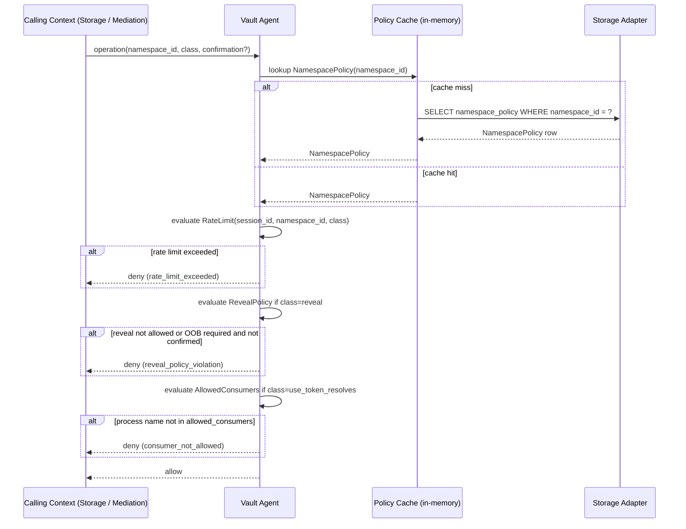
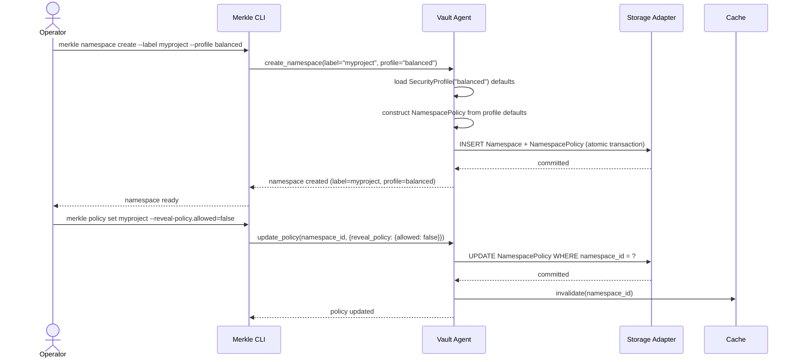

# Policy and Permissions

## Purpose

The Policy and Permissions bounded context is the rule-enforcement layer for
the entire vault. It defines how Namespace-scoped policies govern Secret
operations, controls which operations require out-of-band confirmation, limits
the rate at which credentials may be accessed, restricts which external
processes may consume Use Tokens, and prevents cross-Namespace reads by default.
Every operation that touches Secret material passes through a policy lookup in
this context before the Secret Storage or Access Mediation context proceeds.

This context does not store Secrets, manage keys, or produce Audit Entries for
individual Secret operations. It is a pure decision engine: given an operation
descriptor and the current Namespace Policy, it returns allow or deny with a
reason. The Vault Agent calls into this context synchronously on the hot path;
policy lookups must be fast and free of I/O.

## Ubiquitous Language

| Term | Definition | Notes |
|---|---|---|
| Namespace Policy | Set of rules applied to all Secrets in a Namespace. | Covers default sensitivity, rate limits, OOB threshold, allowed consumers, tag validation, cross-namespace access, and retention policy. |
| Rate Limit | Maximum number of operations of a given class per unit time. | Default classes: `plaintext_reads`, `use_token_resolves`, `reveals`. |
| Reveal Policy | Configuration controlling when and how a Reveal can be authorized. | Whether allowed at all; sensitivity threshold for OOB; whether only Slash Commands can pass the confirmation flag. |
| Cross-Namespace Access | Whether a session bound to Namespace A may read Secrets from Namespace B. | Default: forbidden. Positive allowlist of imports permitted by configuration. |
| Allowed Consumers | Glob list of process names authorized to dereference Use Tokens for a Namespace. | Checked against peer PID on the Companion Socket. |
| Operator Confirmation | Verifiable signal that the human operator authorized a sensitive action. | Sources: Slash Command, OOB Confirmation, signed config flag. |
| OOB Confirmation | Out-of-band acknowledgment delivered through a channel distinct from the MCP transport. | Desktop notification, terminal prompt, or localhost browser page. |
| Slash Command | Client-side trigger carrying a verifiable Operator Confirmation flag. | `/merkle-reveal`, `/merkle-rollback`, `/merkle-show`. |
| Security Profile | Bundle of policy defaults applied at init. | Built-in profiles: `relaxed`, `balanced`, `paranoid`. |
| Sensitivity | Closed enum: `low`, `medium`, `high`. | Drives OOB requirement and rate-limit class selection. |
| Tag | Structured `key:value` discriminator. | `env:*` prefix required for `sensitivity = high` Secrets. |
| Handle | Opaque URI identifying a Secret. | Presented to policy lookup for per-Secret decisions. |
| Namespace | Top-level Secret container; scope of every policy evaluation. | |
| Use Token | Short-lived opaque token; rate-limited under `use_token_resolves` class. | |
| Reveal | Explicit return of Secret plaintext to MCP transport. | Rate-limited under `reveals` class; governed by Reveal Policy. |
| Vault Agent | Long-running background daemon; evaluates Namespace Policy on every op. | |
| MCP Session | Connection between a client window and the MCP server process. | Rate-limit windows are tracked per session and per namespace. |

## Aggregates and Roles

### NamespacePolicy

Role: AggregateRoot.

Responsibility: The authoritative policy record for one Namespace. Persisted
in the database alongside the Namespace record. Owns the complete set of
policy fields: default Sensitivity, rate-limit configuration for each class,
the Reveal Policy, the Allowed Consumers list, the cross-namespace import
allowlist, tag validation rules, the retain_count for Secret versioning, and
a reference to the Security Profile from which the policy was initialized.
Loaded into the Vault Agent's policy cache on Unseal and invalidated on any
write to the policy record.

Invariants:

1. Every Namespace has exactly one NamespacePolicy; the policy is created with
   Security Profile defaults at Namespace creation time.
2. A NamespacePolicy must declare a `default_sensitivity` value; it cannot be
   null or absent.
3. Changes to NamespacePolicy take effect on the next operation; in-flight
   operations that already passed the policy check are not retroactively
   revoked.
4. The cross-namespace import allowlist is validated at write time; circular
   imports (Namespace A imports B, B imports A) are rejected.

### RateLimit

Role: ValueObject.

Responsibility: Immutable configuration of maximum operations per class per
unit time. Each class (`plaintext_reads`, `use_token_resolves`, `reveals`) has
its own window size (in seconds) and maximum count. The Vault Agent maintains
a sliding-window counter per (session, namespace, class) tuple in memory;
policy lookup increments the counter and returns deny if the limit is exceeded.
RateLimit is embedded in NamespacePolicy and is applied uniformly to all
Secrets in the Namespace regardless of individual Secret sensitivity.

Invariants:

1. All three default rate-limit classes must be present in a valid
   NamespacePolicy; partial configurations are rejected at validation time.
2. A RateLimit with `max_count = 0` denies all operations of that class
   unconditionally; this is the mechanism for disabling Reveals entirely
   at the namespace level.
3. Rate-limit counters are per-session and are reset when the MCP Session
   closes; there is no cross-session rate accumulation unless the policy
   declares a `global` window.

### RevealPolicy

Role: ValueObject.

Responsibility: Governs whether a Reveal is permitted for Secrets in the
Namespace and under what conditions. Contains three fields: `allowed` (bool),
`require_oob_above` (Sensitivity threshold above which OOB Confirmation is
required), and `slash_command_only` (bool; when true, the confirmation flag
is accepted only from a Slash Command, not from an API parameter). Embedded
in NamespacePolicy.

Invariants:

1. When `allowed = false`, no Reveal is permitted regardless of other fields;
   the denial is immediate and does not prompt for confirmation.
2. When `require_oob_above = low`, every Reveal at any sensitivity requires
   OOB Confirmation; this is the effective behavior of the `paranoid` Security
   Profile.
3. `slash_command_only = true` combined with `require_oob_above = medium`
   is the default for `balanced` Security Profile; API-parameter confirms
   are accepted only for `low` sensitivity in that configuration.

### SecurityProfile

Role: ValueObject.

Responsibility: A named bundle of NamespacePolicy defaults applied at
Namespace creation or at re-initialization via `merkle profile apply`. Three
built-in profiles ship with Merkle. Per-namespace overrides may diverge from
the profile after initialization; the profile reference in the policy is
informational only after that point.

The three built-in profiles:

- `relaxed` — low default sensitivity; OOB only for `high`; rate limits
  generous; allows API-parameter confirms.
- `balanced` — medium default sensitivity; OOB for `medium` and `high`;
  moderate rate limits; Slash Command only for confirms.
- `paranoid` — high default sensitivity; OOB for all sensitivities; strict
  rate limits; cross-namespace imports disabled; Reveals allowed only via
  explicit Slash Command with OOB.

Invariants:

1. The Security Profile name stored in NamespacePolicy is informational; it
   does not enforce ongoing compliance with the profile's defaults after
   initialization.
2. Custom Security Profiles may be defined in `config.toml`; they must
   declare all required policy fields and are validated at vault start time.

### AllowedConsumers

Role: ValueObject.

Responsibility: A glob list of process names that may connect to the Companion
Socket and dereference Use Tokens for Secrets in this Namespace. Evaluated at
CompanionSocketSession establishment time against the peer process name resolved
from the connecting PID. An empty list denies all external process access to
this Namespace through the Companion Socket; the Vault Agent itself is always
an implicit allowed consumer.

Invariants:

1. Glob patterns follow Unix shell glob semantics (`*` matches any sequence
   of characters; `?` matches one character); they do not match directory
   separators.
2. An AllowedConsumers list with the single entry `*` permits any process
   name; this is the `relaxed` profile default.
3. Process name matching is case-sensitive on Linux and case-insensitive on
   macOS; the policy record must declare the target platform's convention.

## Key Invariants

1. Every Namespace has exactly one NamespacePolicy; there is no policy
   inheritance or merging across Namespaces.
2. Sensitivity `high` requires at least one `env:*` Tag on the Secret; this
   rule is enforced here and in Secret Storage independently.
3. Rate limits are applied per (session, namespace, class) window; exceeding
   the limit denies the operation immediately without side effects.
4. Cross-Namespace reads are denied by default; a positive import allowlist
   entry is required for each permitted pairing.
5. `allowed_consumers` with an empty list denies all Companion Socket access
   to the Namespace; an explicit `*` permits any process name.
6. When `reveal_policy.allowed = false`, no Reveal is possible regardless of
   Operator Confirmation or Slash Command.
7. Security Profile selection at init determines the starting policy; per-
   namespace overrides diverge from the profile freely after that.

## Primary Flows

### Policy Lookup on Every Operation

### Security Profile Application at Namespace Init

### Rate Limit Window Tracking

```mermaid
stateDiagram-v2
    [*] --> Idle: session established
    Idle --> Counting: first op in class
    Counting --> Counting: op within window (count < max)
    Counting --> Denied: op exceeds max_count
    Denied --> Counting: window expires; counter reset
    Counting --> Idle: no ops for window duration
    Idle --> [*]: session closed; counters discarded
```

## Edge Cases and Trade-offs

**Policy cache coherence.** The policy cache is invalidated on every write to
the NamespacePolicy table. In a multi-session scenario (multiple MCP Server
processes connected simultaneously), each process holds its own cache. A
policy change written through one session is visible to other sessions only
after their next cache miss. This creates a short window (bounded by the cache
TTL) during which different sessions may observe different policies. For most
policy changes this is acceptable; for emergency revocation (e.g.,
`allowed = false` on reveals), the operator should restart the Vault Agent to
flush all caches immediately.

**Rate limits in memory only.** Rate-limit counters are held in the Vault
Agent's memory and are not persisted. An agent restart resets all rate-limit
windows. This means a burst of operations immediately before a restart, followed
by a burst immediately after, can exceed the configured rate limit across the
restart boundary. For high-assurance environments, the Backup and Audit Entry
log provides retrospective evidence even if the real-time limit was bypassed.

**AllowedConsumers and glob matching.** Glob patterns are powerful but can be
accidentally permissive. A pattern like `ssh*` permits any process whose name
begins with `ssh`, including unexpected variants. Operators should prefer
exact process names where possible and use globs only when multiple specific
names must be covered.

**Cross-Namespace import allowlist and revocation.** Adding a cross-namespace
import entry takes effect immediately (on next cache invalidation). Removing
one also takes effect immediately; in-flight Use Tokens that were issued before
the revocation complete normally, since token verification checks only the
Namespace Policy of the issuing Namespace at issue time, not at resolution
time. To close the gap, operators should revoke outstanding Use Tokens by
restarting the Vault Agent or issuing an explicit token revoke command.

**paranoid profile and automation.** The `paranoid` Security Profile is
designed for interactive use; it requires OOB Confirmation for every Reveal
and disables cross-namespace imports. Automated pipelines that must access
secrets without human interaction cannot use `paranoid` profiles. The intended
pattern is to create a dedicated automation Namespace with a `relaxed` or
custom profile and strictly limit its Allowed Consumers to the automation
process name.

## Integration Points

**Driving (inbound):**
- Companion Socket Port (Hexagonal driving port) — receives `create_namespace`,
  `update_policy`, and `profile apply` commands via MCP Adapter or CLI Adapter.
  Policy evaluation queries arrive from SecretStorage and AccessMediation as
  synchronous in-process calls; the Companion Socket Port is the single external
  inbound surface for administrative mutation of NamespacePolicy records.

**Driven (outbound):**
- Storage driven port → `StorageAdapter` for persisting NamespacePolicy records
  to SQLite and for reading them on cache miss.
- Policy Cache (in-memory) — a write-through cache keyed by `namespace_id`;
  invalidated on every NamespacePolicy write; no external driven port, purely
  in-process.

**Cross-context outbound relationships:**
- Governs AccessMediation (C/S — this context is upstream) — every Proxy Tool
  execution, Use Token issuance, and Reveal request passes through a synchronous
  policy evaluation call before proceeding.
- Governs SecretStorage (C/S — this context is upstream) — Secret write,
  rotation, and Namespace creation operations delegate retention enforcement and
  Namespace Policy lookups to this context.
- BackupScheduler in BackupRecovery reads `max_interval`, `change_threshold`,
  and `idle_timeout` fields from NamespacePolicy (C/S — this context is
  upstream of BackupRecovery scheduling decisions).

**Context relationships (see [context-map.md](context-map.md)):**
- Upstream of AccessMediation (C/S) — owns RevealPolicy and RateLimit contracts.
- Upstream of SecretStorage (C/S) — owns NamespacePolicy and retention contract.
- Upstream of BackupRecovery scheduling (C/S) — supplies scheduling parameters
  via NamespacePolicy fields.
- No runtime dependency on IdentityAndSealing or AuditCompliance.

## Cross-Context Contracts

**Receives (inbound commands/queries):**

- `PolicyEvalRequest` from `AccessMediation` — shape: `(namespace_id, class, confirmation?)`;
  carries `class` from `{plaintext_reads, use_token_resolves, reveals}` and optional
  Operator Confirmation flags. PolicyPermissions returns allow or deny with a reason code.
- `PolicyEvalRequest` from `SecretStorage` — shape: `(namespace_id, op, retain_count)`;
  delegates retention enforcement and Namespace Policy lookup to this context on
  every `put`, `rotate`, and Namespace create operation.
- `SchedulingParamsQuery` from `BackupScheduler` (BackupRecovery) — shape: fields
  `max_interval`, `change_threshold`, `idle_timeout` read from `#NamespacePolicy`
  (see `schemas/policy_permissions/namespace_policy.cue`).
- `UpdatePolicyCommand` from `Operator` (via Companion Socket Port) — shape:
  partial `#NamespacePolicy` fields; validated at write time; circular cross-namespace
  imports rejected.

**Emits (outbound events):**

- `NamespacePolicy` to `AccessMediation` — shape: `#NamespacePolicy`
  (see `schemas/policy_permissions/namespace_policy.cue`) — governs
  every Proxy Tool execution; carries `#RevealPolicy`, `#RateLimit`,
  `#AllowedConsumers` (see `schemas/policy_permissions/`).
- `NamespacePolicy` to `SecretStorage` — shape: `#NamespacePolicy` — supplies
  `retain_count` and tag validation rules for Secret write operations.
- `NamespacePolicy` to `BackupRecovery` — shape: `#BackupScheduler` fields
  `max_interval`, `change_threshold`, `idle_timeout`
  (see `schemas/backup_recovery/backup_scheduler.cue`).

## References

- [ADR-0011: Slash only reveal with oob for high sensitivity](../adr/0011-slash-only-reveal-with-oob-for-high-sensitivity.md)
- Policy: [sensitivity_oob.rego](../policies/sensitivity_oob.rego)
- Policy: [tag_validation.rego](../policies/tag_validation.rego)
- Policy: [unseal_required.rego](../policies/unseal_required.rego)
