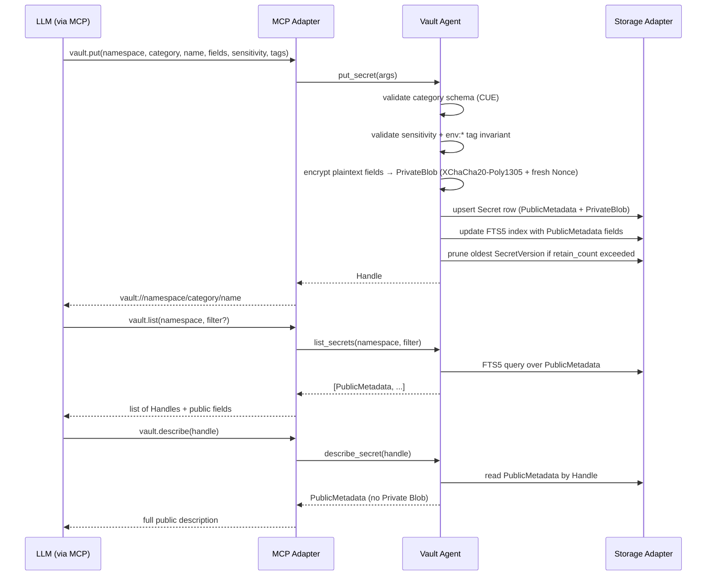

# Secret Storage

## Purpose

The Secret Storage bounded context is responsible for the complete lifecycle
of secrets within the vault: creation, versioning, categorization, search,
rotation, and deletion. It defines the data model that all other contexts
reference and enforces the invariants that protect sensitive material at
rest. The context owns both the public shape of a Secret (metadata safe for
the transcript) and the encrypted private shape (material that never leaves
the agent process unencrypted).

This context does not make authorization decisions, enforce rate limits, or
audit individual operations — those concerns belong to the Policy and
Permissions context and the Audit and Compliance context respectively.
Secret Storage treats its callers as already-authorized; it validates data
integrity and schema conformance but delegates policy enforcement to
neighboring contexts through domain events.

## Ubiquitous Language

| Term | Definition | Notes |
|---|---|---|
| Namespace | Top-level container for related Secrets; identified by UUIDv7 and a stable label. | Bound by default to the current working directory hash. |
| Secret | Aggregate root storing a credential, key, token, note, or structured artifact. | Has public metadata and a private blob. |
| Secret Version | Historical revision of a Secret; created on every `vault.rotate`. | Retention governed by Namespace Policy (default `retain_count = 3`). |
| Handle | Opaque URI identifying a Secret without exposing its material. Format: `vault://<namespace-label>/<category>/<name>`. | Sufficient to invoke any Proxy Tool; insufficient to reveal plaintext. |
| Category | Closed enum classifying Secret shape and semantics. | Built-in: `ssh`, `password`, `token`, `env`, `cert`, `key`, `database`, `note`, `otp`, `cloud`, `gpg`. |
| Sensitivity | Closed enum: `low`, `medium`, `high`. | Determines OOB Confirmation requirement and default rate-limit class. |
| Tag | Structured discriminator of the form `key:value`. | Examples: `env:prod`, `project:acme`, `role:bastion`. |
| Public Metadata | Fields returned by `vault.list` and `vault.describe`; visible in the transcript. | Never includes private material. |
| Private Blob | Encrypted serialization of the Secret's sensitive material. | Decrypted only inside the agent process. |
| Schema | Per-Category CUE definition declaring field visibility and type constraints. | |
| Namespace DEK | Per-Namespace Data Encryption Key wrapping the Private Blob column. | Provided by Identity and Sealing context at runtime. |
| FTS5 Index | SQLite full-text search virtual table over public metadata fields. | Private material is never indexed. |
| SQLite | Embedded relational database used as persistence backend; WAL mode. | |
| Per-Blob Encryption | XChaCha20-Poly1305 encryption applied to the `private_blob` column with per-secret nonces. | |
| Nonce | Per-blob random 24-byte value prefixed to ciphertext. | |
| XChaCha20-Poly1305 | AEAD cipher used for per-blob encryption. | RFC 8439 extended-nonce variant. |
| Operator Confirmation | Verifiable signal that the human operator authorized a sensitive action. | Required for Reveal of high-sensitivity Secrets. |
| Reveal | Explicit return of a Secret's plaintext to the MCP transport; always requires Operator Confirmation. | Default-denied for `sensitivity = high`. |
| Vault Agent | Long-running background daemon that owns Secret lifecycle. | |
| MCP Tool | Function exposed over the MCP stdio transport. | `vault.put`, `vault.list`, `vault.describe`, `vault.rotate`, `vault.delete`. See [integrations/mcp-protocol.md](../integrations/mcp-protocol.md) for the complete catalog. |

## Aggregates and Roles

### Namespace

Role: AggregateRoot.

Responsibility: Groups Secrets sharing a common operational context. Owns its
NamespaceDek reference (obtained from Identity and Sealing on first write),
the label, and the binding configuration. Enforces that all Secrets within it
conform to a consistent retention policy and that cross-Namespace operations
are explicitly permitted by the Policy and Permissions context. Raises a
domain event when the first Secret is written (triggering DEK provisioning)
and when the last Secret is deleted (allowing DEK cleanup).

Invariants:

1. Label is immutable after creation; renaming creates a new Namespace.
2. A Namespace without a provisioned NamespaceDek cannot accept writes; it
   must request DEK provisioning from the Identity and Sealing context first.
3. Cross-Namespace reads require an explicit import allowlist entry in the
   Namespace Policy; the default is deny.

### Secret

Role: AggregateRoot.

Responsibility: Stores a single credential artifact with its full version
history. Validates category conformance against the per-Category CUE Schema on
every write. Manages the set of SecretVersions and enforces retention limits.
The Handle is derived deterministically from the Namespace label, Category,
and name, and is stable across rotations.

Invariants:

1. The Handle uniquely identifies a Secret within its Namespace; no two
   Secrets in the same Namespace share a Handle.
2. The Private Blob is never returned to any caller outside the agent process
   unless an explicit Reveal is authorized with Operator Confirmation.
3. Category is immutable after creation; changing category requires deleting
   the Secret and creating a new one.
4. Every write to the Private Blob generates a fresh Nonce; nonce reuse
   with the same NamespaceDek is a critical fault.
5. Deletion marks the Secret as logically deleted and tombstones all
   SecretVersions; physical removal may be deferred to a vacuum pass.

### SecretVersion

Role: Entity.

Responsibility: Represents one historical revision of a Secret's private
material and its associated Public Metadata snapshot. Created automatically
on every `vault.rotate` call. Carries a monotonically increasing version
number within its parent Secret, a creation timestamp, and an optional
expiration time.

Invariants:

1. Version numbers are monotonically increasing and never reused within a
   Secret.
2. The number of retained SecretVersions at any time must not exceed
   `retain_count` from the Namespace Policy; excess oldest versions are
   pruned atomically in the same transaction as the rotation write.
3. A SecretVersion cannot be mutated after creation; rollback restores by
   copying the historical Private Blob into a new current version.

### Handle

Role: ValueObject.

Responsibility: Opaque reference to a Secret that can be safely passed
through the MCP transport and stored in the LLM transcript without exposing
credential material. Parsed to validate structural integrity; not resolved to
plaintext without passing through the Access Mediation context.

Invariants:

1. Format is `vault://<namespace-label>/<category>/<name>` and is fully
   deterministic; the same logical Secret always produces the same Handle.
2. A structurally valid Handle that references a non-existent Secret must be
   rejected with a not-found error, not silently ignored.

### Category

Role: ValueObject.

Responsibility: Immutable enum value that selects the CUE Schema governing a
Secret's field layout. Determines which fields are public, which are private,
and what validation rules apply. The closed set of built-in categories covers
the vast majority of credential types; custom categories require an explicit
Schema declaration.

Invariants:

1. Category membership is validated against the known set plus any declared
   custom schemas at write time; unknown categories are rejected.
2. The CUE Schema for a Category must declare a complete field manifest
   before any Secret of that Category can be stored.

### Sensitivity

Role: ValueObject.

Responsibility: Immutable three-level classification attached to a Secret.
Controls the default rate-limit class applied to operations on the Secret and
determines whether OOB Confirmation is required for Reveal. Defaults to
`medium` if not specified.

Invariants:

1. `sensitivity = high` requires at least one `env:*` Tag; the system
   rejects the write if no such Tag is present.
2. Sensitivity can be increased but not decreased without an explicit
   override flag; downgrade requires Operator Confirmation.

### Tag

Role: ValueObject.

Responsibility: Structured `key:value` label that provides informal cohesion
between Secrets. Stored in the Public Metadata and indexed in the FTS5 Index.
Tags with the `env:` prefix are treated as environment discriminators and
participate in the Cross-Env Warning logic in the Audit and Compliance
context.

Invariants:

1. Tag keys and values must be non-empty and must not contain whitespace.
2. A Secret may carry multiple Tags with the same key (e.g., multiple
   `role:` values) but must not carry duplicate `key:value` pairs.

### PublicMetadata

Role: ValueObject.

Responsibility: Snapshot of all fields that are safe to return to the MCP
transport: name, category, sensitivity, tags, description, expiration,
created-at, updated-at, and Handle. Immutable once captured; a new
PublicMetadata value is created on every write.

Invariants:

1. No field in PublicMetadata contains or references private material.
2. PublicMetadata is always complete; partial snapshots are rejected.

### PrivateBlob

Role: ValueObject.

Responsibility: The encrypted byte string containing the credential's
sensitive fields (passwords, key material, tokens, passphrases). Produced by
encrypting the plaintext blob with XChaCha20-Poly1305 using the NamespaceDek
and a freshly generated Nonce. Stored in the database column `private_blob`.

Invariants:

1. PrivateBlob is stored only in encrypted form; the plaintext is held in
   process memory only during the active write or read operation.
2. The Nonce is stored as the first 24 bytes of the PrivateBlob field,
   immediately before the ciphertext.

## Key Invariants

1. A Handle uniquely identifies a Secret within a Namespace at all times,
   including during rotation and after logical deletion.
2. The Private Blob is never returned through the MCP transport except through
   an explicit Reveal authorized by Operator Confirmation.
3. `sensitivity = high` Secrets must carry at least one `env:*` Tag;
   write is rejected otherwise.
4. The default version retention count is three; older versions are pruned
   atomically on rotation.
5. The FTS5 Index is built only over Public Metadata; Private Blob fields
   are never indexed or tokenized.
6. Category is immutable after creation; a category change is a delete and
   re-create operation.
7. Nonces are unique per encryption call; nonce reuse with the same
   NamespaceDek is a critical fault that must cause the write to abort.
8. A Namespace without an active NamespaceDek rejects all write operations
   until DEK provisioning completes.

## Primary Flows

### Put and Describe Flow



### Rotation Flow

```mermaid
sequenceDiagram
    participant LLM as LLM (via MCP)
    participant MCP as MCP Adapter
    participant Agent as Vault Agent
    participant DB as Storage Adapter

    LLM->>MCP: vault.rotate(handle, new_fields)
    MCP->>Agent: rotate_secret(handle, new_fields)
    Agent->>Agent: validate category schema for new_fields
    Agent->>Agent: encrypt new_fields → PrivateBlob (fresh Nonce)
    Agent->>DB: begin transaction
    Agent->>DB: insert SecretVersion (archive current version)
    Agent->>DB: update Secret row with new PrivateBlob + PublicMetadata
    Agent->>DB: prune SecretVersions exceeding retain_count
    Agent->>DB: update FTS5 index
    Agent->>DB: commit transaction
    Agent-->>MCP: Handle (unchanged)
    MCP-->>LLM: same Handle; new version active
```

## Edge Cases and Trade-offs

**FTS5 index on public-only fields.** The decision to exclude Private Blob
content from the FTS5 Index means that search cannot match against credential
values (passwords, token strings). This is intentional: any full-text index
over private material would require decrypting content at index time and would
persist queryable forms of the plaintext. Operators needing credential-value
search must implement that outside the vault.

**Soft delete and vacuum.** Logical deletion preserves the audit trail and
tombstone, which is necessary for the Hash Chain in the Audit and Compliance
context to remain contiguous. Physical vacuum is a separate, scheduled
operation. Between logical deletion and vacuum, a deleted Secret occupies
storage but is unreachable through normal APIs.

**Custom categories.** A custom Category requires a CUE Schema declaration
before any Secret of that type can be stored. This means custom categories
cannot be created ad hoc inside a `vault.put` call; they must be declared
through a schema registration step. This prevents accidental creation of
structurally unknown Secret types that the system cannot validate.

**retain_count and rollback.** The pruning of old SecretVersions is
irreversible; once a version falls outside the retention window, it is gone
unless a Backup exists. Operators who need a longer audit trail of credential
values should increase `retain_count` in the Namespace Policy or export a
Backup before rotation.

**Handle stability across namespace relabeling.** Because a Namespace label
is immutable, the Handle derived from it is stable for the lifetime of the
Namespace. If an operator needs to move Secrets to a differently labeled
Namespace, new Handles are issued and all references in the LLM transcript
become stale.

## Integration Points

**Driving (inbound):**
- Companion Socket Port (Hexagonal driving port) — receives `vault.put`,
  `vault.list`, `vault.describe`, `vault.rotate`, and `vault.delete` commands
  via MCP Adapter or CLI Adapter. The Companion Socket Port is the single
  inbound driving port that delivers commands to this context.

**Driven (outbound):**
- Storage driven port → SQLite repository via `StorageAdapter` (per ADR-0003).
- Crypto driven port → XChaCha20-Poly1305 AEAD via `CryptoAdapter` for
  per-blob encryption and decryption (per ADR-0004).
- Config read port → `ConfigStore` for reading Namespace binding overrides from
  `.merklerc` files.

**Cross-context inbound dependencies:**
- IdentityAndSealing (C/S upstream) — provides unwrapped NamespaceDeks for
  Private Blob encryption. SecretStorage conforms to the DEK envelope format.
- PolicyPermissions (C/S upstream) — governs Namespace Policy and retention
  rules (`retain_count`). Every write delegates retention enforcement here.

**Cross-context outbound relationships:**
- Provides resolved Private Blob to AccessMediation (C/S — this context is
  upstream); AccessMediation calls in-process to resolve a Handle to a
  Private Blob.
- Provides vault state snapshot to BackupRecovery (C/S — this context is
  upstream); BackupRecovery is a Conformist consumer of the export contract.

**Context relationships (see [context-map.md](context-map.md)):**
- Downstream of IdentityAndSealing (C/S + CF) — receives unwrapped NamespaceDeks.
- Downstream of PolicyPermissions (C/S) — governed by NamespacePolicy at
  PutSecret, RotateSecret, and Reveal time.
- Upstream of AccessMediation (C/S) — supplies Secret records by Handle.
- Upstream of BackupRecovery (C/S) — supplies vault state for backup export.

## Cross-Context Contracts

**Receives (inbound commands/queries):**

- `PutSecretCommand` from `Operator` (via Companion Socket Port through MCP Adapter
  or CLI Adapter) — shape: `#Secret` fields including `name`, `category`, `sensitivity`,
  `tags`, and encrypted Private Blob (see `schemas/secret_storage/secret.cue`) —
  validated against per-Category CUE schema before write.
- `NamespaceDek` from `IdentityAndSealing` — shape: `#NamespaceDek`
  (see `schemas/identity_and_sealing/namespace_dek.cue`) — unwrapped 32-byte
  key delivered in-process on demand for Private Blob encryption; SecretStorage
  conforms to the DEK envelope format (CF).
- `PolicyDecision` from `PolicyPermissions` — shape: `#NamespacePolicy` fields
  `retain_count`, `#TagsRules`, and cross-namespace import allowlist
  (see `schemas/policy_permissions/namespace_policy.cue`) — governs every write,
  rotation, and Namespace creation operation.

**Emits (outbound events):**

- `Handle` to `AccessMediation` — shape: `#Handle`
  (see `schemas/secret_storage/handle.cue`) — opaque URI
  `vault://<namespace-label>/<category>/<name>` returned to the MCP transport;
  AccessMediation uses it to resolve the Private Blob (C/S — this context is
  upstream).
- `PrivateBlob` to `AccessMediation` — shape: `#PrivateBlob`
  (see `schemas/secret_storage/private_blob.cue`) — encrypted blob resolved
  in-process by Handle; decrypted only inside agent boundary before bridge
  invocation by ProxyExecutor.
- `VaultStateSnapshot` to `BackupRecovery` — SQLite Online Backup API stream;
  BackupRecovery is a Conformist consumer of this contract.
- `AuditEntry` (lifecycle) to `AuditCompliance` — shape: `#AuditEntry`
  (see `schemas/audit_compliance/audit_entry.cue`) — emitted for `op=put`,
  `op=rotate`, `op=delete`, `op=namespace_create`, `op=restore`.

## References

- ADR-0003: [SQLite with per-blob encryption](../adr/0003-sqlite-with-per-blob-encryption.md)
- ADR-0004: [XChaCha20-Poly1305 AEAD for blob encryption](../adr/0004-xchacha20-poly1305-aead-for-blobs.md)
- [ADR-0007: Handle default exposure model](../adr/0007-handle-default-exposure-model.md)
- [ADR-0012: Eleven built in categories plus cue schema for custom](../adr/0012-eleven-built-in-categories-plus-cue-schema-for-custom.md)
- [ADR-0013: Fts5 on public metadata fields only](../adr/0013-fts5-on-public-metadata-fields-only.md)
- [ADR-0014: Retention policy default retain count three](../adr/0014-retention-policy-default-retain-count-three.md)
- [ADR-0017: Llm as composer no foreign keys between secrets](../adr/0017-llm-as-composer-no-foreign-keys-between-secrets.md)
- Schema: [namespace.cue](../schemas/secret_storage/namespace.cue)
- Schema: [secret.cue](../schemas/secret_storage/secret.cue)
- Schema: [secret_version.cue](../schemas/secret_storage/secret_version.cue)
- Schema: [handle.cue](../schemas/secret_storage/handle.cue)
- Schema: [category.cue](../schemas/secret_storage/category.cue)
- Schema: [sensitivity.cue](../schemas/secret_storage/sensitivity.cue)
- Schema: [tag.cue](../schemas/secret_storage/tag.cue)
- Schema: [public_metadata.cue](../schemas/secret_storage/public_metadata.cue)
- Schema: [private_blob.cue](../schemas/secret_storage/private_blob.cue)
- Policy: [tag_validation.rego](../policies/tag_validation.rego)
- Policy: [sensitivity_oob.rego](../policies/sensitivity_oob.rego)
- Feature: [put_secret.feature](../specs/features/put_secret.feature)

## Schema contracts

See also the [schema index](../schemas/README.md).

- [`schemas/secret_storage/secret.cue`](../schemas/secret_storage/secret.cue)
- [`schemas/secret_storage/secret_id.cue`](../schemas/secret_storage/secret_id.cue)
