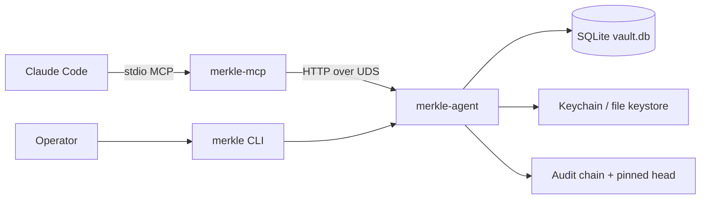

# Product Overview — Merkle

## Overview

Merkle is a **local-first secret vault** that mediates between LLM coding agents
(via MCP) and operator-held credentials. The LLM works with opaque handles and
proxy tools; plaintext reveal requires human-gated confirmation. The long-running
`merkle-agent` owns key material, SQLite storage, the audit hash chain, and
proxy I/O. `merkle-mcp` and the `merkle` CLI are thin Companion Socket clients.

## Actors

| Actor | Role |
|---|---|
| Operator | Human owner; slash commands, OOB, CLI |
| LLM / MCP host | Issues tool calls; cannot authorize its own reveal |
| `merkle-mcp` | Thin stdio MCP server |
| `merkle` CLI | Operator CLI |
| `merkle-agent` | Daemon composition root |

## Flow

Primary product flows for the vault:

## Primary flows

1. **Init** — MasterKey, RecoveryKey, dual-wrapped VRK (ADR-0021).
2. **Unseal / seal** — load VRK; derive audit HMAC; state machine gates.
3. **Bind** — session ↔ namespace; at-most-one bind per MCP session (ADR-0026).
4. **Put / rotate / rollback** — AEAD blobs; retention; append-copy rollback.
5. **Use / tempfile / fifo** — single-use tokens; never returned to the LLM.
6. **Reveal** — slash + optional OOB; MCP `_meta` confirmation (ADR-0011).
7. **Proxy** — SSH/HTTP/crypto in agent under SSRF + peer-cred (ADR-0030).
8. **Audit / doctor / rebaseline** — chain verify; sealed-safe diagnostics.

## Acceptance criteria

* Default tool responses contain handles and public metadata only.
* Same-UID Unix socket peer-cred required; no trusted client headers.
* Audit chain verifies under VRK-derived HMAC when unsealed.
* HTTP proxy rejects non-https and non-public destinations by default.
* Idle re-lock seals after configured inactivity (default 1800s, ADR-0031).

## Observability

* Metrics: optional Prometheus endpoint (`merkle_*` series) — see
  `doc/arch/observability/observability.md`.
* Logs: structured JSON; no secret plaintext.
* Integrity: `merkle doctor` / audit chain verify (ADR-0009).
* SLOs: `docs/arch/slo/` indicators and objectives.

## Spec map

| Concern | Location |
|---|---|
| ADRs | `docs/arch/adr/` (`doc/arch/adr` symlink) |
| OpenAPI | `docs/arch/integrations/openapi/companion-socket.yaml` |
| Gherkin | `docs/arch/specs/features/` |
| Domain | `docs/arch/domain/` |
| Threat model | `docs/arch/threat-model/` + privacy LINDDUN doc |
