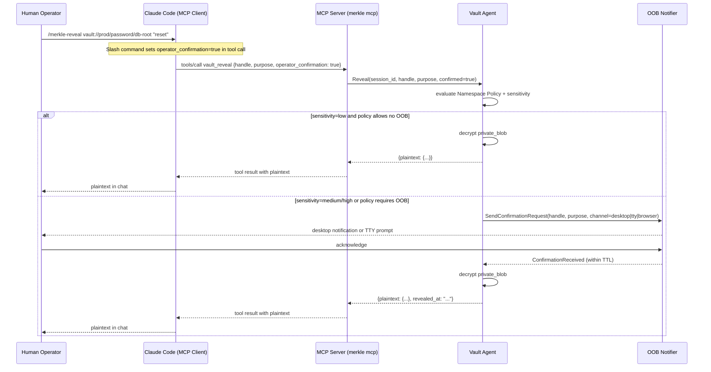

# Claude Code Wiring Guide

Integration contract describing how to connect Merkle to Claude Code
as an MCP server and how to configure the slash commands that carry
Operator Confirmation.

## 1. Overview

Claude Code is the canonical MCP host for Merkle. It satisfies the
key requirement for Operator Confirmation: only the human operator
can type a slash command, so the `operator_confirmation: true` flag
can be verifiably linked to a human action rather than to LLM-
generated text.

Merkle conforms to the MCP specification and will work with any
compliant MCP host. Configuration examples in this document target
Claude Code specifically. Hosts that do not support slash commands
can still use all Merkle tools except those requiring Operator
Confirmation (`vault_reveal`), which will always return `RevealDenied`
unless the confirmation flag arrives as `true`.

The MCP server process is `merkle mcp`. It communicates over stdio
(stdin/stdout) with the Claude Code process. One MCP server process
is spawned per Claude Code window; it connects to the shared Vault
Agent daemon over the Companion Socket.

## 2. Configuration Snippet

Add the following entry to `~/.claude.json` under the `mcpServers`
key. Create the file if it does not exist.

```json
{
  "mcpServers": {
    "merkle": {
      "command": "/usr/local/bin/merkle",
      "args": ["mcp"],
      "env": {
        "MERKLE_PROFILE": "balanced"
      }
    }
  }
}
```

### Configuration Fields

| Field | Value | Notes |
|---|---|---|
| `command` | `/usr/local/bin/merkle` | Adjust to the actual install path. Use `which merkle` to locate. |
| `args` | `["mcp"]` | Starts the MCP server process (stdio transport). |
| `env.MERKLE_PROFILE` | `"balanced"` | Selects the Security Profile. Options: `relaxed`, `balanced`, `paranoid`. |

### Optional Environment Variables

| Variable | Default | Purpose |
|---|---|---|
| `MERKLE_AGENT_SOCKET` | Auto-discovered | Override the Companion Socket path |
| `MERKLE_LOG` | `warn` | Log level for stderr: `error`, `warn`, `info`, `debug`, `trace` |
| `MERKLE_NAMESPACE` | Working directory hash | Pre-bind to a specific Namespace label on startup |
| `MERKLE_AUDIT_SINK` | None | Path to a secondary audit sink file |

After editing `~/.claude.json` restart Claude Code or run
`/mcp restart merkle` to reload the server configuration.

### Verification

Run `vault_doctor` via Claude Code after configuration:

```
Ask Claude: "Call vault_doctor and show me the full result."
```

The response should include `"sealed": false` if the agent is running
and unsealed, or `"sealed": true` with a remediation hint if the agent
needs to be unsealed first.

## 3. Slash Commands

Slash commands in Claude Code allow the operator to pass a verifiable
signal that a sensitive action is authorized. Merkle leverages this by
mapping each slash command to a specific `vault_*` tool call with
`operator_confirmation: true` set by the client before the tool
invocation reaches the MCP server.

The flag is set to `true` **only** when the operator types the slash
literal. Claude cannot set this flag through generated text or through
indirect tool arguments.

### /merkle-reveal

Reveal the plaintext of a Secret.

```
Usage: /merkle-reveal <handle> [purpose]

Example: /merkle-reveal vault://prod/password/db-root "manual admin reset"
```

Maps to: `vault_reveal { handle, purpose, operator_confirmation: true }`.

When the Secret's `sensitivity` is `medium` or `high` and the
Namespace Policy requires OOB Confirmation, the agent will emit an OOB
prompt even with `operator_confirmation: true`. Both signals must be
present for the reveal to succeed.

---

### /merkle-show

Display the public metadata of a Secret without revealing plaintext.
Equivalent to `vault_describe` but surfaced as a slash command for
quick access from the operator.

```
Usage: /merkle-show <handle>

Example: /merkle-show vault://prod/ssh/bastion
```

Maps to: `vault_describe { handle }`. Does not require Operator
Confirmation; included as a slash command for discoverability.

---

### /merkle-rollback

Restore a Secret to a previous version.

```
Usage: /merkle-rollback <handle> <version>

Example: /merkle-rollback vault://prod/token/github-ci 2
```

Maps to: `vault_rollback { handle, target_version }` with operator
confirmation injected only via MCP `_meta` key
`dev.fapp.merkle/operator_confirmation` = JSON boolean `true` (MERK-001;
never a tool argument). The agent append-copies the historical blob into a
**new** monotonic version (`version_no = max+1`); it does not re-activate
the historical version in place (ADR-0014 amendment). Audit records
`op=rotate` for success and denial.

Requires Operator Confirmation because rollback changes the live
Secret value while preserving immutable history.

---

### /merkle-doctor

Run the diagnostic pass and display agent health.

```
Usage: /merkle-doctor
```

Maps to: `vault_doctor {}`. Does not require Operator Confirmation.
Included as a slash command because operators routinely call it at the
start of a session.

## 4. Operator Confirmation Flow

The following diagram shows how the slash command confirmation flag
travels from the human operator through Claude Code to the Vault Agent
and triggers either an immediate reveal or an OOB Confirmation round
trip.



**Key invariant**: `operator_confirmation: true` is only honored when
it arrives from Claude Code as a result of a slash command invocation.
LLM-generated tool arguments with `operator_confirmation: true` are
rejected at the MCP Adapter layer with `RevealDenied`. The MCP Adapter
validates this by checking that the invocation originated from a slash
command context flag passed in the `_meta` field of the JSON-RPC
request, not from the tool `arguments` payload.

## 5. Common Workflows

### 5.1 SSH into Production Database via Bastion

```
Operator: "SSH into the prod-db host via the bastion and run
           SELECT COUNT(*) FROM orders WHERE created_at > NOW() - INTERVAL '1 day'."

Claude steps:
1. vault_bind { label: "prod" }
2. vault_list { category: "ssh", tags: ["role:bastion", "env:prod"] }
   → handle: "vault://prod/ssh/bastion"
3. vault_list { category: "ssh", tags: ["role:db", "env:prod"] }
   → handle: "vault://prod/ssh/prod-db"
4. vault_ssh_exec {
     handle: "vault://prod/ssh/prod-db",
     command: "psql -U app -d orders -c \"SELECT COUNT(*) FROM orders WHERE created_at > NOW() - INTERVAL '1 day'\""
   }
   (agent resolves jump_host_handle=vault://prod/ssh/bastion automatically)
5. Returns: "count\n-------\n  4821"
```

The LLM never sees the SSH private key or the database password. The
bastion jump is resolved by the SSH Bridge using the `jump_host_handle`
field on the `prod-db` Secret.

### 5.2 Pull AWS Credentials and Run Terraform Plan

```
Operator: "Run terraform plan for the prod environment."

Claude steps:
1. vault_bind { label: "prod" }
2. vault_list { category: "cloud", tags: ["provider:aws", "env:prod"] }
   → handle: "vault://prod/cloud/aws-prod"
3. vault_spawn {
     env_handles: [{ handle: "vault://prod/cloud/aws-prod" }],
     cmd: "terraform",
     args: ["plan", "-var-file=prod.tfvars"],
     working_dir: "/home/user/infra/terraform"
   }
4. Returns: "Plan: 3 to add, 0 to change, 1 to destroy."
```

The AWS access key and secret key are injected as environment variables
(`AWS_ACCESS_KEY_ID`, `AWS_SECRET_ACCESS_KEY`) by the Proxy Executor.
They are never visible in the MCP response; only the Terraform plan
output is returned.

### 5.3 Reveal a One-Off Password for Paste into a UI

```
Operator: /merkle-reveal vault://personal/password/wifi-guest "paste into phone"

Claude: (calls vault_reveal with operator_confirmation=true)
        "The password is: [plaintext shown here]"
        "Warning: This value is now in the conversation context."
```

This workflow is appropriate for `sensitivity = low` Secrets where the
operator needs to read the value and type it elsewhere. For higher
sensitivity Secrets the OOB Confirmation flow activates before the
plaintext is returned.

After use, the operator should consider running `vault_audit_query`
to confirm the reveal is logged, and rotating the Secret if it was
intended for single use.

## 6. Best Practices

**Bind a Namespace explicitly at session start.** Call `vault_bind`
at the start of every session to avoid relying on the default
working-directory derivation. This makes audit log entries easier to
correlate.

```
"Before we start, bind the namespace for this project."
→ Claude calls vault_bind { label: "acme-prod" }
```

**Use tags consistently.** Adopt a tagging convention and apply it at
`vault_put` time. Recommended tag axes:

| Axis | Examples |
|---|---|
| Environment | `env:dev`, `env:staging`, `env:prod` |
| Project | `project:acme`, `project:infra` |
| Role | `role:bastion`, `role:db`, `role:ci` |
| Provider | `provider:aws`, `provider:gcp` |

Tags are the primary mechanism by which the LLM discovers related
Secrets. A Secret with no tags is harder to find via `vault_list`
and `vault_search`.

**Avoid `sensitivity = high` unless necessary.** High sensitivity
adds OOB Confirmation to `vault_reveal` calls unconditionally. Use
`sensitivity = medium` for Secrets that can be revealed in context
(with slash command) and reserve `high` for Secrets that should never
appear in any LLM context (HSM keys, root CA private keys).

**Review the audit log weekly.** Schedule a regular review:

```
"Show me the audit log for the last 7 days, grouped by operation."
→ Claude calls vault_audit_query { since: "<7 days ago>", limit: 500 }
```

Look for unexpected `reveal` operations, cross-environment accesses
(Secrets with different `env:` tags accessed in the same session), and
unusual caller PIDs.

**Use `vault_rotate` for all Secret updates.** Do not delete and re-
create a Secret to change its value. `vault_rotate` preserves the
version history and the handle URI, so any existing references (in
scripts, aliases, or Claude sessions) continue to resolve correctly.

## 7. Troubleshooting

### NamespaceNotBound

**Symptom**: Most tool calls return `NamespaceNotBound`.

**Cause**: The session started without calling `vault_bind` and the
default Namespace (derived from the working directory hash) does not
exist in the vault.

**Fix**: Ask Claude to call `vault_bind { label: "<your-namespace>" }`.
If you are unsure which Namespace labels exist, check the output of
`vault_list` after binding the label you expect.

---

### UnsealRequired

**Symptom**: All tool calls return `UnsealRequired`.

**Cause**: The Vault Agent is in Sealed State. This happens after a
machine boot, an agent crash, or an explicit `merkle seal` command.

**Fix**: Run `merkle unseal` in a terminal. On macOS with Touch ID
configured the agent will prompt for Touch ID. On Linux the agent
will prompt for the passphrase if no Secret Service is running. Once
unsealed, retry the tool call.

---

### OobConfirmationTimeout

**Symptom**: `vault_reveal` returns `OobConfirmationTimeout`.

**Cause**: The OOB Confirmation was not acknowledged within the
configured TTL (default 30 seconds).

**Fix**: Re-issue the `/merkle-reveal` slash command and acknowledge the
desktop notification or terminal prompt within the TTL. If the
notification is not appearing, check that the agent is running and
that the OOB notifier is configured correctly (`vault_doctor` will
report `"oob_notifier": "active"` or `"unavailable"`).

---

### RevealDenied (policy gate)

**Symptom**: `vault_reveal` returns `RevealDenied` even with the slash
command.

**Cause 1**: The Secret has `sensitivity = high` and the Namespace
Policy does not allow reveal for this sensitivity level.

**Fix**: Update the Namespace Policy to allow reveals at this
sensitivity, or lower the Secret's sensitivity if the classification
was incorrect.

**Cause 2**: The tool call arrived with `operator_confirmation: false`
(i.e., Claude generated the argument rather than the slash command
setting it).

**Fix**: Use the `/merkle-reveal` slash command, not a direct request
to Claude to "call vault_reveal with operator_confirmation: true" in
prose. The slash command is the only path that sets the flag correctly.

---

### MCP Server Not Listed

**Symptom**: Claude Code does not show Merkle tools.

**Cause**: `~/.claude.json` is missing or malformed, or the `merkle`
binary is not at the configured path.

**Fix**: Verify with:

```sh
cat ~/.claude.json | python3 -m json.tool
which merkle
merkle --version
```

Restart Claude Code after fixing the configuration.

## 8. References

- Claude Code documentation: <https://docs.anthropic.com/en/docs/claude-code>
- MCP specification: <https://modelcontextprotocol.io/specification>
- ADR-0007: Handle Default Exposure Model
- [ADR-0011: Slash-only Reveal with OOB for high sensitivity](../adr/0011-slash-only-reveal-with-oob-for-high-sensitivity.md)
- MCP protocol contract: `mcp-protocol.md`
- Glossary: `../glossary.md` (Operator Confirmation, Slash Command, OOB Confirmation, Reveal Policy)
