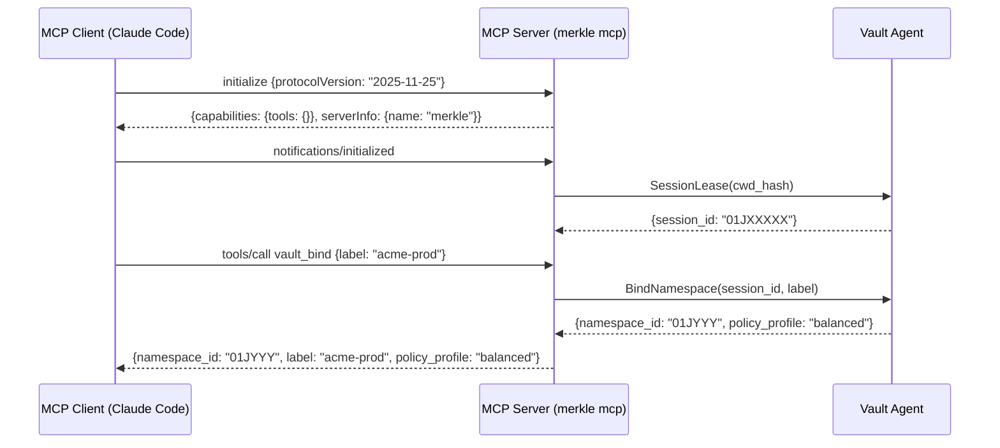
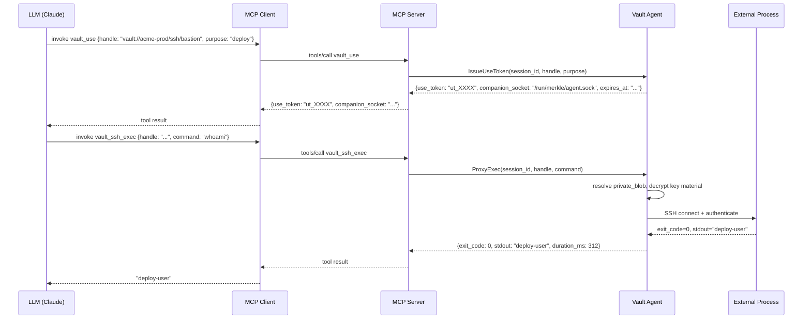
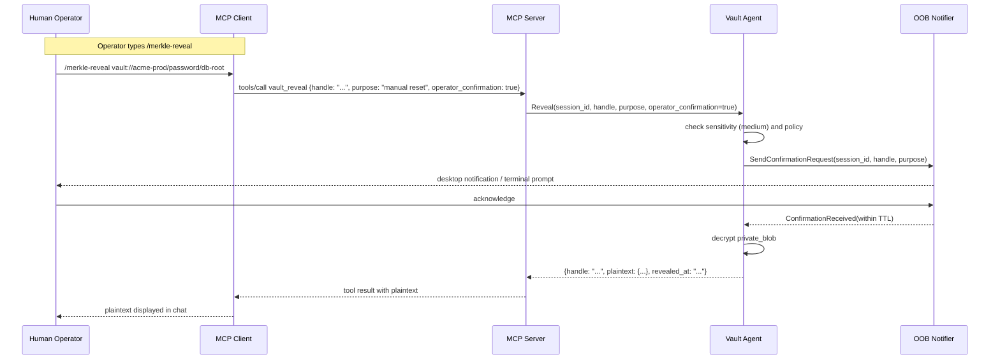

# MCP Protocol Contract

Integration contract defining the Model Context Protocol surface that
Merkle exposes to MCP host applications.

## 1. Overview

Merkle implements the Model Context Protocol (MCP) as its primary
driving interface. The authoritative specification is published at
<https://modelcontextprotocol.io/specification>. Merkle targets the
2025-11-25 protocol date, which is negotiated at the `initialize`
handshake.

The transport is **stdio JSON-RPC 2.0**. The MCP server process
(`merkle mcp`) reads newline-delimited JSON from `stdin` and writes
responses to `stdout`. All log output goes to `stderr`. This matches
the MCP stdio transport contract: one request per line, one response
per line, no interleaving.

The Rust implementation uses the **rmcp** crate
(<https://crates.io/crates/rmcp>), the official Rust SDK for MCP.
`rmcp` provides the JSON-RPC dispatch loop, capability negotiation,
schema validation, and tool registration macros. The MCP Adapter
(bounded context: MCP Adapter) is a thin translation layer between
`rmcp` tool handlers and the Vault Agent application services
accessed over the Companion Socket.

Key properties:

- No MCP resources or prompts are exposed; only tools.
- **Tool names** use underscores only (`vault_bind`, `vault_ssh_exec`, …)
  and match the MCP pattern `^[a-zA-Z0-9_-]{1,64}$`. Dotted names
  (`vault.bind`) are **not** used — strict clients (e.g. Grok) drop
  any tool whose name contains characters outside that set.
- All tool responses are structured JSON. Plaintext material never
  appears in a tool response except through `vault_reveal` with
  Operator Confirmation.
- The MCP server process is short-lived: one process per client
  window, spawned by the client. The long-lived Vault Agent daemon
  holds keys in memory.

## 2. Session Lifecycle

### 2.1 Capability Negotiation

On startup the client sends an `initialize` request. The server
responds with:

```json
{
  "protocolVersion": "2025-11-25",
  "capabilities": {
    "tools": { "listChanged": false }
  },
  "serverInfo": {
    "name": "merkle",
    "version": "0.1.0"
  }
}
```

`listChanged: false` means the tool list is static for the lifetime
of the server process. The client must send `notifications/initialized`
before issuing tool calls.

### 2.2 Session ID Assignment

After `notifications/initialized` is received, the MCP Adapter
connects to the Vault Agent over the Companion Socket and requests a
session lease. The agent issues a `session_id` (UUIDv7). All
subsequent calls from this server process carry the `session_id` in
the Companion Socket framing. The `session_id` is used for:

- Tempfile ownership and orphan reaping on agent restart.
- Idle backup triggers when no Merkle tool call has been seen for
  the configured idle threshold.
- Rate-limit accounting per session.

The `session_id` is never returned to the LLM; it exists only in the
MCP Adapter to agent communication layer.

### 2.3 Namespace Binding

After session establishment the client (or the LLM at the operator's
direction) should call `vault_bind` to associate the session with a
Namespace. Without a binding, all tool calls that require a Namespace
resolve to the default Namespace derived from the working directory
hash. `vault_bind` may be called at most once per session; re-binding
is rejected.

### 2.4 Session Teardown

When the client closes the stdin pipe or sends an explicit close
notification, the MCP Adapter sends a `SessionClose` message to the
Vault Agent. The agent:

1. Revokes all Use Tokens issued in this session.
2. Schedules cleanup of all Tempfiles owned by this `session_id`.
3. Releases the session lease.

If the MCP server process exits unexpectedly (crash, SIGKILL), the
agent detects the closed Companion Socket connection and performs the
same cleanup on the next keepalive interval.

## 3. Tool Catalog

All tools accept and return JSON objects. Input parameters are
validated against their JSON Schema before the request reaches the
application service layer. A validation failure returns error code
`-32602` (Invalid params) with a structured `data` field listing the
failing constraints.

### vault_bind

Associate the current MCP session with a named Namespace.

**Input**

```json
{
  "label": "string  // required; Namespace label"
}
```

**Output**

```json
{
  "namespace_id": "string  // UUIDv7 of the bound Namespace",
  "label": "string",
  "policy_profile": "string  // relaxed | balanced | paranoid"
}
```

**Errors**: `NamespaceNotFound`, `AlreadyBound`.

**Policy preconditions**: Vault must be in Unsealed State.

---

### vault_list

List Secrets matching filter criteria. Returns public metadata only.

**Input**

```json
{
  "category": "string?   // ssh | password | token | env | cert | key | database | note | otp | cloud | gpg",
  "tags": ["string"]?,   // must match ALL supplied tags (AND semantics)",
  "name_pattern": "string?  // glob, e.g. prod-*",
  "expires_before": "string?  // ISO 8601 datetime",
  "sensitivity": "string?  // low | medium | high",
  "fts_query": "string?   // FTS5 MATCH expression over public metadata"
}
```

**Output**

```json
{
  "items": [
    {
      "handle": "vault://label/category/name",
      "name": "string",
      "category": "string",
      "sensitivity": "string",
      "tags": ["string"],
      "description": "string?",
      "expires_at": "string?",
      "created_at": "string",
      "version": "integer"
    }
  ],
  "total": "integer"
}
```

**Errors**: `NamespaceNotBound`, `UnsealRequired`.

---

### vault_describe

Return full public metadata for a single Secret.

**Input**

```json
{
  "handle": "string  // vault://<label>/<category>/<name>"
}
```

**Output**: Same shape as a single `vault_list` item, plus a
`schema_id` field referencing the CUE schema in effect.

**Errors**: `HandleNotFound`, `NamespaceNotBound`.

---

### vault_search

Free-text semantic search over public metadata using the FTS5 index.
Returns ranked handles with a relevance score.

**Input**

```json
{
  "query": "string  // natural-language or keyword query",
  "limit": "integer?  // default 10, max 50"
}
```

**Output**

```json
{
  "results": [
    {
      "handle": "string",
      "name": "string",
      "category": "string",
      "score": "number  // BM25 relevance, lower = more relevant in FTS5"
    }
  ]
}
```

**Errors**: `NamespaceNotBound`, `UnsealRequired`.

---

### vault_put

Create or overwrite a Secret. The `value` field contains the sensitive
material and is never echoed back.

**Input**

```json
{
  "category": "string   // required",
  "name": "string       // required; unique within Namespace + category",
  "value": "object      // required; shape validated against category schema",
  "schema_id": "string? // custom CUE schema ref; omit to use built-in",
  "tags": ["string"]?,
  "sensitivity": "string?  // default: Namespace Policy default",
  "expose": "boolean?       // if true, mark as safe for FTS public indexing"
}
```

**Output**

```json
{
  "handle": "string",
  "version": "integer",
  "created_at": "string"
}
```

**Errors**: `NamespaceNotBound`, `UnsealRequired`, `SchemaValidationFailed`,
`DuplicateName` (if name collision and no overwrite intent).

---

### vault_get

Return public metadata and a WARNING that plaintext is withheld.
This tool confirms the Secret exists and is accessible; it does not
return the private blob.

**Input**

```json
{
  "handle": "string",
  "purpose": "string  // human-readable reason; recorded in audit log"
}
```

**Output**

```json
{
  "handle": "string",
  "name": "string",
  "category": "string",
  "sensitivity": "string",
  "tags": ["string"],
  "version": "integer",
  "warning": "Plaintext withheld. Use vault_use for proxy operations or vault_reveal (requires Operator Confirmation) for explicit access."
}
```

**Errors**: `HandleNotFound`, `NamespaceNotBound`, `UnsealRequired`,
`RateLimitExceeded`.

---

### vault_delete

Permanently delete a Secret and all its versions.

**Input**

```json
{
  "handle": "string",
  "purpose": "string"
}
```

**Output**

```json
{
  "deleted": true,
  "versions_removed": "integer"
}
```

**Errors**: `HandleNotFound`, `NamespaceNotBound`, `UnsealRequired`.

---

### vault_rotate

Replace the active value of a Secret, retaining prior versions up to
the Namespace Policy `retain_count`.

**Input**

```json
{
  "handle": "string",
  "new_value": "object  // same schema as vault_put value",
  "purpose": "string"
}
```

**Output**

```json
{
  "handle": "string",
  "version": "integer",
  "rotated_at": "string",
  "versions_retained": "integer"
}
```

**Errors**: `HandleNotFound`, `NamespaceNotBound`, `UnsealRequired`,
`SchemaValidationFailed`.

---

### vault_use

Issue a Use Token that grants a single consumer process access to the
Secret's plaintext via the Companion Socket. The plaintext never
appears in the MCP response.

**Input**

```json
{
  "handle": "string",
  "purpose": "string"
}
```

**Output**

```json
{
  "use_token": "string  // opaque, short-lived; default TTL 60 seconds",
  "expires_at": "string",
  "companion_socket": "string  // path to Unix domain socket or Windows named pipe"
}
```

**Errors**: `HandleNotFound`, `NamespaceNotBound`, `UnsealRequired`,
`RateLimitExceeded`.

**Note**: The `use_token` is intended for delivery to a local process,
not for consumption by the LLM. Standard workflow: `vault_use` then
`vault_ssh_exec` (or another proxy tool), which internally resolves
the token.

---

### vault_reveal

Return the plaintext of a Secret directly in the MCP response.
Requires Operator Confirmation. Default-denied for
`sensitivity = high` unless the Namespace Policy permits it.

**Input**

```json
{
  "handle": "string",
  "purpose": "string",
  "operator_confirmation": "boolean  // must be true; set by slash command only"
}
```

**Output**

```json
{
  "handle": "string",
  "plaintext": "object  // decrypted value; shape per category schema",
  "revealed_at": "string",
  "warning": "This value was returned in plaintext and is now in the conversation context."
}
```

**Errors**: `HandleNotFound`, `NamespaceNotBound`, `UnsealRequired`,
`RevealDenied` (confirmation false or sensitivity gate),
`OobConfirmationRequired`, `OobConfirmationTimeout`,
`RateLimitExceeded`.

---

### vault_ssh_exec

Execute a remote command over SSH using credentials from a Secret.

**Input**

```json
{
  "handle": "string       // ssh category Secret",
  "command": "string",
  "args": ["string"]?,
  "env": {"key": "value"}?,
  "timeout_secs": "integer?  // default 30"
}
```

**Output**

```json
{
  "exit_code": "integer",
  "stdout": "string  // filtered; max 64 KiB",
  "stderr": "string  // filtered; max 16 KiB",
  "duration_ms": "integer"
}
```

**Errors**: `HandleNotFound`, `SshAuthFailed`, `SshConnectionFailed`,
`CommandTimeout`, `UnsealRequired`.

---

### vault_ssh_copy

Copy files to or from a remote host using credentials from a Secret.

**Input**

```json
{
  "handle": "string",
  "direction": "string  // to_remote | from_remote",
  "local_path": "string",
  "remote_path": "string",
  "recursive": "boolean?"
}
```

**Output**

```json
{
  "bytes_transferred": "integer",
  "duration_ms": "integer"
}
```

**Errors**: `HandleNotFound`, `SshAuthFailed`, `LocalPathNotFound`,
`RemotePathNotFound`, `UnsealRequired`.

---

### vault_ssh_port_forward

Establish a local or remote port forward over SSH.

**Input**

```json
{
  "handle": "string",
  "direction": "string  // local | remote",
  "bind_address": "string?  // default 127.0.0.1",
  "bind_port": "integer",
  "target_host": "string",
  "target_port": "integer",
  "ttl_secs": "integer?  // default 300"
}
```

**Output**

```json
{
  "forward_id": "string  // opaque; pass to vault.ssh.close_forward",
  "bound_address": "string",
  "bound_port": "integer",
  "expires_at": "string"
}
```

**Errors**: `HandleNotFound`, `SshAuthFailed`, `PortBindFailed`,
`UnsealRequired`.

---

### vault_ssh_shell

(non-interactive buffered) Open an SSH shell session and capture all
output. Output is buffered and returned in full at session end via the
tool response. Suitable for short sessions that produce bounded output;
long-running shells should use `vault_ssh_exec` with a command.

**Note**: stdin is not accepted. The session is write-once from the
server side; interactive input cannot be delivered after the session
opens. Use `vault_ssh_exec` for commands requiring stdin.

**Input**

```json
{
  "handle": "string",
  "term": "string?  // default xterm-256color",
  "cols": "integer?  // default 220",
  "rows": "integer?  // default 50",
  "timeout_secs": "integer?  // default 120"
}
```

**Output**

```json
{
  "output": "string  // combined stdout+stderr of the session",
  "exit_code": "integer?",
  "duration_ms": "integer"
}
```

**Errors**: `HandleNotFound`, `SshAuthFailed`, `SshConnectionFailed`,
`UnsealRequired`.

---

### vault_http_request

Perform an HTTP request injecting credentials from a Secret as headers
or body fields, without exposing them.

**Input**

```json
{
  "handle": "string       // token | password | key category Secret",
  "method": "string       // GET | POST | PUT | PATCH | DELETE",
  "url": "string",
  "inject_as": "string    // bearer | basic | header | query_param | body_field",
  "headers": {"key": "value"}?,
  "body": "string?        // raw body; may reference {{handle.field}} placeholders",
  "timeout_secs": "integer?  // default 30"
}
```

**Output**

```json
{
  "status_code": "integer",
  "headers": {"key": "value"},
  "body": "string  // max 256 KiB; truncated with warning if larger",
  "duration_ms": "integer"
}
```

**Errors**: `HandleNotFound`, `HttpRequestFailed`, `TimeoutExceeded`,
`UnsealRequired`.

---

### vault_http_download

Download a file, optionally using credentials from a Secret for
authentication.

**Input**

```json
{
  "url": "string",
  "destination": "string  // local filesystem path",
  "handle": "string?      // optional auth credential",
  "inject_as": "string?",
  "timeout_secs": "integer?"
}
```

**Output**

```json
{
  "destination": "string",
  "bytes_written": "integer",
  "status_code": "integer",
  "duration_ms": "integer"
}
```

**Errors**: `HttpRequestFailed`, `LocalWriteFailed`, `TimeoutExceeded`.

---

### vault_http_upload

Upload a file using credentials from a Secret.

**Input**

```json
{
  "url": "string",
  "source": "string  // local filesystem path",
  "handle": "string?",
  "inject_as": "string?",
  "method": "string?  // default PUT",
  "content_type": "string?",
  "timeout_secs": "integer?"
}
```

**Output**

```json
{
  "status_code": "integer",
  "response_body": "string  // max 64 KiB",
  "duration_ms": "integer"
}
```

**Errors**: `LocalReadFailed`, `HttpRequestFailed`, `TimeoutExceeded`.

---

### vault_spawn

Spawn a child process with environment variables drawn from one or more
Secrets. The process is isolated; its stdin is closed.

**Input**

```json
{
  "env_handles": [
    {
      "handle": "string",
      "field": "string?  // specific field within env category; omit to expand all"
    }
  ],
  "cmd": "string",
  "args": ["string"]?,
  "working_dir": "string?",
  "timeout_secs": "integer?  // default 60",
  "capture_output": "boolean?  // default true"
}
```

**Output**

```json
{
  "exit_code": "integer",
  "stdout": "string  // max 256 KiB",
  "stderr": "string  // max 64 KiB",
  "duration_ms": "integer"
}
```

**Errors**: `HandleNotFound`, `SpawnFailed`, `CommandTimeout`,
`UnsealRequired`.

---

### vault_write_tempfile

Materialize a Secret on the local filesystem as a Tempfile or FIFO.
Useful for tools that require a file path (e.g., `ssh -i`).

**Input**

```json
{
  "handle": "string",
  "mode": "string?  // default 0600; octal string",
  "fifo": "boolean? // if true, create a named pipe; default false"
}
```

**Output**

```json
{
  "path": "string   // absolute path to the tempfile or FIFO",
  "fifo": "boolean",
  "expires_at": "string  // cleaned up on session close or idle timeout"
}
```

**Errors**: `HandleNotFound`, `TempfileCreateFailed`, `UnsealRequired`.

---

### vault_revoke_tempfile

Explicitly revoke a Tempfile or FIFO before session close or idle
timeout. The file is removed immediately and the path becomes invalid.

**Input**

```json
{
  "path": "string  // absolute path previously returned by vault_write_tempfile"
}
```

**Output**

```json
{
  "revoked": true,
  "path": "string"
}
```

**Errors**: `TempfileNotFound`, `UnsealRequired`.

---

### vault_write_fifo

Materialize a Secret as a named pipe (FIFO). The agent writes the
Secret plaintext to the pipe once; the file is removed after the
first successful read. Suitable for programs that open a credential
path exactly once (e.g., `ssh -i`).

**Input**

```json
{
  "handle": "string"
}
```

**Output**

```json
{
  "path": "string   // absolute path to the FIFO",
  "fifo": true,
  "expires_at": "string  // removed after first read or session close"
}
```

**Errors**: `HandleNotFound`, `TempfileCreateFailed`, `UnsealRequired`.

---

### vault_audit_query

Query the append-only Audit Log.

**Input**

```json
{
  "handle": "string?          // filter by handle",
  "op": "string?              // category_create | cross_env_warning | delete | disaster_recovery | get | namespace_create | put | restore | reveal | rotate | unseal | use | use_token_resolved",
  "since": "string?           // ISO 8601",
  "until": "string?",
  "session_id": "string?",
  "limit": "integer?          // default 50, max 500",
  "verify_chain": "boolean?   // run Chain Verifier; default false"
}
```

**Output**

```json
{
  "entries": [
    {
      "seq": "integer",
      "timestamp": "string",
      "op": "string",
      "handle": "string?",
      "purpose": "string?",
      "outcome": "string  // allow | deny | error; fine-grained rejection in denial_reason",
      "denial_reason": "string?  // rejected_policy | rejected_no_confirmation | rejected_oob_timeout | rejected_rate_limit",
      "session_id": "string",
      "caller_pid": "integer?",
      "current_hash": "string  // ^blake3:[0-9a-f]{64}$",
      "prev_hash": "string  // ^blake3:[0-9a-f]{64}$"
    }
  ],
  "chain_valid": "boolean?  // present only when verify_chain=true",
  "total": "integer"
}
```

**Errors**: `UnsealRequired`.

---

### vault_doctor

Run a diagnostic pass and return agent health status.

**Input**: `{}` (no parameters)

**Output**

```json
{
  "agent_version": "string",
  "sealed": "boolean",
  "keychain_reachable": "boolean",
  "db_path": "string",
  "db_size_bytes": "integer",
  "audit_chain_valid": "boolean",
  "last_backup_at": "string?",
  "backup_overdue": "boolean",
  "expiring_soon": [
    { "handle": "string", "expires_at": "string" }
  ],
  "disk_free_bytes": "integer",
  "warnings": ["string"]
}
```

**Errors**: None; always returns a result even in degraded state.

---

### vault_history

Return the version history of a Secret.

**Input**

```json
{
  "handle": "string",
  "limit": "integer?  // default 10, max 50"
}
```

**Output**

```json
{
  "handle": "string",
  "versions": [
    {
      "version": "integer",
      "created_at": "string",
      "rotated_at": "string?",
      "deleted_at": "string?",
      "size_bytes": "integer  // size of private blob, not plaintext"
    }
  ]
}
```

**Errors**: `HandleNotFound`, `NamespaceNotBound`, `UnsealRequired`.

## 4. Error Envelope

All application-level errors (distinct from JSON-RPC transport errors)
are returned as a JSON-RPC `error` object with:

```json
{
  "code": "integer    // application error code",
  "message": "string  // human-readable summary",
  "data": {
    "hint": "string   // remediation suggestion",
    "error_type": "string  // symbolic name from the table below"
  }
}
```

### Well-Known Error Types

| `error_type` | Code | Meaning | Hint |
|---|---|---|---|
| `UnsealRequired` | -32001 | Vault Agent is in Sealed State | Run `merkle unseal` or configure Touch ID |
| `RateLimitExceeded` | -32002 | Operation class rate limit hit | Wait for the window to expire; check Namespace Policy |
| `RevealDenied` | -32003 | Reveal blocked by policy or missing confirmation | Pass `operator_confirmation: true` via slash command |
| `HandleNotFound` | -32004 | No Secret matches the given handle | Verify handle URI; check `vault_list` |
| `NamespaceNotBound` | -32005 | Session has no Namespace binding | Call `vault_bind` first |
| `OobConfirmationRequired` | -32006 | OOB Confirmation channel must be used | Acknowledge the desktop notification or terminal prompt |
| `OobConfirmationTimeout` | -32007 | OOB Confirmation not received within deadline | Re-issue the tool call and confirm promptly |
| `AlreadyBound` | -32008 | Session already bound to a Namespace | One binding per session; start a new session to change |
| `SchemaValidationFailed` | -32009 | Input value did not satisfy the category CUE schema | Check the `data.fields` array for constraint failures |
| `DuplicateName` | -32010 | A Secret with this name already exists | Use `vault_rotate` to update an existing Secret |
| `SshAuthFailed` | -32020 | SSH authentication rejected | Verify key material or passphrase in the Secret |
| `SshConnectionFailed` | -32021 | Cannot reach the SSH host | Check network, firewall, and host address |
| `HttpRequestFailed` | -32030 | HTTP request did not complete | Check URL, TLS, and network |
| `SpawnFailed` | -32040 | Child process could not be started | Check command path and permissions |
| `CommandTimeout` | -32041 | Command exceeded `timeout_secs` | Increase timeout or check for hang |
| `TempfileCreateFailed` | -32050 | Could not create Tempfile or FIFO | Check permissions on the temp directory |

## 5. Sequence Diagrams

### 5.1 Handshake and Namespace Binding



### 5.2 vault_use Leading to Companion Socket Resolution



### 5.3 vault_reveal with OOB Confirmation



## 6. References

- MCP specification: <https://modelcontextprotocol.io/specification>
- rmcp crate: <https://crates.io/crates/rmcp>
- [ADR-0016: rmcp — Official Rust SDK for MCP](../adr/0016-rmcp-official-rust-sdk-for-mcp.md)
- ADR-0002: Agent + MCP adapter topology
- Glossary: `../glossary.md`
- Companion Socket: `../domain/access-mediation.md`
