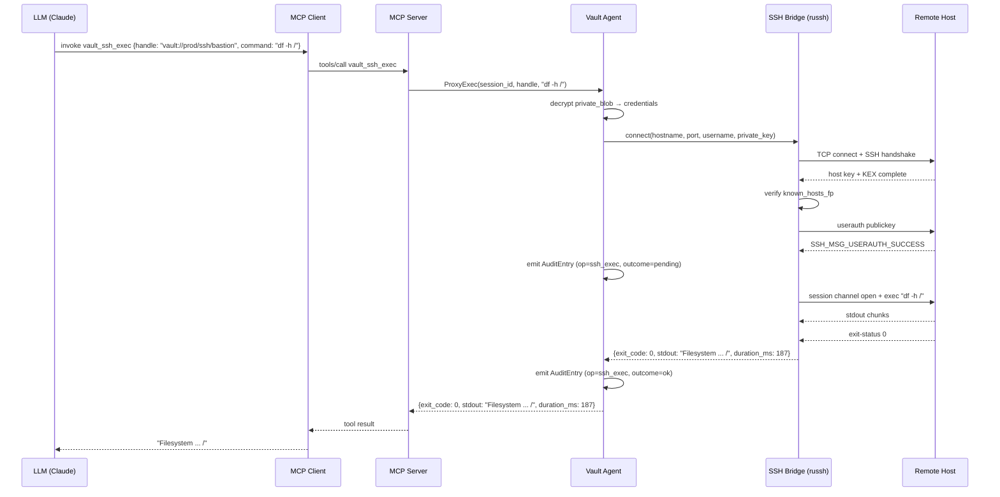

# SSH Bridge Contract

Integration contract describing the SSH proxy tool implementation
within the Vault Agent and the `vault_ssh_*` tool surface exposed
through the MCP Adapter.

## 1. Overview

The SSH Bridge is the External Service Adapter responsible for SSH
operations. It is invoked by the Proxy Executor when the LLM calls any
`vault_ssh_*` tool. Its primary guarantee is that SSH key material and
passphrases are resolved from the encrypted private blob inside the
agent process and never appear in the MCP transport, the audit log
payloads, or on disk in plaintext outside of a controlled Tempfile or
FIFO lifetime.

Two implementation paths exist:

**Path A — russh (preferred):** The `russh` crate
(<https://crates.io/crates/russh>) implements the SSH client protocol
entirely in Rust within the agent process. This provides maximum
control over authentication flow, connection lifecycle, and per-
operation auditing. All SSH operations are observable at the Rust API
boundary, enabling precise audit event emission before and after each
network call.

**Path B — subprocess fallback:** When `russh` cannot satisfy an edge
case (e.g., a vendor SSH implementation requiring a proprietary
`HostKeyAlgorithm`, or FIDO2/hardware-token authentication that
requires a physical user gesture and a process-local security key
handle), the SSH Bridge falls back to spawning an `ssh` subprocess
with credentials delivered via a short-lived FIFO (see Section 6).
The subprocess path is logged at `WARN` level to make the downgrade
visible in the audit trail.

The active path for each connection is recorded in the Audit Entry
under `meta.ssh_impl` as `"russh"` or `"subprocess"`.

## 2. Authentication Flow

### 2.1 Credential Resolution

When a `vault_ssh_*` tool call arrives the Proxy Executor:

1. Resolves the handle to the `ssh` category Secret.
2. Decrypts the `private_blob` inside the agent (XChaCha20-Poly1305).
3. Extracts the credential fields defined by the `ssh` category schema:
   - `username: string`
   - `hostname: string`
   - `port: integer` (default 22)
   - `auth_method: "key" | "password" | "agent"`
   - `private_key_pem: string?` (PEM-encoded; present when `auth_method = "key"`)
   - `passphrase: string?` (key encryption passphrase; may be absent for unencrypted keys)
   - `password: string?` (present when `auth_method = "password"`)
   - `known_hosts_fp: string?` (expected host fingerprint in `SHA256:base64` format)
   - `jump_host_handle: string?` (see Section 4)

4. The decrypted `private_key_pem` is parsed in memory by `russh` or
   written to a FIFO (subprocess path). It is never written to any
   regular file unless explicitly requested via `vault_write_tempfile`.

### 2.2 Key Parsing

For `auth_method = "key"` the agent parses the PEM block using the
`russh-keys` crate. Supported key types: `RSA` (≥2048 bit),
`Ed25519`, `ECDSA P-256`, `ECDSA P-384`. Encrypted keys (PEM-wrapped
with `ENCRYPTED` marker or `Proc-Type: 4,ENCRYPTED`) are decrypted
using the `passphrase` field before parsing.

If `passphrase` is absent and the key is encrypted the operation fails
with `SshKeyDecryptFailed`. The error message does not include the
passphrase field; the audit entry records only the key type and the
error code.

### 2.3 Agent Forwarding

`auth_method = "agent"` instructs the SSH Bridge to forward the system
SSH agent socket (`SSH_AUTH_SOCK`). This path is available on the
subprocess fallback only. The `russh` path does not support agent
forwarding; if the Secret specifies `auth_method = "agent"` the Bridge
automatically downgrades to subprocess. This downgrade is recorded in
the audit entry and emitted as a `WARN` log.

## 3. Known Hosts

### 3.1 Fingerprint Validation

If the Secret contains a non-empty `known_hosts_fp` field the SSH
Bridge extracts the server's host key during the `kex` handshake and
computes `SHA256:base64(host_key_bytes)`. The computed fingerprint is
compared with `known_hosts_fp`. On mismatch the connection is aborted
with error `SshHostKeyMismatch`.

If `known_hosts_fp` is absent the Bridge applies the TOFU policy
(Section 3.2).

The fingerprint check is performed in both `russh` and subprocess
paths. For the subprocess path the Bridge wraps `ssh` with a
`ControlMaster` pre-connect to capture the fingerprint before the
command runs, then validates before proceeding.

### 3.2 Trust-On-First-Use (TOFU) Policy

Default mode: `strict`. On first connection to a host with no
`known_hosts_fp` on the Secret, the agent:

1. Fetches the host key fingerprint during the key exchange.
2. Records it in the Audit Log as a `host_key_seen` event.
3. Returns `SshHostKeyUnknown` with `data.fingerprint` populated.
4. Does not proceed with the connection.

The operator must then either:

- Update the Secret's `known_hosts_fp` field via `vault_rotate`.
- Set `tofu_policy = "auto_accept"` in `config.toml` (not recommended
  for production) to silently accept and store the fingerprint on first
  contact.

`auto_accept` mode logs an `INFO`-level audit event on each new
fingerprint accepted. It does not re-prompt on subsequent connections
to the same host with the same fingerprint.

## 4. Jump Host Chaining

The `jump_host_handle` field on an `ssh` category Secret references a
second handle pointing to another `ssh` category Secret. This
implements ProxyJump (`ssh -J`) semantics.

### 4.1 Resolution

When `jump_host_handle` is non-null the Proxy Executor:

1. Resolves the jump host handle, decrypting its private blob.
2. Opens a TCP connection to the jump host using the jump Secret's
   credentials.
3. Requests a direct-tcpip channel to the target host's `hostname:port`.
4. Runs the target host's SSH handshake over that channel.

This produces a two-hop tunnel. Chaining is recursive: if the jump
host Secret itself has a non-null `jump_host_handle`, a third hop is
resolved, and so on.

### 4.2 Cycle Detection

Before opening any connection the Proxy Executor builds the full chain
of handles by following `jump_host_handle` references. If any handle
appears more than once in the chain the operation fails immediately
with `SshJumpCycleDetected` and the cycle is listed in
`data.cycle_path`. No network connections are opened.

The maximum chain depth is 8 hops (configurable via
`config.toml` `[ssh] max_jump_hops`). Chains exceeding this limit fail
with `SshJumpDepthExceeded`.

## 5. SSH Operations Supported

### 5.1 Exec

`vault_ssh_exec` runs a non-interactive command. The SSH Bridge opens
a session channel, sends an `exec` request, captures `stdout` and
`stderr` up to the configured size limits (64 KiB and 16 KiB
respectively), and waits for the channel to close. The exit status is
captured from the `exit-status` channel request.

Stdout and stderr are filtered through a configurable output sanitizer
that redacts sequences matching patterns in the Namespace Policy's
`redact_patterns` list before returning them to the MCP layer.

### 5.2 Copy (SCP / SFTP)

`vault_ssh_copy` supports both SCP and SFTP modes.

- **SFTP** (default, preferred): the `russh-sftp` sub-crate opens an
  SFTP subsystem and performs `put` (to_remote) or `get` (from_remote)
  operations. Supports recursive directory copy.
- **SCP** fallback: for remote hosts that do not support the SFTP
  subsystem, the Bridge sends a raw `scp -t` or `scp -f` command and
  implements the SCP wire protocol directly.

The transfer is streamed; large files do not accumulate in agent
memory. Progress events are emitted to the internal event bus (not
visible in the MCP response; the final `bytes_transferred` summary is
returned).

### 5.3 Port Forward

`vault_ssh_port_forward` opens a local (`-L`) or remote (`-R`) port
forward and holds it open until either the TTL expires or the session
is closed.

A local forward (`direction: "local"`) binds `bind_address:bind_port`
on the local machine and forwards accepted connections to
`target_host:target_port` through the SSH tunnel.

A remote forward (`direction: "remote"`) requests the remote to bind
a port and forward it back to a local address. The bound port on the
remote side is returned in `bound_port`.

The forward is associated with the MCP `session_id`. When the session
closes (planned or unexpected) the Vault Agent tears down all port
forwards owned by that session.

### 5.4 Shell

`vault_ssh_shell` opens a PTY-backed interactive shell. The Bridge
requests a pty-req channel with the supplied dimensions, then opens a
shell channel. Input from the tool call is not supported (the tool
does not accept a `stdin` parameter). The shell runs for up to
`timeout_secs` and all output is buffered and returned as a single
`output` string.

This tool is appropriate for introspection sessions (check logs, run
a quick diagnostic). For automation, prefer `vault_ssh_exec`.

## 6. Tempfile Handling

When the subprocess fallback path is active and the remote tool
requires a key file path (e.g., `ssh -i /path/to/key`), the SSH
Bridge uses `vault_write_tempfile` in FIFO mode:

1. Creates a named pipe at a path under `$XDG_RUNTIME_DIR/merkle/` (or
   `%TEMP%\merkle\` on Windows) with mode `0600`.
2. Spawns a writer thread that blocks until the FIFO is opened for
   reading, then writes the PEM bytes and closes the write end.
3. Passes the FIFO path to the `ssh` subprocess via `-i <fifo_path>`.
4. The `ssh` process reads the key from the FIFO exactly once.
5. The writer thread exits; the FIFO is unlinked immediately after the
   subprocess reads from it (or on error/timeout).

The FIFO lifetime is bounded by the subprocess lifetime. The Tempfile
reaper in the agent also tracks this path under the `session_id` for
orphan cleanup on agent restart.

A regular Tempfile (non-FIFO) may be used when the remote tool re-
reads the key file (some `ssh-keygen` invocations, some legacy tools).
In that case the file is unlinked as soon as the subprocess exits and
no later than session close.

## 7. Session Lifecycle Within Vault Agent

### 7.1 Connection Caching

The SSH Bridge maintains an in-process connection cache keyed by
`(handle_id, session_id)`. A cached connection is a live `russh`
`client::Handle` with an open TCP stream. The cache has a per-
connection TTL (default 300 seconds, configurable via
`config.toml` `[ssh] connection_ttl_secs`).

When a `vault_ssh_*` call arrives the Bridge:

1. Looks up `(handle_id, session_id)` in the cache.
2. If found and the `russh` handle is still healthy (liveness checked
   via a keepalive), reuses the connection.
3. If not found or unhealthy, opens a new connection, authenticates,
   and inserts into the cache.

Cache entries are evicted on TTL expiry, on `session_id` close, or
when the agent receives a `SIGHUP`.

### 7.2 Concurrency

Multiple `vault_ssh_*` calls on the same connection are serialized at
the session-channel level. `russh` supports concurrent channels on a
single connection; the Bridge uses a channel pool of up to
`config.toml` `[ssh] max_channels_per_connection` (default 4) before
queuing additional calls. Queued calls time out at `timeout_secs`.

### 7.3 Session Close

When the MCP session closes the Bridge:

1. Removes all cache entries with the matching `session_id`.
2. Sends `SSH_MSG_DISCONNECT` on each open connection for that session.
3. Cancels all pending port forwards owned by that session.
4. Unlinks all FIFOs and Tempfiles tracked under that session.

## 8. Sequence Diagram: vault_ssh_exec End-to-End

## 9. References

- `russh` crate: <https://crates.io/crates/russh>
- `russh-keys` crate: <https://crates.io/crates/russh-keys>
- `russh-sftp` crate: <https://crates.io/crates/russh-sftp>
- ADR-0007: Handle Default Exposure Model
- RFC 4254: The Secure Shell (SSH) Connection Protocol
- RFC 4253: The Secure Shell (SSH) Transport Layer Protocol
- Glossary: `../glossary.md` (SSH Bridge, Proxy Tool, Use Token, Tempfile, FIFO, Companion Socket)
- MCP protocol contract: `mcp-protocol.md`
