# Lifecycle

Operational states and transitions of the Vault Agent process.

## 1. States

| State | Description |
|---|---|
| `agent-down` | Process does not exist. Companion Socket is absent. |
| `starting` | Process has been created by the service manager or CLI; configuration and database loading in progress. |
| `sealed` | Process is running; database is open; Vault Root Key is not in memory. All MCP operations are rejected with `ErrSealed`. |
| `unsealing` | Unseal Protocol is executing: fetching Master Key from keychain (or prompting for passphrase), decrypting Vault Root Key. |
| `unsealed` | Vault Root Key is loaded in protected memory (`mlock` when available). Operations are permitted. |
| `idle` | Subset of `unsealed`: no MCP sessions are active and no background work is running. Re-lock timer is counting down. |
| `busy` | Subset of `unsealed`: one or more MCP tool calls or background workers (backup, reaper) are executing. |
| `shutting-down` | SIGTERM received; agent is draining in-flight requests, flushing audit log, and triggering backup if pending. |
| `down` | Process has exited cleanly (exit code 0). |

The states `unsealed`, `idle`, and `busy` share the same memory-key
condition; they differ only in activity level.

---

## 2. State Diagram

```mermaid
stateDiagram-v2
    [*] --> agent_down

    agent_down --> starting : service manager start / merkle agent

    starting --> sealed : config loaded, DB open, socket bound
    starting --> agent_down : fatal error (bad config, DB corrupt)

    sealed --> unsealing : unseal trigger received
    sealed --> shutting_down : SIGTERM in sealed state

    unsealing --> unsealed : Master Key fetched; Vault Root Key decrypted
    unsealing --> sealed : keychain denied / passphrase wrong (retry permitted)

    unsealed --> idle : last MCP session closes; no background work pending
    unsealed --> busy : MCP tool call received
    unsealed --> shutting_down : SIGTERM

    idle --> busy : MCP tool call received / backup trigger fires
    idle --> sealed : re-lock timer expires (default 30 min) / SIGUSR1
    idle --> shutting_down : SIGTERM

    busy --> idle : all active work completes
    busy --> shutting_down : SIGTERM (drains in-flight first)

    sealed --> shutting_down : SIGTERM
    shutting_down --> down : drain complete; audit flushed; fsync done

    down --> [*]
```



---

## 3. Boot Sequence

When the service manager (or the user) executes `merkle agent`, the
following steps execute in order:

1. **Load configuration.** Parse `~/.config/merkle/config.toml`.
   Validate required fields. Fail fast with a descriptive error if the
   file is absent or malformed; the service manager interprets a non-zero
   exit code as a failed start.

2. **Open database.** Open the SQLite database at the configured path in
   WAL mode. If the file does not exist and `--init-on-boot` is set,
   create it; otherwise fail. A locked database (another agent already
   running) causes an immediate exit with a clear error message.

3. **Run migrations.** Apply any pending schema migrations in order.
   Migrations are embedded in the binary; no external migration tool is
   required. The agent refuses to start if it detects a database schema
   version newer than the binary understands (downgrade guard).

4. **Bind Companion Socket.** Create the Unix domain socket (or Windows
   named pipe) at the configured path (default:
   `~/.local/run/merkle/agent.sock`). Fail if the path is already in
   use and a liveness probe confirms another agent is listening.

5. **Notify service manager.** Send `sd_notify READY=1` on Linux
   systemd; call `launchctl checkin` on macOS; signal the SCM on
   Windows. This marks the service as started.

6. **Check AnacronState.** Read the last successful backup timestamp.
   If the configured `max_interval` has elapsed and there are pending
   changes, queue an immediate Anacron Trigger backup (section 8).

7. **Enter Sealed state.** Begin accepting connections on the Companion
   Socket. All tool calls receive `ErrSealed` until an Unseal Trigger
   is received.

---

## 4. Unseal Triggers

The agent transitions from `sealed` to `unsealing` when any of the
following events occurs:

| Trigger | Description |
|---|---|
| First MCP tool call | Any tool call received on the Companion Socket while sealed causes the agent to attempt unseal before processing the call. The call is held; on success it proceeds; on failure `ErrUnsealFailed` is returned. |
| CLI command | Running `merkle unseal` from the CLI sends a signal to the running agent via the socket. Useful for scripted automation. |
| Auto-unseal on user login | When `auto_unseal = true` in `config.toml` and the service is configured as a `KeepAlive` Launch Agent (macOS) or a `user@.service` systemd user unit (Linux) that starts on session login, the agent calls the keychain immediately on boot without waiting for a trigger. Suitable for security profiles where keychain access does not require a separate prompt. |

After a failed unseal attempt, the agent remains in `sealed` state and
accepts subsequent triggers. Rate-limiting applies: no more than five
consecutive failed attempts within 60 seconds before a 5-minute lockout.

---

## 5. Idle Behavior

When the last MCP session closes and no background work is pending, the
agent enters the `idle` sub-state. A re-lock timer starts with the
value configured in `idle_lock_timeout_secs` (default: 1800, 30 minutes).

When the timer expires, the agent:

1. Wipes the Vault Root Key from memory (`explicit_bzero` or equivalent).
2. Wipes all cached Namespace DEKs.
3. Transitions to `sealed` state.
4. Logs `INFO agent re-locked after idle timeout`.

The re-lock timer resets whenever a new MCP session connects or a
background worker starts.

**Forced re-lock.** Sending `SIGUSR1` to the agent process forces
immediate re-lock regardless of the timer or active sessions. In-flight
operations are rejected with `ErrSealed` before they complete. This is
the equivalent of `gpg-agent --quiet --daemon --preset-passphrase` plus
manual passphrase drop. Useful for scripted lockdown on screen lock
events.

**Re-lock does not stop the agent.** The Companion Socket remains bound;
the backup scheduler and tempfile reaper continue running. Only the
Vault Root Key and Namespace DEKs are cleared.

---

## 6. Sleep and Wake Hooks

The agent registers for platform sleep notifications to trigger a
best-effort backup before the machine suspends.

### macOS — IOKit power notifications

The agent registers `IORegisterForSystemPower` with the callback
`kIOMessageSystemWillSleep`. On receiving the notification:

1. If pending changes exist, trigger an immediate backup.
2. Flush and fsync the audit log.
3. Optionally re-lock (if `lock_on_sleep = true` in `config.toml`).
4. Release the power assertion to allow sleep to proceed.

Wake notification (`kIOMessageSystemHasPoweredOn`) re-arms the Anacron
Trigger check.

### Linux — logind D-Bus `PrepareForSleep`

The agent subscribes to the D-Bus signal
`org.freedesktop.login1.Manager.PrepareForSleep`. On `before=true`:

1. Acquire the inhibitor lock (inhibitor type: `sleep`, mode: `delay`,
   maximum hold: 2 seconds).
2. Trigger backup if pending; flush audit log; optionally re-lock.
3. Release the inhibitor lock.

On `before=false` (wake), re-arm the Anacron Trigger check.

### Windows — `WM_POWERBROADCAST`

The agent registers a hidden message-only window and handles the
`WM_POWERBROADCAST` message with `wParam = PBT_APMSUSPEND`. On receipt:

1. Trigger backup if pending; flush audit log; optionally re-lock.
2. Return `TRUE` to allow suspend to proceed.

`PBT_APMRESUMESUSPEND` triggers re-arm of the Anacron Trigger check.

---

## 7. Graceful Shutdown

When the agent receives SIGTERM (or the equivalent stop signal from the
service manager), it executes the following drain sequence:

1. **Stop accepting new connections.** The Companion Socket is closed to
   new callers. In-progress connections remain open.

2. **Drain MCP sessions.** Wait up to 10 seconds for all in-flight MCP
   tool calls to complete or time out. Calls that do not complete within
   the drain window receive `ErrShuttingDown`.

3. **Cancel background workers.** Signal the backup scheduler and
   tempfile reaper to stop. Allow up to 5 seconds for clean termination.

4. **Trigger backup if pending.** If uncommitted mutations exist since
   the last backup and a backup target is configured, execute a
   synchronous backup. If the backup fails, log `WARN` and continue
   shutdown (do not block indefinitely on a failed backup target).

5. **Flush audit log.** Write all buffered audit entries to the database.
   Call `fsync` on the database file descriptor.

6. **Save AnacronState.** Update the AnacronState record with the current
   timestamp so that the next boot correctly evaluates whether a backup
   is overdue.

7. **Wipe keys.** Clear Vault Root Key and Namespace DEKs from memory.

8. **Exit zero.** The service manager interprets exit code 0 as a clean
   stop. Non-zero exit codes trigger restart logic.

Forced kill (SIGKILL) bypasses the drain sequence; WAL recovery on the
next boot handles any uncommitted writes.

---

## 8. Crash Recovery

On boot, the agent performs the following recovery checks before
entering `sealed` state:

| Check | Mechanism | Action on Failure |
|---|---|---|
| WAL replay | SQLite WAL mode performs automatic replay of uncommitted transactions on first open | Non-recoverable WAL corruption logged; agent exits with error |
| Anacron Trigger | Compare current time to `last_backup_timestamp` in AnacronState | Queue immediate backup if interval elapsed and pending changes exist |
| Orphan tempfile reap | Scan tempfile registry for entries with no live `session_id` | Delete orphaned tempfiles; log count |
| Audit chain verification | Chain Verifier reads all entries and validates the hash chain | Log `WARN chain_broken` and emit a metric; do not block startup (chain is append-only; corruption after boot should not prevent new entries) |

These checks run synchronously before the socket is bound and before
`READY=1` is sent to the service manager.

---

## 9. Process Supervision

### macOS — launchd

`KeepAlive: { Crashed: true }` in the plist restarts the agent if it
exits with a non-zero code. `ThrottleInterval: 10` prevents restart
storms. The agent will not be restarted on a clean exit (exit code 0).

### Linux — systemd

```ini
Restart=on-failure
RestartSec=5
StartLimitBurst=5
StartLimitIntervalSec=60
```

`Restart=on-failure` restarts on non-zero exit code. After five
consecutive failures within 60 seconds (`StartLimitBurst=5,
StartLimitIntervalSec=60`), systemd stops attempting restarts and
marks the unit as failed. The operator must intervene with
`systemctl --user reset-failed vault-agent` before a new attempt.

### Windows — SCM failure actions

```powershell
sc.exe failure MerkleVaultAgent reset= 60 \
    actions= restart/5000/restart/5000/restart/5000
```

Three restart attempts separated by 5-second delays. After all three
are exhausted, no further automatic restart occurs until the failure
counter resets (60-second window). The operator restarts with
`sc.exe start MerkleVaultAgent`.

### Manual supervision

When running without a service manager (development, CI), wrap the agent
with a supervisor such as `s6`, `runit`, or a simple shell loop:

```sh
while true; do
    merkle agent
    echo "agent exited $?; restarting in 5s" >&2
    sleep 5
done
```

This is not recommended for production; use the native service manager
integration described above.
