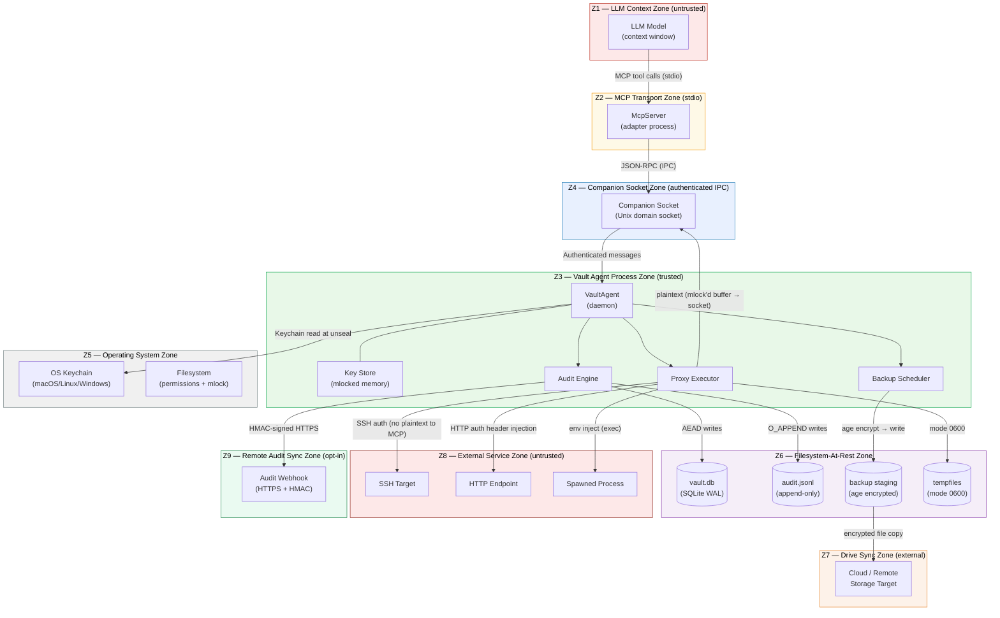

# Trust Boundaries

**Project:** Merkle — local-first MCP vault  
**Version:** 0.1.0  
**Scope:** All trust zones and the boundaries between them, covering data flow,
authentication mechanisms, encryption posture, and assumptions on each side.

---

## Trust Zone Definitions

| Zone ID | Name | Trust Level | Description |
|---|---|---|---|
| Z1 | LLM Context Zone | Untrusted (prompt-injection susceptible) | The model's context window, including all tool call arguments and results. Even when the LLM provider is trusted, the content the LLM processes may be adversarially crafted. |
| Z2 | MCP Transport Zone | Partially trusted | stdio between the MCP client (Claude Code) and the MCP server adapter. Observable as a stream; content is determined by what the LLM generates. |
| Z3 | Vault Agent Process Zone | Trusted (highest trust) | The `vault-agent` daemon process. Holds the Vault Root Key in `mlocked` memory. All cryptographic operations occur here. |
| Z4 | Companion Socket Zone | Authenticated IPC | Process-to-process Unix domain socket. Trust depends on caller identity verification (PID + program name). |
| Z5 | Operating System Zone | Trusted platform | Host kernel, filesystem permissions, keychain service, process isolation. Trusted unless the local attacker achieves root or kernel-level compromise. |
| Z6 | Filesystem-At-Rest Zone | Protected at rest | `vault.db`, `audit.log`, backup staging files, tempfiles. Protected by per-blob AEAD; integrity protected by hash chain. Accessible to any process with user-level filesystem access. |
| Z7 | Drive Sync Zone | External; partially trusted | Cloud storage or remote filesystem target where backups are written. Contents are always encrypted before reaching this zone. |
| Z8 | External Service Zone | Untrusted | SSH targets, HTTP endpoints, cloud APIs, spawned processes. Outside vault control; may be compromised or adversarially controlled. |
| Z9 | Remote Audit Sync Zone | Optional; conditionally trusted | HTTPS webhook receiver for out-of-band audit delivery. Opt-in. Receives HMAC-signed entries but not key material. |

---

## Architecture Diagram



---

## Boundary Catalog

### Boundary B1: LLM Context Zone ↔ MCP Transport Zone

**Description:** The LLM generates tool calls (JSON-RPC over stdio) that cross
into the MCP transport. This is the highest-value boundary because it is the
primary attack surface for prompt injection.

| Dimension | Detail |
|---|---|
| What crosses — data | Tool call names, arguments (handle URIs, purpose strings, option flags), tool results (public metadata, opaque handles, proxy output) |
| What crosses — control | Tool invocation sequence is determined by the LLM; the LLM cannot issue arbitrary IPC directly |
| Authentication | None at the LLM→adapter direction; slash commands carry a user-turn flag (client-enforced) |
| Encryption in transit | stdio is an in-process pipe; no network encryption needed; pipe is not encrypted at the OS level |
| Encryption at rest | N/A — this is a live in-memory channel |
| Trust assumption (Z1 side) | LLM-generated content is untrusted; any field value may be adversarially crafted via prompt injection |
| Trust assumption (Z2 side) | The MCP server adapter trusts the schema of the JSON-RPC envelope but treats all parameter values as untrusted input |
| Primary threat | Prompt injection turning the LLM into an exfiltrator: crafted content causes the LLM to call `vault.reveal` or accumulate public metadata for exfiltration |
| Key mitigations | Handle default (LLM sees opaque URIs, not plaintext); `vault.reveal` requires operator confirmation; high-sensitivity OOB confirmation; rate limits on reveal operations; Use Token TTL 60 s |
| High-value boundary marker | **Yes — this is the most critical boundary in the Merkle architecture.** Compromise of the prompt injection prevention at this boundary is the most impactful single failure mode. |

---

### Boundary B2: MCP Transport Zone ↔ Vault Agent Process Zone

**Description:** The MCP server adapter forwards validated JSON-RPC messages to the
VaultAgent over the Companion Socket. This crossing authenticates the MCP adapter
as a trusted process.

| Dimension | Detail |
|---|---|
| What crosses — data | Vault operation requests (structured, schema-validated); operation responses (handles, public metadata, proxy results, audit acknowledgments) |
| What crosses — control | Operation dispatch; session lifecycle management |
| Authentication | `SCM_CREDENTIALS` / `SO_PEERCRED` PID check + resolved binary path checked against `allowed_consumers` on every message |
| Encryption in transit | Unix domain socket (kernel-internal); no network encryption needed; not encrypted at the OS level; root can observe via `/proc/<pid>/fd` |
| Encryption at rest | N/A |
| Trust assumption (Z2 side) | The MCP adapter is trusted by the agent only if its binary path matches the allowlist; all parameter values remain untrusted until domain validation |
| Trust assumption (Z3 side) | The VaultAgent trusts only operations that pass the allowlist check and domain validation; it never trusts the adapter to enforce policy |
| Primary threat | Rogue process connecting to the companion socket; binary replacement of the adapter to intercept responses |
| Key mitigations | Allowlist with binary path verification; session ID binding; rate limits enforced at the agent, not the adapter |

---

### Boundary B3: Vault Agent Process Zone ↔ Companion Socket Zone (Use Token path)

**Description:** Consumer processes (e.g., external tools invoked by `vault.spawn`)
resolve Use Tokens via the Companion Socket. This boundary authenticates the
consumer.

| Dimension | Detail |
|---|---|
| What crosses — data | Use Token (opaque UUID); resolved plaintext secret (returned only to authenticated consumers) |
| What crosses — control | Token resolution request; single-use consumption confirmation |
| Authentication | PID + resolved binary path against namespace `allowed_consumers` glob; UUIDv4 token (128-bit entropy); TTL 60 seconds; single-use |
| Encryption in transit | Unix domain socket; kernel-internal; not encrypted at the OS level |
| Encryption at rest | N/A |
| Trust assumption (Z4 side) | Consumer process must be on the `allowed_consumers` list; process identity verified by OS kernel via `SO_PEERCRED` |
| Trust assumption (Z3 side) | Agent trusts the OS kernel's PID reporting; token itself is unforgeable by an unauthorized process |
| Primary threat | Rogue process spoofing a legitimate consumer; token brute-force (mitigated by 128-bit entropy and 60 s TTL) |
| Key mitigations | Short TTL; single-use; binary path allowlist; rate limit on token resolution attempts per socket connection |

---

### Boundary B4: Vault Agent Process Zone ↔ Operating System Zone (Keychain)

**Description:** The agent reads the Master Key from the OS keychain at unseal
time and holds it in `mlocked` memory.

| Dimension | Detail |
|---|---|
| What crosses — data | Master Key (32 bytes); service identifier used for lookup |
| What crosses — control | Keychain read request; keychain write request (at init and key rotation) |
| Authentication | OS keychain ACL restricts access to the agent binary path; additional biometric or password prompt on macOS for non-stored access |
| Encryption in transit | OS-internal API call; not a network boundary |
| Encryption at rest | Keychain encrypts stored data with the OS login key (macOS) or user session key (Linux Secret Service) |
| Trust assumption (OS side) | OS keychain is trusted to protect the entry against non-privileged access; root can bypass on systems without SIP or LUKS |
| Trust assumption (Z3 side) | The Master Key returned by the keychain is authentic; the agent zeroizes it after wrapping into the protected key store |
| Primary threat | Keychain ACL bypass by a rogue binary with the same path (after binary replacement); lost laptop with unencrypted keychain |
| Key mitigations | Full-disk encryption (FileVault/LUKS) required; Recovery Key path enables disaster recovery if keychain is wiped; Argon2id passphrase fallback for headless environments |

---

### Boundary B5: Vault Agent Process Zone ↔ Filesystem-At-Rest Zone

**Description:** The agent reads and writes the SQLite database, audit log, and
backup staging files.

| Dimension | Detail |
|---|---|
| What crosses — data | Encrypted secret blobs (XChaCha20-Poly1305); wrapped key material; public metadata; hash-chained audit entries; age-encrypted backup payload |
| What crosses — control | SQL queries; JSONL append; file create/read/rename |
| Authentication | Filesystem ownership and mode bits (`0600` for all sensitive files); no separate authentication mechanism at the file level |
| Encryption in transit | N/A (local filesystem I/O) |
| Encryption at rest | Per-blob AEAD (private blobs); age encryption (backups); audit entries are plaintext but HMAC-signed and hash-chained; no full-database encryption (by design — per-blob is preferred) |
| Trust assumption (Z5 side) | Filesystem permissions accurately reflect access control; kernel does not permit cross-user reads without explicit grants |
| Trust assumption (Z3 side) | Data read from the filesystem is authenticated by AEAD tags before use; audit entries are validated by the chain verifier before forensic reliance |
| Primary threat | Local attacker with user privileges reading the database file; root attacker reading or replacing the database; WAL-file side-channel; audit log truncation or modification |
| Key mitigations | Per-blob AEAD authentication; `O_APPEND` on audit log; Blake3 hash chain; exclusive SQLite lock mode; `0600` file permissions at creation |

---

### Boundary B6: Vault Agent Process Zone ↔ External Service Zone

**Description:** The Proxy Executor invokes SSH connections, HTTP requests, and
process spawns on behalf of the LLM without exposing plaintext to the MCP
transport.

| Dimension | Detail |
|---|---|
| What crosses — data | SSH private key material (used internally, not transmitted to MCP); API tokens and credentials (injected into HTTP headers or env vars); command stdout/stderr (returned to LLM after filtering) |
| What crosses — control | SSH session establishment and command execution; HTTP request dispatch; process fork-exec |
| Authentication | SSH: host key pinning (TOFU then pinned); HTTP: TLS with hostname verification (`rustls`); spawn: allowlist of permitted binaries |
| Encryption in transit | SSH: encrypted by the SSH protocol; HTTP: TLS 1.2+ required; spawn: local pipe (no network encryption) |
| Encryption at rest | N/A (live connections) |
| Trust assumption (Z3 side) | Remote SSH servers and HTTP endpoints are trusted only to the extent they are authenticated by their TLS certificates or SSH host keys; their output is treated as untrusted |
| Trust assumption (Z8 side) | External services are considered potentially compromised; their output may contain adversarial content (prompt injection via stdout) |
| Primary threat | Compromised SSH target injecting prompt injection payloads via stdout; MITM on the TLS connection; DNS spoofing of the target hostname |
| Key mitigations | Host key pinning; strict TLS certificate verification; output length bounding and sanitization before returning to LLM; audit entry records raw output for forensic comparison |

---

### Boundary B7: Filesystem-At-Rest Zone ↔ Drive Sync Zone

**Description:** Backup files are copied (or synced) from the local filesystem to
a cloud or remote storage target.

| Dimension | Detail |
|---|---|
| What crosses — data | age-encrypted backup file (ciphertext only; no plaintext ever written) |
| What crosses — control | File create/update events; cloud sync client file events |
| Authentication | Cloud storage API authentication (out of scope for Merkle; operator's responsibility); the backup file itself is authenticated by age AEAD |
| Encryption in transit | HTTPS by cloud sync client (out of scope); backup is already encrypted before transit |
| Encryption at rest | age AEAD with two recipients (Master public key + Recovery Public Key); cloud provider sees only ciphertext |
| Trust assumption (Z7 side) | Cloud storage provider is not trusted with plaintext; they receive only age ciphertext |
| Trust assumption (Z6 side) | The local backup file written to disk is already encrypted; cloud sync reads only the encrypted form |
| Primary threat | Cloud account compromise allowing an attacker to download the backup file; attacker requires Recovery Key or Master Key to decrypt |
| Key mitigations | age dual-recipient encryption; backup file integrity ensured by age AEAD authentication; operator must protect the Recovery Key offline |

---

### Boundary B8: Vault Agent Process Zone ↔ Remote Audit Sync Zone

**Description:** Optional delivery of HMAC-signed audit entries to a configured
HTTPS webhook for out-of-band audit storage and compliance verification.

| Dimension | Detail |
|---|---|
| What crosses — data | Audit entry payload (handle URI, operation, timestamp, session ID, outcome, chain hashes); HMAC signature |
| What crosses — control | HTTP POST per audit batch; retry on failure; backlog drain on reconnect |
| Authentication | Outbound TLS with certificate pinning (SPKI SHA-256 pin in config); HMAC-BLAKE3 signature on each entry (receiver can verify with the shared HMAC key) |
| Encryption in transit | TLS 1.2+ to the webhook endpoint; HMAC key is never transmitted, only used to sign |
| Encryption at rest | Receiver's responsibility; Merkle does not govern storage at the receiver |
| Trust assumption (Z9 side) | The webhook receiver is trusted to store audit entries without modification; the HMAC signature allows the receiver or any authorized party to verify authenticity independently |
| Trust assumption (Z3 side) | The remote endpoint may be unavailable or compromised; the local JSONL log is the authoritative record regardless of remote delivery status |
| Primary threat | Forged webhook endpoint intercepting audit entries; replay of audit entries to mislead the receiver; HMAC key compromise enabling forgery |
| Key mitigations | Certificate pinning; HMAC on every entry; chain sequence numbers prevent undetected reordering; local JSONL is authoritative; HMAC key stored in keychain, not in `config.toml` |

---

## Summary: Boundary Criticality Ranking

| Rank | Boundary | Criticality | Primary Reason |
|---|---|---|---|
| 1 | B1 — LLM Context ↔ MCP Transport | Critical | Prompt injection entry point; compromise turns LLM into exfiltrator |
| 2 | B4 — VaultAgent ↔ OS Keychain | Critical | Master Key extraction enables offline decryption of all secrets |
| 3 | B2 — MCP Transport ↔ VaultAgent | High | Companion socket spoofing enables unauthorized secret operations |
| 4 | B9 — Companion Socket ↔ OOB Channel | High | Compromised Companion Device bypasses the OOB barrier for sensitivity=high reveals |
| 5 | B6 — VaultAgent ↔ External Services | High | Compromised external service enables prompt injection via proxy output |
| 6 | B5 — VaultAgent ↔ Filesystem-At-Rest | High | Database tampering or audit log forgery; mitigated by AEAD + hash chain |
| 7 | B3 — VaultAgent ↔ Companion Socket (Use Token) | Medium | Rogue consumer process; mitigated by 256-bit tokens and allowlist |
| 8 | B7 — Filesystem ↔ Drive Sync | Medium | Cloud account compromise; mitigated by age encryption before sync |
| 9 | B8 — VaultAgent ↔ Remote Audit Sync | Low-Medium | Webhook spoofing; mitigated by TLS pinning + HMAC signatures |

---

## Amendment — 2026-05-22

### Boundary B9: Companion Socket OOB Channel ↔ Companion Device

**Description:** The OOB channel over which the vault agent emits
`oob/challenge/issued` events to an enrolled Companion Device and receives
`oob/challenge/resolved` responses. The Companion Device is paired via an
Ed25519 keypair registered at enrollment time (ADR-0011 Amendment — 2026-05-22).

| Dimension | Detail |
|---|---|
| What crosses — data | Challenge payload: `challenge_id` (UUIDv7), `device_id`, `handle` reference, `sensitivity` level, HMAC-bounded nonce; resolution payload: `challenge_id`, `outcome` (approved/denied), Ed25519 signature over `challenge_id \|\| nonce \|\| outcome`. |
| What crosses — control | Challenge issuance (agent → device); resolution response (device → agent via Companion Socket) |
| Authentication | Ed25519 signature on every `oob/challenge/resolved` response, verified against the enrolled device's public key; signatures are bound to the specific `challenge_id` and nonce, making replay infeasible |
| Encryption in transit | The Companion Socket event stream is a local Unix domain socket (kernel-internal); challenge payloads are not separately encrypted; any process that can read the Companion Socket events can observe `oob/challenge/issued` payloads |
| Encryption at rest | Enrolled device public keys are stored in the vault's sealed state (AEAD-protected); the Companion Device holds its Ed25519 private key in tamper-resistant hardware (recommended) |
| Trust assumption (agent side) | The agent trusts a resolution bearing a valid Ed25519 signature from a currently enrolled device; it does not trust the transport — it re-verifies the signature regardless of which socket connection delivered the response |
| Trust assumption (device side) | The Companion Device trusts the challenge payload only to the extent needed to display it to the operator; the device signs only after explicit user touch/biometric confirmation |
| Primary threat | Rogue device enrolled before the legitimate device (spoofing); compromised device that auto-approves without user interaction (elevation of privilege); event flood draining operator attention (DoS) |
| Key mitigations | Per-challenge nonce binding prevents replay; single-use challenge IDs; rate limits on challenge issuance (`per_minute`, `per_hour` per ADR-0011); enrollment audit chain; `merkle device list` for enumeration; `merkle device revoke` for revocation |
| High-value boundary marker | **Yes — this boundary controls access to `sensitivity=high` secrets.** Compromise of the device or the enrollment ceremony bypasses the primary OOB confirmation barrier for high-sensitivity reveals. |
| Confidentiality note | Challenge payload (handle, namespace, sensitivity) is visible to any process reading the Companion Socket event stream. High-sensitivity data does **not** cross this boundary in plaintext — only the handle URI (opaque reference) and sensitivity classification are included. The plaintext secret is never included in the challenge payload. |

---

### Boundary B3: Use Token Canonical Format Correction

The Use Token format documented in the B3 row above (Authentication column) is
corrected. The previous text stated "UUIDv4 token (128-bit entropy)" which does not
match the CUE schema (`docs/arch/schemas/access_mediation/use_token.cue`).

**Canonical format:** 43-character URL-safe base64 string, encoding 256 bits of
entropy drawn from `rand_core::OsRng`. The regex constraint in the CUE schema is:

```
token: =~ "^[A-Za-z0-9_-]{43}$"
```

The 43-character length is the standard URL-safe base64 encoding of 32 bytes
(256 bits) without padding (`ceil(32 * 8 / 6) = 43`). This provides 256 bits of
entropy, not 128. The brute-force infeasibility argument in the B3 row holds with
greater margin: guessing a 256-bit token within the 60-second TTL is computationally
infeasible under any current attack model.

All references in this document and in `trust-boundaries.md` to "UUIDv4 token" or
"128-bit token" for Use Tokens are superseded by this amendment. The authoritative
source of truth for the token format is `docs/arch/schemas/access_mediation/use_token.cue`.
